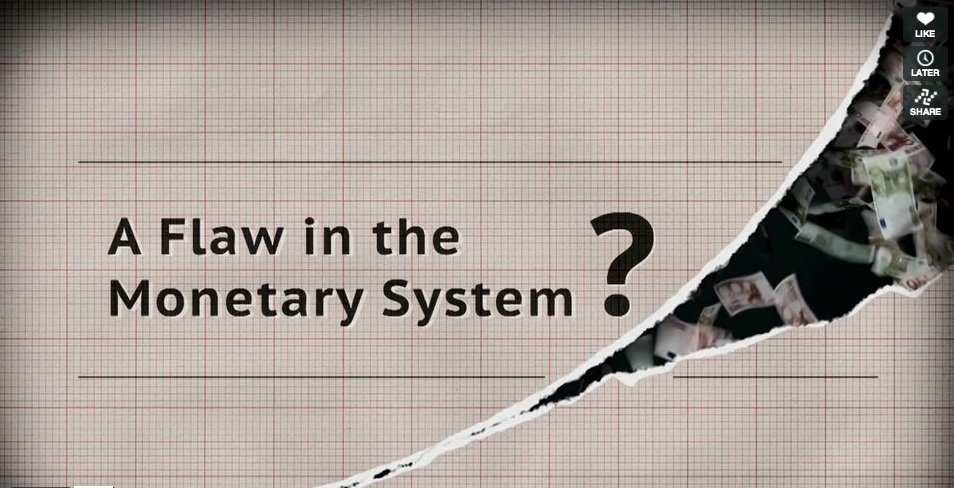

# A flaw in the monetary system?

Excellent 7 minute video of [how we fool ourselves with our current monetary system](https://vimeo.com/71074210).

Still, the majority of people do not fully understand this. On the outlook for the sequel on this video, covering a mutual credit system and ‘[[flow money]]’ (demurrage, or negative interest) and a dynamic [[trustspace]].