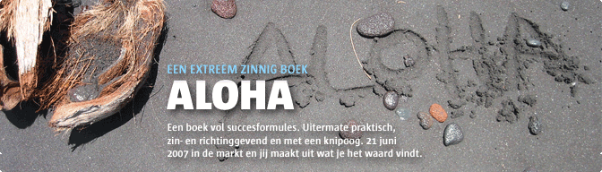

# Aloha
### 2006-11-23

::: vista

:::

Aloha: Hawaiaans voor affectie, liefde, compassie, dank, tot ziens, hallo en andere sentimenten met een vergelijkbare natuur. En een fraaie naam voor een zinderend project met de titel HARTelijk Dank!. Lees meer over de betekenis en het karakter van het woord Aloha.

Het {vurig verlangen} van het Aloha genootschap is:

> **We maken een verassend mooie reis waarbij we op 7/7/7 tenminste €1M hebben ontvangen in een fonds dankzij ons extreem zinnige en succesvolle boek en de andere dingen die uit onze Aloha-reis voortkomen!**

Geheel in de geest van Ben & Jerry's medeoprichter Ben Cohen die zegt “Wat je geeft krijg je terug.” zijn wij zijn ervan overtuigd dat geven en ontvangen in onze samenleving een verandering teweeg kan brengen. Daarom stellen wij dit boek geheel vrij beschikbaar voor de prijs die de koper daarvoor wenst te betalen.

Dit vertrouwen wordt bevestigd door navraag en onderzoek bij diverse winkeliers, die dit ook een prachtig initiatief vinden. Daarmee willen we geven en ontvangen grootschalig bewust maken voor elk Nederlands-sprekend mens.

~~~js
import { section } from "./components/aids.js";
import { aloha as toc } from "./zones/aardbron.js";
display(section(toc));
~~~