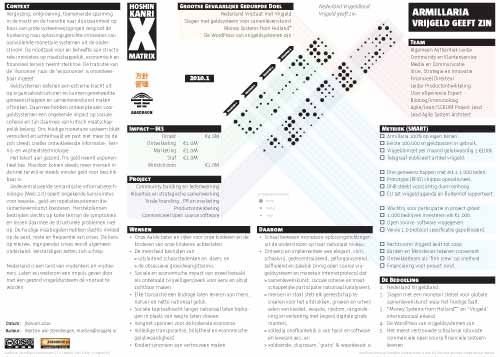

# Armillaria hoshin kanri
### 2010-01-04

Armillaria is de {hoshin kanri}—voorstel, reden, zakelijke zin en plan van aanpak op één A4—om met **Nederland Vrijgeldland**™ [[samenlevenskunst]] op te laten bloeien.

Klik op onderstaande plaat voor de PDF van Armillaria.

Nog [meer hoshin kanri](hoshin-kanri). Voor meer uitleg, zie {hoshin kanri}.

## Wensen

- Onze Aarde beter en rijker voor onze kinderen en de kinderen van onze kinderen achterlaten.
- De mensheid bevrijden van:
   - uitsluitend schaarstedenken en -doen; en
   - de obsessieve groeidwangstoornis.
- Sociale en economische impact van zowel betaald als onbetaald (vrijwilligers)werk voor eens en altijd zichtbaar maken.
- Elke transactie een bijdrage laten leveren aan mens, natuur en netto nationaal geluk.
- Sociale kapitaalkracht langer nationaal laten bijdra- gen in plaats van weg te laten vloeien.
- Vangnet spannen voor de krakende economie.
- Volledige transparantie, billijkheid en economische gelijkwaardigheid.
- Krediet synoniem aan vertrouwen maken.

## De Bedoeling

1. **Nederland Vrijgeldland**™.
1. **[[Vrijgeld]] geeft zin**™.
1. Slagen met een monetair stelsel voor globale [[samenlevenskunst]] waar het huidige faalt.
1. Money Systems from Holland™ en Vrijgeld™ internationaal erkend.
1. De Google + WordPress + Wikipedia van vrijgeldsystemen zijn.
1. Het meest vertrouwde schaalvrije robuuste commerciële open source financiële systeem leveren.

## Daarom

- Schaal bewezen monetaire oplossingsrichtingen uit de onderstroom op naar nationaal niveau.
- Ontwerp en implementeer een elegant, slim, schaalvrij, gedecentraliseerd, zelforganiserend, zelfhelend en zakelijk zinnig open source [[vrijgeld]]systeem en monetair internetprotocol dat:
  - [[samenlevenskunst]], sociale cohesie en maatschappelijke participatie nationaal katalyseert;
  - mensen in staat stelt elk gereedschap te creëren voor het uitdrukken, groeien en uitwisselen van krediet, waarde, rijkdom, rangordening en verkiezing met (eigen) digitale girale munten;
  - volledig onafhankelijk is van hard- en software en leveranciers; en
  - voldoende, duurzaam, ‘gratis’ & waardevast is.

## Waarom?
Vergrijzing, ontgroening, toenemende spanning in de markt en de transitie naar duurzaamheid op basis van grote systeemwijzigingen vergroot de hunkering naar oplossingsgerichte innovaties van aanvullende monetaire systemen uit de onderstroom. De noodzaak voor en behoefte aan structurele innovaties op maatschappelijk, economisch en financieel terrein neemt sterk toe. De transitie van de ‘ikonomie’ naar de ‘wijconomie’ is onomkeer- baar ingezet.

Geldsystemen oefenen een extreme kracht uit op organisatiestructuren en kunnen genetwerkte gemeenschappen en samenlevenskunst maken of breken. Daarmee hebben ontwerpkeuzes voor geldsystemen een ongekende impact op sociale cohesie en zijn daarmee van kritisch maatschap- pelijk belang. Ons huidige monetaire systeem blijkt verouderd en achterhaald en past niet meer bij de zich steeds sneller ontwikkelende informatie-, kennis- en wijsheidstechnologie.

Het tekort aan gezond, fris geld neemt exponen- tieel toe. Hierdoor komen steeds meer mensen in de knel terwijl er steeds minder geld voor beschikbaar is.

Gedecentraliseerde semantische informatietechnologie (Web 3.0) opent ongekende kansruimtes voor waarde-, geld- en reputatiesystemen die [[samenlevenskunst]] koesteren. Herstelplannen bestrijden slechts op korte termijn de symptomen en lossen daarmee de structurele problemen niet op. De huidige maatregelen hebben slechts invloed op de aard, mate en frequentie van crises. De kans op nieuwe, ingrijpender crises wordt algemeen onderkend. Verstandigen zetten zich schrap.

Nederland is een land van vrijdenkers en vrijdoeners. Laten wij wederom een impuls geven door met een gezond [[vrijgeld]]systeem dé vrijstaat te worden.

## Stap voor stap
 In antichronologische volgorde komen stap voor stap dichterbij **Nederland [[Vrijgeld]]land**™ en **[[Vrijgeld]] geeft zin**™.

- **Seizoen 4**:
   - Armillaria 100% op eigen benen.
   - Eerste 100.000 [[vrijgeld]]passen in gebruik.
   - [[Vrijgeld]]omzet per maand gelijkwaardig ≥ €100k.
   - Telegraaf publiceert artikel [[vrijgeld]].
- **Seizoen 3**:
   - Drie gemeenschappen met elk ≥ 1.000 leden.
   - Prototype (RFID) chippas operationeel.
   - DNB steekt voorzichtig duim omhoog.
   - EU zet [[vrijgeld]] op agenda en Buitenhof rapporteert.
- **Seizoen 2**:
   - Wachtrij voor participatie in project groeit.
   - 1.000 bedrijven investeren elk €1.000.
   - Open source software vrijgegeven.
   - Versie 1.0 protocol specificatie gepubliceerd.
- **Seizoen 1**:
   - Rechtsvorm [[Vrijgeld]] leidt tot coöp.
   - Banken en Ministeries tekenen convenant.
   - Ontwikkelteam als ‘film crew’ op snelheid.
   - Financiering voor project rond.
