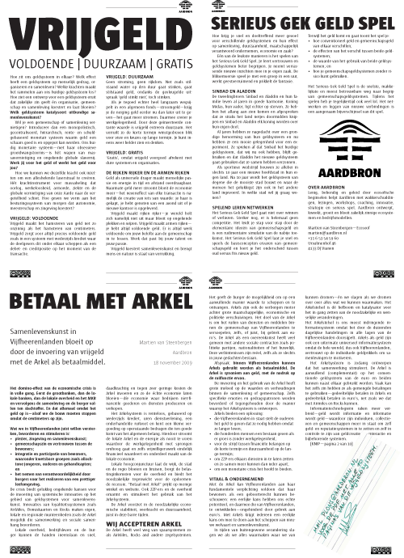

# Betaal met Arkel
### 2009-11-24

Op 24 november 2009 organiseert de Kamer van Koophandel Midden-Nederland een [samenscholing voor alle ZZP-ers](http://www.kvk.nl/agenda/193343/netwerkbijeenkomst_voor_zzpers_in_de_regio_vijfheerenlanden/) van de [Vijfheerenlanden](http://nl.wikipedia.org/wiki/Vijfheerenlanden).

Wow! Hoe kunnen we een vrijgeldsysteem voor [[samenlevenskunst]] van ZZP-ers opzetten voor deze enerverende regio en **elkaar betalen met Arkels**? Alle meer dan 60 deelnemers krijgen als hart onder de riem onderstaande flyer over <a href="Vrijgeld-SGGS-Arkel.pdf" download>Betaal met Arkel, Vrijgeld</a> en het [[Serieus Gek Geld Spel]].

De Vijfheerenlanden—en daarmee de munt—dankt zijn naam aan **de heren van [Arkel](http://nl.wikipedia.org/wiki/Land_van_Arkel)**, van Ter Leede, van [Hagestein](http://nl.wikipedia.org/wiki/Hagestein), van [Everdingen](http://nl.wikipedia.org/wiki/Everdingen), en de [Van Brederodes](http://nl.wikipedia.org/wiki/Van_Brederode) van [Vianen](http://nl.wikipedia.org/wiki/Vianen), die in 1284 gezamenlijk maatregelen namen tegen de wateroverlast vanuit de Geldersche Betuwe.

<a href="Vrijgeld-SGGS-Arkel.pdf" download>Lees alle 10 pagina's van **Betaal met Arkel**</a> (PDF) of pak de flyer hieronder.

**Verzin je eigen munt** en muntstelsel en [[contact|wij]] maken voor €30 (incl. BTW) jouw eigen versie van **Betaal met Arkel**. Bijvoorbeeld:
- **Betaal met Reigers** in Vianen.
- **Betaal met Keien** in Amersfoort.
- **Betaal met Slootjes** in Slotervaart.

---

