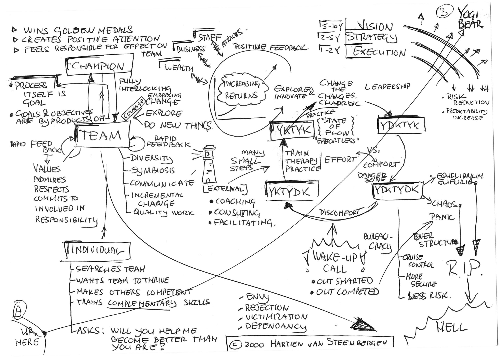

# Change the changes
### 2008-12-10

::: as-is

:::

Een {praatplaat} uit 2000 over:
- de cirkel Bewust Bekwaam → Onbewust Bekwaam → Onbewust Onbekwaam → Bewust Onbekwaam → Bewust Bekwaam → …;
- in het Engels: You Know That You Know → You Don't Know That You Know → You Don't Know That You Don't Know → You Know That You Don't Know → You Know That You Know → …
- leiderschap, team building en kampioenen;
- de fundamentele—en voor velen confronterende—vraag die je elk ander teamlid kan stellen:
  > **Wil jij mij helpen beter te worden dan dat jij bent?**

Wat mij triggerde om deze plaat weer boven water te halen was Dan Roam's artikel [Seeing What We Don't Know](http://digitalroam.typepad.com/digital_roam/2008/12/seeing-what-we-dont-know.html).

## You are here

> **If you don’t know where you are going, you might end up somewhere else.**
> > —Yogi Berra

> **If you don’t know where you are going, any path will take you there.**
> > —Alice in Wonderland

## Vision, Strategy, Execution

- Change the Changes
- State of Flow
- Explore & Innovate
- Increasing Returns
  - Positive Feedback
  - Self-reinforcement
  - Attracts Staff and Business and Wealth
  - Captures & Cultivates Collective Knowledge & Intelligence

### Vision
- Architectural Principles (5-10 year view)
- Take Risks
- Lead the Pack
- Show Direction

### Strategy
- Informatiebeleid (2-5 year view)
- Mergers & Acquisitions

### Execution
- Planning (1-2 year view)
- Process
- Goals & Milestones
- Short, iterative processes; driving a car

## Flow Spiral
Goal is to spiral yourself to ever higher states of consciousness, to self-unfold, to realize your full potential—as an individual, as an organization, and as a society—by taking many small steps rather than a few big ones. Small steps are less painful.

### YDKTYK: State of Flow
- You Don’t Know That You Know
- Process feels “effortless”
- On the edge between Chaos and Order (Chaordic State)
- Best place to be
- Optimal balance between Effort & Comfort
- Danger of “switching” to YDKTYDK Comfort State

### YDKTYDK: Extreme Discomfort & Death
- You Don’t Know That You Don’t Know
- Comfortably Numb
- Cruise Control
- Danger Zone!!!
- Self-affirmative; more secure; less risk
- Do the things you’ve so often done already
- Over-structured (bureaucracy)
- Further strengthen Comfortable Numb State: Equilibrium or Complete Order: R.I.P.
- Outsmarted or Outpaced
- Wake-up call by competition
- Glide into total Chaos & Panic (“_brandjes blussen_”: R.I.P.
- Discomfort to the Extreme
- Best way out: Transition to YKTYDK State

### YKTYDK: Therapy, Rehabilitation and Revalidation
- You Know That You Don’t Know
- Train, Coach, Facilitate – often by External Consultants
- Effort Required! Investment in Time & Material
- How? Many small steps
  - Avoid getting swamped, panic; c.f. your first driving lesson
  - Too large a change will increase resistance; Try to avoid by taking many small steps rather than one big step
  - Loosing weight: not 10 kg in a year, but 1 kg every month: short result-driven iterations
  - Focus on _Genot Gemak Gewin_
  - Be aware of Affect, Behavior, Cognition (Gevoel, Gedrag, Gedachten)
    - Identify typical patterns of ABC
    - Understand how these unwanted patterns emerged from the past
    - Describe the complete ABC chain (this is time intensive)
    - Create a break-through strategy to address the issue
    - Practice new ABC over and over again (therapy)
    - Changing Affect is hardest because of emotional resistance
  - Focus on positive feedback, increasing returns
- Transition to YKTYK State

### YKTYK: Repeat, over and over again
- You Know That You Know
- Effort still required
- Exercise, Execute, over and over again, until you get into a State of Flow again

### State of Flow: Flow = Team + Process
- Charter:  have a common direction and still remain individual distinct
  - Avoids Not Invented Here Syndrome
- Objective
  - Change (better still: Change the Changes)
  - Do New Things
- Threat: internal competition and envy
- Key Strengths
  - Diversity: Total is much much more than the sum of its parts!
  - Symbiosis: State of Living Together or Cooperative Relationship
  - Fully Interlocking
- Killing Teams:
  - Envy
  - Reject others
  - Feel victimized by others
  - Feel dependent on others
- Killer Teams:
  - Cultivate Diversity
    - Therefore advance faster
    - Are Constantly Getting Better in Getting Better
  - Values the others
  - Admires the others
  - Compliments the others (be/ask about specifics)
  - Emphasize the Importance of Contribution of Others to Your Performance
  - Survive Disasters
  - Fully Respect other Team Members
  - Are Committed
  - Give Good Feedback
  - Are Involved
  - Take many small steps, rather than a few big ones
- Topper
  - Wins the Golden Medals
  - Creates Positive Attention for the Whole Team
  - Feels Responsible for His Effect on Whole Team
- Individual Team Members
  - Search Teams
  - Want Team to Thrive & Survive
  - Make others competent
  - Ask: “Will you help me become better than you are?”
  - Train in Skills they don’t already have
  - Excels in some Specific Areas
  - Know that they’ll die if the team dies
- Process
  - Process is most interesting, not the goal itself
  - Explore!!!
  - The Pleasure is in the Climbing, You’re Only at the Top for a Short Time
  - Software Process Improvement is a process in itself
  - Results (goals & milestones met) are the byproducts of process

## All this is recursive, fractal
- Remember that Process Improvement is a Process in Itself
