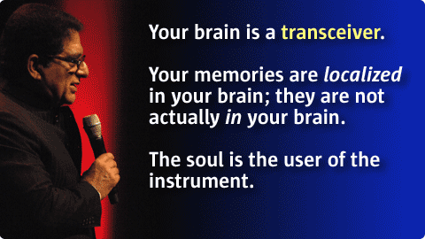

# De ziel van Leiderschap
### 2008-04-16

::: vista

:::

Een prachtige dag in een redelijk zonnig Almere met Deepak Chopra. En ja, hij heeft in de ochtend de hele werking van het Universum helder uit de doeken gedaan. Einstein, kwantumfysika, de wet van de aantrekkingskracht, de ziel, het bewustzijn. Ook de video van [[Op slag inzicht]] van Jill Bolte Taylor werd 's middags integraal getoond.

Veel dank aan Kees en Arthur van Zijtveld & Team van Nieuwe Dimensies voor het chaorganiseren van deze waardevolle dag.

Hieronder mijn aantekeningen, waarvan uitgewerkt:
- [[Zielsprofiel]]
- [[Droom]]

<a href="soul-of-leadership-martiens-notes.pdf" download>Martien's aantekeningen van The Soul of Leadership</a> (pdf)