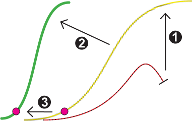

# Doorbraakversneller
### 2008-04-06

De ontwikkeling van de Doorbraakversneller™ is gestart.

::: as-is

:::

De Doorbraakversneller:
1. **Vergroot de kans** op het succesvol doorbreken van goede ideeën, samenwerkingsverbanden en technologiën.
1. **Verkort de tijd** tot volledige wasdom.
1. **Haalt het "tipping point" dichterbij**. Kortom:
> **De Doorbraakversneller katalyseert hiepergroei**.

Gebaseerd op de natuurlijke en spirituele wetten van [[simplexity|simplexiteit]] die geleid hebben tot de successen zoals de telefoon, het Internet en Wikipedia richt de Doorbraakversneller zich daarbij op de volledige ontplooiing van de mens. En alles aan de Doorbraakversneller wordt volledig open source.

Ideale kandidaten de Doorbraakversneller zijn in eerste instantie veelbelovende organisaties en samenwerkingsverbanden en projecten of programma’s die zijn vastgelopen of dreigen vast te lopen zijn (bijvoorbeeld: zorg, diverse sectoren, onderwijs, overheden).

Initiatieven en projecten die bijdragen aan **duurzaamheid**, **samenlevenskunst** en het **helen van Nederland** en onze Aarde hebben de grootste aantrekkingskracht op de Doorbraakversneller.

Het creëert met alle betrokkenen een omgeving waarbinnen letterlijk energie (kennis, creativiteit, nut, toegevoegde waarde, etc.) weer kan stromen en minder energie wordt verspild. **Sociale en zakelijke zingeving** dus. Het besturingssysteem is gebaseerd op **holacratie**—het vlechtwerk van **sociocratie** en "**agile development**".

Het is een volledig **open source platform** dat een sociale vertaling is van open-source successen zoals Wikipedia. Dienstverlening wordt volgens het Creative Commons-principe ontwikkeld.

De Doorbraakversneller is en wordt natuurlijk zelf ook een **co-creatie**. Als jij in staat en bereid bent om mee te bouwen aan de Doorbraakversneller, [[contact|neem dan contact op]] en wordt deelgenoot. [[Aardborrel 003]] staat in het teken van die kameraadschap.

De Doorbraakversneller is op zich zelf een ecologisch systeem dat werkt vanuit natuurlijke ordeningsprincipes. Via het open platform werken kleine en grote organisaties samen om complexe vraagstukken op te lossen en doorbraken te realiseren.

Ter illustratie hebben we <a href="aardbron-doorbraakversneller-interview-005.pdf" download>Paul Witteman interviewt Dennis Kerkhoven over de Doorbraakversneller™</a> verzonnen (PDF, 704 KB).

#### Wanneer breek jij door?
Exponentieel ontwikkelen kun je leren in [[Doorbreken in 7 stappen]].
