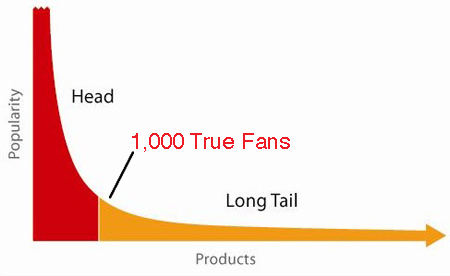
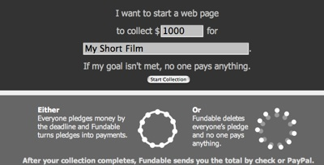

# Duizend echte fans

::: as-is

:::

Vrij naar [Kevin Kelly](http://www.kk.org/)'s [1,000 True Fans](http://www.kk.org/thetechnium/archives/2008/03/1000_true_fans.php).

---
De [[kwispel de langstaart der liefde|langstaart]] is bijzonder goed nieuws voor twee klassen van mensen:
* **een paar gelukkige verzamelaars** zoals Amazon en Netflix; en
* **6 miljard consumenten**.

Van die twee denk ik dat consumenten een grotere beloning verdienen van de rijkdom verborgen in ontelbare hoeken.

Maar de langstaart is beslist een gemengde zegen voor de makers. Individuele kunstenaars, producenten, uitvinders en scheppers zijn verloren gegaan in de vergelijking. De langstaart verhoogt de verkoop van de schepper niet veel, maar voegt wel enorme concurrentie toe en een eindeloze neerwaartse druk op de prijzen. Tenzij kunstenaars grote verzamelaars van de werken van andere kunstenaars worden biedt de langstaart geen pad uit het rustige windstille gebied van minuscule verkopen.

Wat kan een kunstenaar doen om te ontsnappen aan de langstaart, behalve het mikken op een kassucces?

**Een oplossing is om {duizend echte fans} te vinden**. Terwijl sommige kunstenaars dit pad hebben ontdekt zonder het zo te noemen, denk ik dat het waardevol is om dit te proberen te formaliseren. De kern van {duizend echte fans} eenvoidig worden worden verklaard:

> Een schepper, zoals een kunstenaar, muzikant, fotograaf, vakman, performer, animator, ontwerper, videomaker of auteur—in andere woorden, iedereen die kunstwerken produceert—dient slechts {duizend echte fans} te verzamelen om te kunnen bestaan.

Een **‘echte fan’** wordt gedefinieerd als **iemand die van alles en nog wat dat je produceert aanschaft**. Ze zullen 200 km rijden om je te zien zingen. Zij kopen de superdeluxe opnieuw uitgebrachte hi-res box set van je spullen, ook al hebben ze de low-res versie. Ze hebben een Google-melding voor je naam. Zij hebben een boekenlegger op de eBay-pagina waar jouw edities verschijnen die uit druk zijn. Ze komen naar jouw openingen. Ze laten je hun kopieën ondertekenen. Zij kopen het t-shirt, en de beker, en de hoed. Ze kunnen niet wachten tot je je volgende werk uitbrengt. Ze zijn echte fans.

::: as-is

:::

**Maak rechtstreeks verbinding met jouw echte fans** om je omzet uit de het platte gedeelte van de langstaart te trekken. In andere woorden: **converteer duizend Kleine Fans naar {duizend echte fans}**.

Veronderstel, conservatief, dat je echte fans elk één dagloon per jaar ter ondersteuning van wat je doet aan je uitgeven. Dat “één dagloon” is een gemiddelde, want natuurlijk zullen jouw waarste fans veel meer dan dat spenderen. Laten we die per diem die elke {echte fan} besteedt op vaststellen op €100 per jaar. Met 1.000 fans levert dat €100.000 per jaar op, hetgeen, minus enkele bescheiden kosten, een goed leven is voor de meeste mensen.

Duizend is een haalbaar aantal. Je kan tot 1.000 tellen. Als je één fan per dag toegevoegd, duurt het slechts drie jaar. {echt fanship} is uitvoerbaar. Een {echte fan} een plezier doen voelt prettig en stimulerend. Het beloont de kunstenaar om trouw te blijven, om zich te concentreren op de unieke aspecten van hun werk, juist die kwaliteiten die echte fans waarderen.

De belangrijkste uitdaging is dat je direct contact met jouw {duizend echte fans} dient te koesteren. Ze geven je hun steun rechtstreeks. Misschien is komen ze naar jouw huisconcerten, of ze kopen jouw DVD's van je website, of ze bestellen jouw afdrukken via Albumprinter of de HEMA. Je verzekert je zoveel mogelijk van hun steun. Je profiteert van de directe feedback en liefde.

Verbindingstechnologieën en snelle productie maken deze cirkel mogelijk. Blogs en RSS-feeds druppelen het nieuws en komende optredens of nieuwe werken naar je fans. Websites tonen galerijen van jouw vroegere werk, biografische archieven en catalogi van [parafernalia](https://nl.wiktionary.org/wiki/parafernalia). Schijffabrikanten, [Blurb](http://www.blurb.com/), winkels voor snelle prototypes, [Hyves](https://nl.wikipedia.org/wiki/Hyves), [Myspace](https://myspace.com), [Facebook](http://www.facebook.com/) en het hele digitale domein zweren allemaal samen en maken duplicatie en verspreiding in kleine hoeveelheden snel, goedkoop en gemakkelijk. Je hebt geen miljoen fans nodig om de productie van iets nieuws te rechtvaardigen. Een kleine duizend volstaat.

Deze kleine cirkel van ‘diehard’ fans, die je kunnen voorzien in je leven, is omgeven door concentrische cirkels van kleinere fans. Deze mensen zullen niet alles kopen wat jij doet en je kan niet rechtstreeks contact met ze zoeken, maar ze zullen veel van wat je produceert kopen. De processen die je ontwikkelt om je echte fans te voeden, koesteren ook de kleinere fans. Met het verzamelen van nieuwe echte fans kan je ook veel meer kleinere fans toevoegen. Als je daarmee doorgaat kan je inderdaad eindigen met miljoenen fans en een hit scoren. Ik ken geen creator die niet is geïnteresseerd in een miljoen fans.

Maar het punt van deze strategie is om aan te geven dat je geen hit nodig hebt om te overleven. Je hoeft niet te streven naar de korte kop van best-sellerdom om te ontsnappen aan de langstaart. Er is een plek in het midden, niet heel ver van de staart, waar je in ieder geval van kunt leven. Die haven halverwege heet {duizend echte fans}. Voor een kunstenaar is het een alternatieve bestemming om naar te streven.

Jonge artiesten die beginnen in deze digitaal gemedieerde wereld hebben een ander pad dan die van sterdom, een pad mogelijk gemaakt door de technologie die zorgt voor de langstaart. In plaats van de poging om de smalle en onwaarschijnlijke pieken van platina hits, bestseller blockbusters en beroemdheid te bereiken kunnen zij streven naar een directe verbinding met {duizend echte fans}. Het is een veel zinniger bestemming om voor te hopen. **Je hebt een leven in plaats van een fortuin.** Je bent niet omringd door een bevlieging en modieuze dwazen, maar door echte fans. En je maakt veel meer kans om daar daadwerkelijk aan te komen.

Een paar kanttekeningen. Deze formule—éénduizend directe echte fans—is gemaakt voor één persoon, de solo-artiest. **Wat gebeurt er in een duo, kwartet of film crew?** Uiteraard heb je dan meer fans nodig. Maar de extra fans die je nodig hebt staan in rechtstreekse geometrische verhouding met de stijging van jouw creatieve groep. In andere woorden, als u jouw groep met 33% in omvang toeneemt dien je slechts 33% meer fans toe te voegen. Deze lineaire groei staat in contrast met de exponentiële groei waarmee veel dingen in het digitale domein zich opblazen.

Ik zou het niet verrassend vinden dat de waarde van jouw netwerk van echte fans de regel van het standaard netwerkeffect volgt en zich verhoogt als het kwadraat van het aantal fans. Zoals jouw echte fans zich met elkaar verbinden zullen zij makkelijker hun gemiddelde bestedingen aan jouw werken verhogen. Dus terwijl de toename van het aantal artiesten betrokken bij de creatie het aantal benodigde echte fans verhoogt, zal die verhoging niet ontploffen maar zachtjes en in verhouding stijgen.

Een belangrijkere **waarschuwing**: Niet elke kunstenaar is in staat of bereid om een hoeder van fans te zijn. Veel muzikanten willen gewoon muziek maken, veel fotografen willen gewoon mooie platen schieten, veel kunstschilders willen gewoon prachtige doeken schilderen, en ze willen met name niet omgaan met fans, met name met echte fans. Voor deze creatievelingen hebben ze een bemiddelaar, een manager, een handelaar, een agent, een gallerijhouder nodig—iemand die zich bekommert om hun fans. Ondanks dat kunnen ze nog steeds streven naar dezelfde middelste bestemming van {duizend echte fans}. Ze werken gewoon in duet.

**Derde onderscheid**. Rechtstreekse fans zijn het beste. Het aantal echte fans die nodig zijn om brood op de plank te hebben stijgt indirect snel maar niet oneindig. Neem bloggen als voorbeeld. Omdat de steun van een fan voor een blogger door middel van reclameklikken loopt (behalve bij de incidentele fooienpot), zijn meer fans nodig om een blogger in leven te houden.

Ondanks dat dit de bestemming op de langstaart curve naar links beweegt, is het echter nog steeds ver verwijderd van het grondgebied van de kaskraker. Hetzelfde geldt voor uitgeven van boeken. Wanneer de betrokken bedrijven de meerderheid van de inkomsten voor jouw werk afromen heb je veel meer echte fans nodig om je te ondersteunen. **Hoe meer een auteur rechtstreekse contacten met zijn of haar fans cultiveert, hoe kleiner het aantal benodigde fans.**

**Ten slotte varieert het werkelijke aantal afhankelijk van de media**. Misschien is het 500 echte fans voor een kunstschilder en 5.000 echte fans voor een videomaker. De getallen zullen in de hele wereld zeker variëren. Maar het werkelijke aantal is in feite niet kritisch omdat het niet kan worden bepaald behalve door het te proberen. Als je eenmaal in die modus bent zal het werkelijke aantal duidelijk worden. Dat zal het aantal echte fans dat voor jou werkt duidelijk worden. Mijn formule kan er een aantal factoren naast zitten maar zelfs dan is het vele malen minder dan een miljoen.

Ik heb de literatuur doorkruist op zoek naar alle verwijzingen naar **het echte fan-getal**. Carl Steadman, mede-oprichter van [Suck.com](http://www.suck.com/),  heeft een theorie over microberoemdheden. Naar zijn telling is een microberoemdheid iemand met 1.500 fans. Dus die vijftienhonderd jubelen over jou. En om Danny O'Brien aan te halen: “Eén persoon in élke stad in Groot-Brittannië vindt jouw domme online comic leuk. Dat is voldoende om je het hele jaar in bier (of T-shirt verkoop) te dompelen.”

Anderen noemen deze ondersteuning van een microberoemdheid microsteun, microbegunstiger of gedistribueerde steun.

In 1999 publiceerden John Kelsey en Bruce Schneier hier een model voor First Monday, een online dagboek. Zij noemden dit het ‘**straatartiestenprotocol**’ ([Street Performer Protocol](https://www.schneier.com/wp-content/uploads/2016/02/paper-street-performer.pdf’)).

Met behulp van de logica van een straatartiest gaat de auteur rechtstreeks naar de lezers voordat het boek is gepubliceerd; wellicht zelfs nog voordat het boek is geschreven. De auteur omzeilt de uitgever en maakt een openbare verklaring over de volgorde van: “Als ik €100.000 ontvang in donaties geef ik de volgende roman uit in deze serie.” [een mooi voorbeeld van de **{geldtuimelaar}**—[[Martien]]]

::: as-is

:::

Lezers kunnen naar de website van de auteur gaan, zien hoeveel geld is al gedoneerd en doneren geld met het doel haar roman uit te brengen. Merk op dat het de auteur niet schelen wie betaalt om het volgende deel uit te brengen, noch maakt het haar uit hoeveel mensen het boek lezen en er niet voor betaald hebben. Hij zorgt gewoon dat zijn €100.000 pot wordt gevuld. Wanneer dit het geval is publiceert hij het volgende boek. In dit geval betekent ‘publiceren’ gewoon ‘beschikbaar stellen’, niet ‘binden en te verspreiden via de boekhandel.’ Het boek is beschikbaar gesteld, gratis, voor iedereen—voor wie betaald en wie niet.

In 2004 gebruikte auteur [Lawrence Watt-Evans](http://www.watt-evans.com/) dit model om zijn nieuwste roman te publiceren. Hij vroeg zijn echte fans gezamenlijk $100 per maand te betalen. Toen hij $100 verzameld had publiceerde hij het volgende hoofdstuk van de roman. Het hele boek is online gepubliceerd voor zijn echte fans en vervolgens later op papier voor al zijn ‘gewone’ fans.

Hij schrijft nu een tweede roman op dezelfde manier. Hij komt hiermee rond door met een geschatte 200 echte fans omdat hij ook op de traditionele wijze publiceert—met voorschotten van een uitgever en ondersteund door duizenden kleinere fans. Andere auteurs die gebruik maken van fans voor directe ondersteuning van hun werk zijn Diane Duane, Don Sakers en Sharon Lee en Steve Miller. Game designer Greg Stolze werknemers zetten een soortgelijke **echte fan-model in voor de voorfinanciering** van twee te lanceren spellen. Vijftig van zijn echte fans hebben startkapitaal bijgedragen voor zijn ontwikkelkosten.

Het genie van het echte fan-model is dat de fans in staat zijn om een kunstenaar in een grotere mate dan hun cijfers aangeven uit de buurt van de randen van de langstaart te bewegen. Zij kunnen dit op drie manieren doen:
1. door per persoon meer aan te schaffen;
1. door rechtstreeks aan de maker te betalen zodat zij per verkoop meer marge overhoudt; en
1. door nieuwe modellen van ondersteuning mogelijk te maken.

Nieuwe modellen van ondersteuning omvatten ook microbegunstiging. Een ander model is **voorfinanciering van de opstartkosten**. Digitale technologie maakt vele vormen van deze steun van fans mogelijk.

[Fundable](http://fundable.com/) is een web-gebaseerde onderneming die het voor iedereen mogelijk maakt om een vast geldbedrag voor een project op te brengen terwijl de donateurs van het project gerust kunnen zijn dat het project uitgevoerd wordt. Fundable houdt het geld in kas totdat het volledige bedrag is geïnd. Zij geeft het geld terug als het minimumbedrag niet wordt bereikt.

::: as-is

:::

Hier is een voorbeeld van de Fundable website:

> Amelia, een twintig jaar oude klassieke sopraanzangeres, ‘voorverkocht’ haar eerste CD, voordat ze een opname studio betrad. “Als ik $400 in de voorverkoop verzamel kan ik me de rest [van de studiokosten] veroorloven,” vertelde ze potentiële bijdragers. Fundable's alles-of-niets-model zorgde ervoor dat geen van haar klanten geld zou verliezen als ze in haar doel tekort schoot. Amelia verkocht voor meer dan $940 aan albums.

Duizend euro zal zelfs een hongerende kunstenaar niet lang in leven houden, maar met grote aandacht zal een toegewijd kunstenaar daar beter toe in staat zijn met de hulp van haar echte fans.

Jill Sobule, een muzikant die gedurende vele jaren van toeren en opnemen een aanzienlijke gevolg heeft verzameld, doet het goed op basis van haar echte fans. Onlangs besloot ze om haar fans te vragen voor de financiering van de $75.000 nodig als vergoeding voor professionele opnames die zij nodig had voor haar volgende album. Ze heeft bijna $50.000 verzameld tot nu toe. Door deze rechtstreekse ondersteuning groeit de intimiteit tussen de fans en hun kunstenaar. Volgens de Associated Press:

> Inzenders kunnen kiezen voor een niveau van onderpand, variërend van de $10 voor “ongepolijste rock”, voor een gratis digitale download van haar schijf zodra die gemaakt is, tot en met $10.000 “superdelux plutonium niveau,” waar ze belooft “, dan kom je zingen op mijn CD. Maak je geen zorgen voor als je niet kunt zingen—dat regelen wij wel.” Voor een bijdrage van $5.000 geeft ze een concert in het huis van de donateur. De lagere niveaus, waar donateurs zaken zoals een geavanceerde kopie van de CD, een vermelding in het CD-boekje en een T-shirt die de ze als een ‘junior executive producer’ van de CD identificeert kunnen verdienen, zijn gewilder.

Het gebruikelijke alternatief voor het in leven blijven gebaseerd op echte fans is armoede. In een recente studie uit 1995 bleek dat de aanvaarde prijs om een kunstenaar te zijn groot is. Sociologe Ruth Towse ondervraagde kunstenaars in Groot-Brittannië en stelde vast dat zij gemiddeld onder de armoedegrens verdienden.

Ik stel dat er tussen armoede en de sterdom een plek is voor creatieven. Ergens lager dan het stratosferische bestsellerdom, maar hoger dan de duisternis van de langstaart. Ik weet het werkelijke aantal niet, maar ik verwacht dat een specifieke artiest {duizend echte fans} kan cultiveren en door hun directe ondersteuning en het gebruik van nieuwe technologie een eerlijk leven kunnen leiden. Ik wil graag horen van iemand die zich op een dergelijke een pad heeft gevestigd.