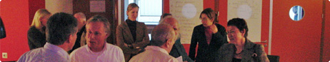
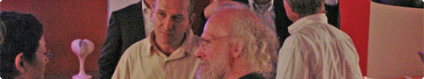

# Feedback van de deelgevers van het eerste uur
### 2007-12-14

11 december organiseerden Martien en ik vanuit Aardbron onze eerste samenscholing bij Seats2Meet. In de voorbereiding werd duidelijk dat de deelnemers van onze samenscholingen geen deelnemers zijn in de oude zin van het woord. Martien begon hen deel_gevers_ te noemen. Een stukje bevrijd van het gewone, streepten we opgelucht de term deelnemer door en spreken we vanaf dat moment van harte van _deelgever_.

Alle deelgevers vulden op het eind een evaluatieformulier in. Uit de evaluatieformulieren blijkt het volgende.

::: vista

:::

**Energie** – 80% van de deelgevers gaat met meer energie naar huis en ruim 13% gaat met evenveel energie weg als zij of hij is gekomen. Net geen 7% gaat met minder energie weg.

**Beeld Peer-to-Peer, Nieuwe beschaving en Holacratie** – Na de samenscholing geeft 60% van de deelgevers aan dat zij tenminste een goed beeld van Peer-to-Peer en de Nieuwe Beschaving hebben. Bijna 27% is neutraal en de overige ruim 12% heeft hiervan nog geen goed beeld. Met betrekking tot Holacratie geeft eenderde aan dat zij hiervan tenminste een goed beeld hebben. De meeste deelgevers (bijna 47%) hebben noch een goed noch geen beeld van Holacratie. 20% zegt geen beeld te hebben.

**Kijken naar de toekomst van organisatie en samenleving** – Voor ruim eenvierde van de deelgevers is de blik naar de toekomst van organisatie en samenleving veranderd. Voor 40% is die blik niet veranderd. De overige deelgevers nemen een neutrale positie in.

::: vista

:::

**Vertaling naar de praktijk van alledag** – Iets meer dan de helft van de deelgevers wil weten hoe dit concept in zijn of haar dagelijks werk en leven toe te passen is. Bijna 27% hoeft dit niet te weten en 20% is neutraal over dit wel of niet willen weten.

Met betrekking tot de samenscholing is de deelgevers gevraagd of het **leren van elkaar** voldoende ruimte heeft gekregen, zij **goede nieuwe ideeën** hebben ontvangen, of zij **nieuwe mensen** hebben leren kennen en of ze de samenscholing als **traumatisch** hebben ervaren.

Voor 60% heeft het leren van elkaar voldoende ruimte gekregen; voor eenderde van de deelgevers niet. Tweederde van de deelgevers heeft goede nieuwe ideeën ontvangen, iets meer dan een kwart is hierover neutraal en bijna 7% heeft geen goede nieuwe ideeën ontvangen. Ruim de helft heeft nieuwe mensen leren kennen, bijna 7% heeft geen nieuwe mensen leren kennen. De overige deelgevers zijn neutraal. Voor geen der deelgevers was de samenscholing traumatisch.

::: vista

:::

**Tijd te kort** – De meeste deelgevers (ruim 85%) vinden dat deze samenscholing een meerdaagse workshop verdient. De overige deelgevers vinden dit niet.

**Gemiddelde score** – De gemiddelde score op de 5-punts-schaal is 3,3. Hoogste gemiddelde score (4,2) is voor het met meer energie weer naar huis gaan, gevolgd door de gelijke scores (3,9) voor het ontvangen van goede nieuwe ideeën en voor de beoordeling dat deze samenscholing een meerdaagse workshop verdient.

**Gouden tips** – We vroegen ook naar een Gouden Tip, het was tenslotte onze eerste keer. De Gouden Tips blijken warme harten onder de riem: ga door met inspireren, doorgaan, zorg voor continuïteit van deze samenscholingen. Maar ook: (nog) meer interactie, balanceer theorie, praktijk en beleving uit.

Deelgevers van het eerste uur, dank je wel. 11 december is een wonderbaarlijke opmaat naar de volgende samenscholing geworden. Zeker met de **krachtige symbolen** die jullie aan het eind deelden: olympische fakkel/vuur, kaars, (Japanse) kersenbloesem en de euro. Hoofd in de wolken, voeten in de klei.

[[veelbelovend begin nieuwe beschaving|Lees ook Martien's verslag]].
