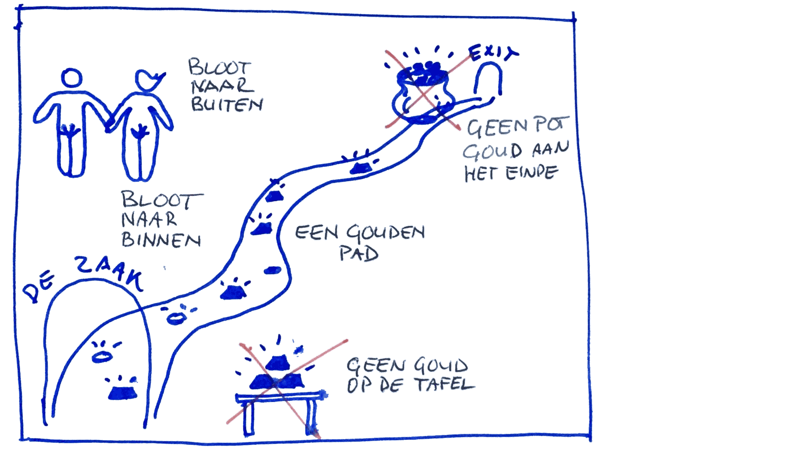

# Wat meten we?

Om te floreren meten we:

- Hoe blij we zijn (zie de [[geluksindex]]).
- Hoe blij onze klanten zijn.

Onze [[ecosofie]] regeert al ons zakelijke en financiële [[huishouden]], dus ook hoe we [[floreren]].

## Hoe betalen wij onze thuisbasis?

{de zaak} is een collectief zonder winstoogmerk. Wij streven ernaar om de uitgaven en enige _overhead_ tot het absolute minimum te beperken. Daardoor blijft ieders bijdrage zo laag mogelijk en houdt iedereen zoveel mogelijk over. Om onze kosten te dekken betaalt elke meemaker een bepaalde ‘verlichting’. We noemen dat verlichting omdat de kosten gemaakt worden om het werk van iedereen te verlichten en mogelijk en plezierig te maken.

De verlichting bestaat uit een vast bedrag plus een percentage van de omzet van de consultant. Het totale bedrag varieert en is afhankelijk van de kosten die we besloten hebben te maken. De bijdrage dient uitsluitend om de vaste kosten te dekken. Daarom passen we de bijdrage elk kwartaal [ad hoc](https://nl.wikipedia.org/wiki/Ad_hoc) aan op basis van hoeveel geld we in kas hebben. Als we minder dan onze gewenste liquiditeit in kas hebben gaat de bijdrage omhoog, en vice versa. Eén voorbeeld van kosten die we maken is de accountant ons fiscaal en financieel ontzorgt en gezond houdt.

## Waarom een vaste en variabele bijdrage?

Als we alleen maar een vaste bijdrage hebben, hebben consultants die op de bank zitten al snel geen geld meer. Als we alleen een variable bijdrage hebben, kunnen we in de problemen komen om onze vast kosten te betalen als er veel consultants op de bank zitten. Met een vaste en variabele bijdrage hebben we een prettige balans die past bij bij het feit dat onze kosten ook vast en variabel zijn. Kortom, dit model is precies goed.

## Plafond

We hebben ook een plafond dat de totale jaarlijkse bijdrage van een consultant begrenst. Sommige consultants verdienen een stuk meer dan anderen en we willen voorkomen dat die vertrekken omdat ze {de zaak} te duur vinden. Het plafond schommelt rond de €10k per jaar. De variabele bijdrage bedraagt meestal 5% tot 15% van de jaarbijdrage.

In [[huishouden]] lees je concrete voorbeelden.

## Wat doen we met het geld?

Dit plaatje vertelt wat we met het geld doen:

::: as-is

:::

De leidende principes zijn:

- **Bloot naar binnen, bloot naar buiten**
    - Je hoeft er geen vermogen in te stoppen om in te stappen.
    - Je kunt niets verzilveren als je uitstapt.
- **Geen goud op de tafel**
    - We verzamelen geen financiële waarde in het bedrijf.
- **Geen pot goud aan het einde**
    - Er is geen financiële prikkel om het bedrijf te verkopen.
- **Een gouden pad**
    - Jij houdt het meeste wat je verdient terwijl je het verdient.

## Waarom bouwen we geen financiële waarde op?

Een grote berg geld geeft meteen een prikkel om een aandeel in {de zaak} te hebben en verhoogt het risico op conflict, met name als de waarde van {de zaak} op en neer gaat. Als we {de zaak} slank houden, met een kleine liquiditeitsbuffer, hoeven we niet te ruziën over wat van wie is.

In [[huishouden]] en [[bezitten]] lees je meer in detail hoe het geld door het systeem vloeit.

## Met zijn hoevelen willen we zijn?

- Wij hebben geen groeidoel. Groei is niet een doel op zich. Om ons te verzekeren van continuïteit en veerkracht willen we wel een kritische massa hebben van tenminste 15 meemakers.
- Wij groeien alleen als we fantastische mensen vinden en niet lijden aan groeipijn.

Wij [[werven]] uitsluitend schitterende individuen.

## Hoe draaien we {de zaak}?

- **Slank, Wendbaar & Open**—Onze aanpak heeft _[Lean](https://nl.wikipedia.org/wiki/Lean_manufacturing), [Agile](https://nl.wikipedia.org/wiki/Agile-softwareontwikkeling) & [Open Source](https://nl.wikipedia.org/wiki/Open_source)_ als basis.
- **Meritocratie & Consent**—We hebben geen functies, managers of rapportagestructuren. In essentie zijn we een [meritocratie](https://nl.wikipedia.org/wiki/Meritocratie), wat erop neerkomt  dat jouw macht om zaken te beïnvloeden gebaseerd is op jouw bekwaamheden en betrokkenheid. De meeste [[beslissen|beslissingen]] worden gemaakt op basis van consent.
- **Handel eerst en vraag later eventueel om vergiffenis**—Als iets wilt starten of iets wilt veranderen, ga je gang! Het standaard antwoord op elk voorstel of idee is “Natuurlijk! Als je erin gelooft en er tijd in wilt stoppen, ga je gang!” Maar weinig missers zijn fataal of onomkeerbaar, dus sporen we je aan om gewoon lekker te experimenteren in plaats van om toestemming te vragen.
- **Eenvoudige modellen**—Omdat we er zo van houden is het voor ons makkelijk om met gedetailleerde regels en structuren voor welk probleem dan ook te komen. Maar we doen echt ons best dat juist niet te doen! We willen {de zaak} graag eenvoudig houden en maken liever aan die kant fouten. Beter om minder dan meer regels te hebben. Beter om richtlijnen van hoog niveau te volgen dan gedetailleerde procedures op laag niveau.

Lees meer over hoe wij [[beslissen]].

## Hoe onderscheiden we ons?

Hoe zijn we anders dan een doorsnee adviesbureau?

- Wij verdienen geen geld aan onze meemakers.
- 100% vrijheid voor alle consultants zolang ze ons honk versterken.
- Ons enige doel is een goed thuis voor onze meemakers te bieden.

## Hoe zijn we anders dan een doorsnee netwerk van ZZP-ers?

- Wij zijn toegewijd aan {de zaak}—met andere woorden: wij dragen met trots ons lidmaatschap van {de zaak} gevraagd en ongevraagd uit.
- In sommige gevallen, met name bij grote en complexe trajecten waar meerdere consultants in samenwerken, factureren we bij voorkeur via {de zaak}.

## Waarom werkt deze strategie?

Ons [[systeem]] legt uit waarom dit model voor ons werkt.
