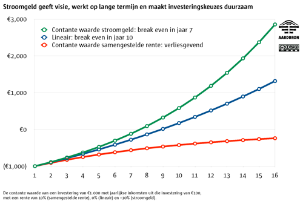

# Flow money
### 2010-02-22

Compound positive interest is a system wide exponential pump that increasingly flushes money from the poor to the rich. It compells us to grow beyond sense. It results in Obsessive Compulsary Growth Disorder, if you will.

This can be proven by mathematics, simulation and experience (as we all feel right now).

Don't get me wrong, development, unfolding, and evolving is good. But only asymptotic s-curved growth, not only exponential unlimited growth. Just take a look at the impossible hamster:

@[youtube](bqz3R1NpXzM)

**If you want to destroy a community**, introduce a monetary system where money can be owned (hoarded and ‘saved’) and with compound positive interest. Introduce it in such a way, that people are willing and able, eager even, to play this system. Mankind has succeeded in that.

Our current monetary system is like a cancer with metastasis into the smallest corners of our system. It cannot be treated. No irradiation, and no cutting will help. In fact, it will only fuel its self-destruction. Future monetary crises and crashes will happen more frequent, faster and will be deeper. The worst has yet to come, Schopenhauer would say.

Compound positive interest also makes each and everyone extremely short-sighted. The economy at large warps itself into short-term profits and utter efficiency. Exact the opposite of sustainability, durability and long-term wealth and richness—in the non-financial meaning.

It's extreme focus on efficiency makes the system as a whole brittle and oversensitive, allergic even to small changes. Flourishing systems have their dynamic balance somewhere in the middle between chaos and order—chaordic—with a slight preference for the chaotic side. **Chaos is creativity searching for order**. Likewise, **order (efficiency) is destructivity searching for chaos**. The sweet spot is an area (not a point) in the middle, nudged slightly towards chaos.

This short-sightedness is due to the economist's [Net **Present** Value](http://en.wikipedia.org/wiki/Net_present_value) calculations. Suppose you invest €1,000 to obtain an annual revenue of €100 during a period of 15 years, so €1,500 in total. You may think that this results in a profit of €500…

An economist however will tell you that €100 in a year will be worth €91 now (with an interest rate of 10%). The €100 in year 2 will be worth €83 now and €75 in year 3 , and so forth. The €100 in year 15 is worth a meager €24 now. All in all, in 15 years, the total Net Present Value of the revenue will be €761, resulting in a loss of €239. In other words, not a profitable investment—the red line in the graph below.

::: vista

:::

This affects our behaviour to **short-term financial gains** and an **obsessive compulsive focus on efficiency and profit**. Combined with the interest pump from poor to rich, this leads to a structurally instable and brittle system.

## Enter ‘flow money’

Flow money—a.k.a. ‘demurrage’ or liquidity tax—is, technically, a negative compound interest. Using exactly the same calculations and formulas as our economist did in the previous example and with an interest of –10%, the first €100 is worth €111 now, the 2nd €123 and the 15th €486, adding up to a total of €3,857 and a profit of €2,857! Break even is during year 7. The green line in the graph above.

Together with the effect that your balance trickles away (into a larger commons fund), this affects our behaviour in such a way that we will:

- **tend to spend our money sooner rather than later** since our buying power now is greater than later, resulting in a lot of employment opportunities, no more unemployed; and we'll chop the forest later rather than now, since we don't want the money now as it will seep away;
- **prefer sustainable, durable, resilient and long-term projects** over short-term ones; it gives all of us vision; we can see clearly now;
- **close the gap between the rich and the poor**; in fact there are only wealthy people and some very wealthy people; and our planet replenishes itself too.

If we can also get rid of the capacity to ‘own’ or hoard money, and we only use money for payment and measuring products and services, than no one is poor. Better still, everyone is rich.

Use money just like we use centimeters. We're never short of centimers (or inches or lightyears for that matter). Everyone is as wealthy as their activity in the community, small and large.

A fully digital giral value system with [[flow money]] combined with a dynamic [[trustspace]] comes to a neigbourhood near you soon.
