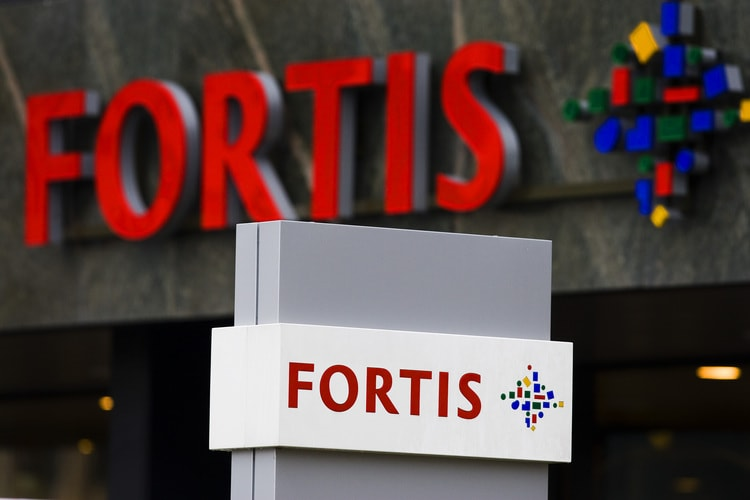
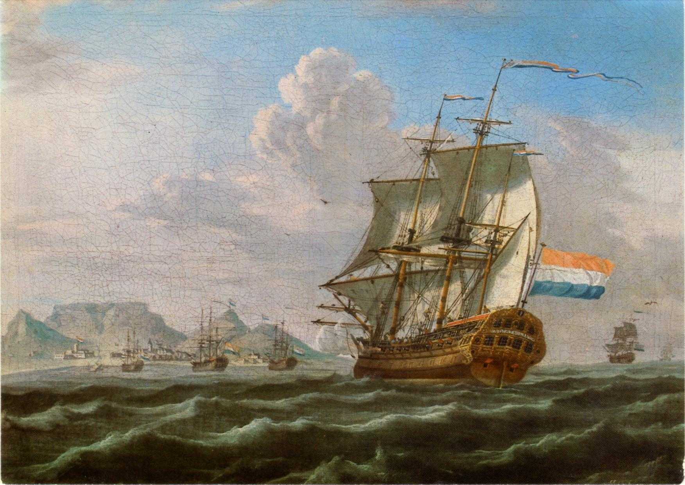

# Fortis failliet
### 2009-07-24

::: vista

:::

## Laten omvallen van banken goed voor échte mensen

Terwijl de financiële instellingen waar we op vertrouwen lijken te kantelen onder hun eigen gewicht haast ons natuurlijke instinct zich hen te steunen. Dit zijn de banken, investeringsgroepen, bedrijven en verzekeringen waaraan wij onze spaargelden, financieringen en beleggingen hebben uitbesteed. Zij financieren onze bedrijven en lenen het meeste van onze munt in bestaan.

Als we ons maar net een beetje meer bewust worden van hoe deze afhankelijkheid zich ontwikkelde en wat het ons op de lange termijn kost, dan kunnen we ervoor kiezen om hun tijdelijk verhoogde kwetsbaarheid naar compleet andere bestemmingen te leiden. **Als we ze allemaal op een rijtje zouden hebben dan kunnen we inderdaad ons best doen om onze grootste banken uit onze ellende te verlossen. Voorgoed.**

De huidige economische crisis is minder een resultaat van slechte besluitvorming door een paar bonuszoekende directieleden dan dat het de ingebedde logica is van een bank- en valutasysteem ontwikkeld tijdens de Renaissance en om redenen die weinig te maken met de bevordering van rijkdom en kansen.

Destijds werd de aristocratie steeds meer bedreigd door zowel een groeiende handelaarsklasse als in toenemende mate welvarende lokale economieën. De zakelijke activiteiten van de permanente aristocratie werden minder en minder. Dus kwamen ze met **twee zakelijke innovaties** om het tij te keren.

::: vista

:::

**De eerste was de verenigigde compagnie** zoals de VOC. In ruil voor aandelen in de vennootschap verleent een koning haar een monopolie om zaken te doen in een bepaalde regio of sector. Vrij van concurrentie kon de onderneming innovatie vergeten en zich richten op uitbuiting. De vorst kon intussen wetten schrijven ten gusten van de handelspraktijken van de onderneming.

Dit is bijvoorbeeld de reden waarom de Amerikaanse kolonisten werd verboden kleding te fabriceren van de katoen ze verbouwden. Ze moesten het katoen tegen vaste prijzen verkopen aan de Britse East India Trading Company, die het vervolgens weer terug naar Engeland verscheepte waar er kleding van werd gemaakt die op hun beurt terug naar Amerika werden verzonden voor de verkoop. De kolonisten was het niet toegestaan om waarde toe te voegen aan de middelen die zij wonnen uit hun eigen grondgebied door er iets van te fabriceren. Ze mochten de middelen uitsluitend aan de onderneming leveren.

De verenigde compagnie werkte om te voorkomen dat iedereen behalve de verenigde compagnie waarde kon creëren of uitwisselen op een manier die niet onmiddellijk kon worden gewonnen door de compagnie. Elke waarde kon alleen worden gemaakt en gewonnen door **de monopolie van de verenigde compagnie**. Om mee te doen moest men óf voor de onderneming werken óf van de onderneming kopen óf in de onderneming te investeren.

**De andere belangrijkste vernieuwing, gecentraliseerde munt**, was ook bedoeld om te voorkomen dat mensen waarde rechtstreeks met elkaar uit konden wisselen. Gedurende de late middeleeuwen werden steden steeds rijker door gebruik van hun eigen valuta gebaseerd op graan. Een boer zou zijn oogst aan graan naar de graanschuur brengen en kreeg daarvoor een bon die kon worden opgedeeld in kleinere stukken en gebruikt als geld. In plaats van te groeien door **rente—slapend rijk worden**—verloor het geld waarde over de tijd. De graanschuur diende graan te verkopen om geld terug te verdienen en een deel van het graan ging verloren aan ratten of bederf.

Dit betekende dat mensen het geld zo snel mogelijk besteedden en herinvesteerden in preventief onderhoud, hoge lonen en plaatselijke activiteiten. Mensen aten goed en werkten minder dan wij vandaag. Ze hadden zo veel extra geld te investeren dat ze de grote kathedralen van Europa bouwden die, in tegenstelling tot algemeen geloof, niet zijn gefinancierd door het Vaticaan maar door kleine steden die daarmee zeer winstgevende pelgrimsoorden en toeristische trekpleisters voor het belang van de toekomstige generaties creërden.

De koninklijke noodmaatregel op al deze gedecentraliseerde rijkdom was om **de lokale munteenheid illegaal te verklaren** en te mandateren dat iedereen de munt van het koninkrijk moest gebruiken. Deze gecentraliseerde valuta's onstonden niet langer door de de verdiensten van landbouwers maar ontstonden door leningen van de centrale bank—meestal ook slechts een monopolie in opdracht.

In tegenstelling tot de overvloedige lokale munt verschoof de munt op basis van schaarse edele metalen de aandacht niet in de richting van de uitgaven maar in de richting van verzamelen en oppotten. Ontwerp ten gunste van de rijken.

Noch zakelijke statuten, noch gecentraliseerde valuta zijn ontwikkeld ter bevordering van de vrije markt maar juist **om een zuivere verdeling van de rijkdom te voorkomen**. Daarom walgt Adam Smith evenveel van overheden als ondernemingen—handlangers in misdaad.

Vandaag ontstaat geld nog steeds door bruikleen—niet door de overheid die, net zoals wij, geld moet lenen—van de centrale bank. De centrale bank leent het geld aan haar gelieerde ondernemingen, met rente, die dit vervolgens doorlenen aan kleinere banken, tegen een hogere rente, die dit vervolgens weer lenen aan bedrijven, tegen een nog hogere rente. Voor elke 100.000 euro geleend aan een bedrijf dient een hoger bedrag te worden terugbetaald. Waar komt dat extra geld vandaan? Van een ander bedrijf die van een bank geleend heeft. voor degene die wil slagen dient de ander failliet te gaan of te groeien.

Ziehier de **ingbouwde groeidwang** van bankgedreven investeringskapitaal. De mate van uitbreiding van een bedrijf of een markt is niet ingegeven door de vraag van de consumenten maar door haar schuldstructuur. **Ondernemingen zijn niets meer dan de namen voor schuld**. De enigen die blijvend verdienen in deze regeling zijn de kredietverstrekkers.

Daarom is het bijzonder ironisch dat, wanneer deze instellingen zich vertillen aan hun voordeel ten opzichte van ons en **verstrikt raken in de rentevalkuil van hun eigenbelang** onze eerste reactie is om hun manier van onvermogen om te betalen te betalen.

Wij besteden liever het geld van onze kleinkinderen aan de redding van de banken dan dat we in de eerste plaats tot het inzicht komen in hoe ze tegen onze belangen werken. **Banken zijn een last voor de economie, niet de bron van haar brandstof.**

Zelfs weinig of geen van de bankiers- of de investeringensstrategen zijn zich bewust van de geschiedenis van het geldsysteem waarmee ze werken of van de effecten van haar functioneren. “Zijn er andere soorten geld?” vragen ze dan?

Ja, die zijn er. En andere vormen van kredietverstrekkers. [Restaurant Comfort in Westchester](http://www.westchestermagazine.com/Westchester-Magazine/July-2009/Local-Currency-Local-Comfort/) geeft, na afgewezen te zijn door de bank, haar eigen dollars uit als een manier van financiering voor een uitbreiding. Stedelingen besteden slechts $100 voor voedsel met een waarde van $120. Een rendement van 20% voor ons en goedkoper geld voor de restaurateur. Bovendien krijgen we zo een beter restaurant in onze stad. Nu groeien en bloeien er onder de radar van het speculatieve kapitaal tientallen van deze lokale valuta door heel Amerika, gebruikt voor van alles: van autoreparatie tot babysitten. Dit is de reële economie die opkomt door noodzaak.

Het falen van reusachtig bankieren is minder een crisis dan **een kans om de verloren kunst van de lokale handel te hervinden**. Vergis je niet, een meerderheid van de bancaire rente is levend en wel en bloeit op basis van het traditionele zakelijke spaar-en kredietmodel van het nemen van stortingen van mensen of bedrijven en het verstrekken van leningen aan anderen. Zij nemen geen deel aan het gesprek, laat staan uitgenodigd voor de hoorzittingen.

**President Obama en minister Bos zijn en worden misleid** te geloven dat de economische kwalen te wijten zijn aan de weigering van grote banken om aan elkaar lenen. De banken hebben meer geld om uit te lenen dan wij nodig hebben om te lenen; dat creëerde de zeepbel van de huizenmarkt in de eerste plaats.

Zoals gijzelaars die lijden aan het [Stockholmsyndroom](http://nl.wikipedia.org/wiki/Stockholmsyndroom) zijn we de instellingen die beslag leggen op onze economie eerder gaan zien als onze weldoeners.

**Als een makke schapen worden we naar de slachtbank geleid.** We moeten stoppen om het huidige besturingssysteem van geld te aanvaarden als een gegeven omstandigheid van de economische realiteit. We moeten stoppen om de speculatieve economie waarin zij opereren als maatregel te accepteren voor de economische gezondheid van de echte wereld. Ze zijn het niet. Ze werden uitgevonden door mensen met belangen tegengesteld aan de onze en zij hebben reeds lang geleden het gebouw verlaten.

Vrij naar [ChangeThis » Too Big Too Live: Why Letting Banks Fail Is Actually Good For Real People](http://changethis.com/59.01.LifeInc) door **Douglas Rushkoff**.

## Aandeelhouder schuift aan tafel
 Stel je hebt een lekker lopend restaurant. Je wilt uitbreiden. De keuken, nieuwe apparatuur, andere tafels, verlichting, whatever. Daar heb je NU 50,000 euro voor nodig en die heb je niet. De bank wil ze je ook niet lenen om wat voor reden dan ook. Je hebt ze **nu** nodig, en niet pas over een jaar. Sparen heeft dus geen zin.

Gemiddeld eet een stel voor ongeveer 50 euro (2 of 3 gangen en een flesje wijn) en eten je vaste klanten tenminste 10 keer per jaar bij je (elke vijf weken wel een keer). Da's 500 euro per stel per jaar. Bied elk stel een dinerpas te koop aan ter waarde van 600 euro waar ze die ze **nu** voor 500 euro kunnen kopen.

Met 100 stellen heb je op deze manier **nu** 50,000 in kas voor je uitbreiding. En je deelgevende klanten hebben 20% meer koopkracht (of 20% korting, 't is maar hoe je't bekijkt). **Bovendien raken je klanten meer betrokken bij de tent.** Ze zijn geïnteresseerd in je plannen en het reilen en zeilen van je toko. Kortom, **ze worden echte deelgevers** (‘aandeelhouders’). Grote kans dat ze vrienden en familie ook meenemen (meer omzet). En omdat ze meer krijgen voor het zelfde geld komen ze mogelijk ook vaker en/of meer eten (meer omzet).

Als extra stimulans kan je ze ook nog een gratis etentje aanbieden voor elke twee nieuwe deelgevers (die ook zo'n dinerbon van 500 euro kopen) die ze aanbrengen.

Natuurlijk blijf je je kwaliteit en dienstverlening op tenminste hetzelfde niveau houden als wat je restaurant in de eerste plaats zo lekker liet lopen. Sterker nog, je kwaliteit gaat er waarschijnlijk op vooruit.

[Restaurant Blauw](http://restaurantblauw.nl/) in Utrecht/Amsterdam heeft iets vergelijkbaars:
- [Restaurant Blauw » Aandeelhouders](http://utrecht.restaurantblauw.nl/content/aandeelhouders)
- [Telegraaf » Aandeelhouder schuift aan tafel](http://utrecht.restaurantblauw.nl/var/UserFiles/File/telegraaf.pdf)
