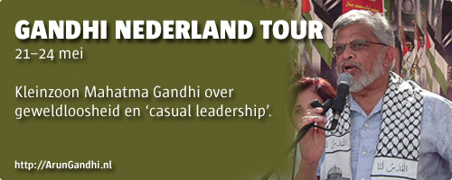

# Gandhi Nederland Tour
### 2009-04-25

::: vista

:::

**Arun Gandhi** is van donderdagmiddag 21 mei tot en met zondagmiddag 24 mei op tournee in Nederland.

[Arun Manilal Gandhi](http://en.wikipedia.org/wiki/Arun_Gandhi "Wikipedia » Arun Gandhi") (14 april 1934), kleinzoon van [Mahatma Gandhi](http://nl.wikipedia.org/wiki/Mahatma_Gandhi "Wikipedia » Mahatma Gandhi") (1896–1984), sluit eind mei zijn bezoek aan Europa af met een vierdaagse toer door Nederland om zijn 75e verjaardag te vieren.

Gandhi beschouwt zichzelf als hindoe, maar integreert concepten en zienswijzen uit het boeddhisme, hindoeïsme, christendom en de islam. Net zoals zijn grootvader gelooft hij in het concept van geweldloosheid (‘[ahimsa](https://nl.wikipedia.org/wiki/Ahimsa)’ of ‘non-violence’).

Arun Gandhi wakkert het licht in mensenharten aan met zijn vurig verlangen naar wereldvrede. “Kennis vergaar je op school, wijsheid door het leven”, zei zijn grootvader, een reden voor president Clinton om ‘drop-out’ Arun Gandhi tot drie keer uit te nodigen voor de samenscholingen van de Renaissance Weekends.

Al zijn handelingen voeren onvermijdelijk terug naar wat hij van Mahatma en Kasturba—opa en oma—geleerd heeft. Liefde, respect, begrip, acceptatie en waardering.

Je wordt alijd diep geraakt als je in zijn nabijheid bent en enige tijd met hem doorbrengt.

## Cadeau
Het mooiste cadeau wat we Arun Gandhi mee kunnen geven is een grote zak geld voor zijn goede projecten zoals gandhiforchildren.org.

Dus geven we hem al het geld wat we overhouden mee naar huis. Natuurlijk wordt iedereen die zich ingezet heeft voor de orkestratie van zijn bezoek aan Nederland netjes betaald voor zijn of haar inspanningen, met name vrijwilligers.

De boekhouding gooien we helemaal open en is voor iedereen ter inzage, zodat je weet waar jouw geld naartoe is gegaan. Als je jouw donatie liever niet publiek wilt maken dan tellen we het anoniem bij de giften op.

## Meemaken?!
Stel dat jij een paar uren de volledige beschikking over Arun Gandhi’s tijd en aandacht krijgt. Wat zou jij dan orkestreren?

Je bent bij deze van harte uitgenodigd om zijn bezoek aan Nederland mee te maken, letterlijk te cocreëren. Kom maar op met je wensen en ideeën zodat we hem met ons allen onvergetelijk gastvrij kunnen onthalen.

We willen Gandhi voor zoveel mogelijk mensen beschikbaar maken én met zo’n groot mogelijke gift naar huis laten gaan.

## ~~ArunGandhi.nl~~
 Het programma ontvouwt zich op ~~[ArunGandhi.nl](http://ArunGandhi.nl/)~~. Blijf op de hoogte en abonneer je aldaar op de postlijst of RSS-feed.

Op ~~ArunGandhi.nl~~ kan je je ideeën kwijt en kan je je inschrijven voor specifieke programmaonderdelen.
