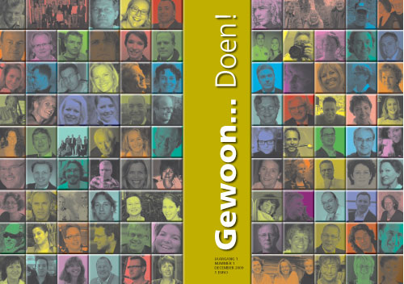

# Gewoon…doen!
### 2009-11-27

Ad Broere, Carin Wormsbecher, Arko van Brakel, Henk Smit en Peter van der Vliet sloegen de handen ineen en bundelden in een flits van 99 praktische idealisten de verhalen (en met een {p|geldtuimelaar} €100) zodat met een budget van €10.000 een zinnig tijdschrift leven ingeblazen wordt dat door de verhalenvertellers zelf wordt gedistribueerd.

Uiteraard deelt Aardbron daarin ook haar visie in exact 500 woorden (zie einde artikel).

Naast de papieren versie staat het magazine ook in haar geheel online (PDF).

::: vista

:::

**Persbericht: Presentatie nieuw magazine: GEWOON…DOEN!**

## WAT?
 Op 13 oktober was de afronding van het project: “Ontwikkeling van het nieuwe Ambachtsbedrijf” bij Driekant in Zutphen. Een bakkerij waar naast brood ook leerwerktrajecten worden aangeboden. Na Aukje Smit van TNO, die vertelde over de impact van het driejarige project op andere ondernemers, gaf Arko van Brakel zijn visie aan de 40 aanwezigen op het nieuwe ondernemen in de communicatiemaatschappij. Hij maakte een doorkijkje van de in essentie community gedreven grondbeginselen van alle wereldgodsdiensten naar moderne succesvolle bedrijven als Google. Vervolgens beschreef hij hoe universele principes als delen in overvloed en vermeerderen zakelijk worden toegepast. Hierna voerden de 40 deelnemers een dialoog over de vraag hoe dit gedachtengoed verder verspreid zou kunnen worden. Aan één van de tafels kwam Carin Wormsbecher van drukkerij Wedding uit Harderwijk met het volgende idee:

“Zou het niet leuk zijn à la You Tube, een gedrukt tijdschrift uit te geven waarin 100 ondernemers, of betrokkenen bij het nieuwe integrale ondernemen hun ervaring, of hun visie delen. Iedereen legt 100 Euro in. Dan heb je 10.000 Euro, daar kunnen wij een tijdschrift voor maken. (Aardbron noemt dit een {p|geldtuimelaar}) We doen dat in een oplage van 10.000. Iedere schrijver van een artikel krijgt 100 exemplaren en zorgt zelf voor de verspreiding van deze exemplaren, dan is gelijk de distributie ook geregeld. 100 geïnspireerde verhalen over bezielend ondernemen. Ik zou het hartstikke leuk vinden om al die verhalen te lezen…”

Ad Broere, schrijver van “Een menselijke economie”, Carin Wormsbecher van drukkerij Wedding, Arko van Brakel, schrijver van “Iedereen ondernemer”, Henk Smit van Driekant en Peter van der Vliet, bruggenbouwer met passie hebben vervolgens de handen in een geslagen.

Het is een goed idee gebleken: er hebben 99 auteurs een verhaal geschreven. Stuk voor stuk inspirerende verhalen over het nieuwe ondernemen. Een unieke bundeling, van wat er allemaal aan nieuwe ideeën leeft bij ondernemende mensen. Via een nieuwe formule vormgegeven. Een idee waarbij internettoepassingen een inspiratiebron zijn voor een gedrukt magazine.

Op 9 december op de dag van de presentatie van het magazine zal ook de bijbehorende website in de lucht gaan: ~~[gewoondoenonline.nl](http://gewoondoenonline.nl)~~.

## Waar?
 Dit bijzondere tijdschrift wordt aangeboden aan de 99 auteurs tijdens een bijzondere bijeenkomst op 9 december 2009. Alle auteurs krijgen 100 exemplaren mee en zorgen daarmee voor de distributie van 10.000 exemplaren. De bijeenkomst zal worden gehouden bij ~~[Drukkerij Wedding](http://www.drukkerijwedding.nl/wedding/)~~, Nobelstraat 16 te Harderwijk.

Om 15.00 uur is een speciale preview voor de vertegenwoordigers van de pers.

U bent van harte uitgenodigd om bij deze inspirerende gebeurtenis aanwezig te zijn.

Aanmelding vooraf gewenst bij: Drukkerij Wedding, info@drukkerijwedding.nl

Nadere informatie, mede namens de andere initiatiefnemers Arko van Brakel, Ad Broere en Henk Smit, bij:
> **Carin Wedding**, drukkerij Wedding, tel.0341412501, info@drukkerijwedding.nl
> **Peter van der Vliet**, bruggenbouwer met passie, tel. 0653937767, info@vandervliet.nu ---- Uiteraard deelt Aardbron in “Gewoon…doen!” ook haar visie in exact 500 woorden:

## Vrijgeld: voldoende | duurzaam | gratis
 Hoe zit ons geldsysteem in elkaar? Welk effect heeft een geldsysteem op menselijk gedrag, organiseren en samenleven? Welke krachten maakt het rammelen aan ons huidige geldsysteem los? Hoe ziet een ontwerp voor een geldsysteem eruit dat zakelijke zin geeft én organisatie, gemeenschap en samenleving koestert en laat bloeien? Welk geldsysteem katalyseert uitbundige [[samenlevenskunst]]?

Wil je een gemeenschap of samenleving vernietigen? Introduceer dan een monopolistisch, gecentraliseerd, hiërarchisch, rente- en schuldgebaseerd monetair systeem waarin geld een schaars goed is en opgepot kan worden.

Ons huidig monetaire systeem—met haar **obsessieve groeidwangstoornis**—is hét wapen van massavernietiging en ongekende globale slavernij. **Werk jij voor het geld of werkt het geld voor jou?**

Hoe we kunnen we diezelfde kracht ook inzetten om een **alleshelende laserstraal** te creëren. Hét krachtinstrument voor massaheling dat oorlog, werkeloosheid, armoede, ziekte en de globale vernietiging van onze Aarde naar de vergetelheid schiet. Hoe geven we vorm aan het besturingssysteem van morgen dat **autonomie**, **meesterschap** en **zingeving** koestert?

### Vrijgeld: voldoende
 Vrijgeld maakt het hamsteren van geld net zo onzinnig als het hamsteren van centimeters. Vrijgeld zorgt voor altijd precies voldoende geld zoals in een systeem met wederzijds krediet waar de deelgevers dit onder elkaar scheppen als een debet- en creditpositie op het moment van de transactie.

### Vrijgeld: duurzaam
 Als je [[stroomgeld|tegoed heel langzaam wegsijpelt]] in een algemeen fonds krijg je de neiging geld eerder nu dan later uit te geven. Daarmee creëer je werkgelegenheid. Extreem duurzaam omdat het de korte termijn winstgedreven blik verruilt voor visie en keuzes op lange termijn. Je kunt ineens weer helder zien en denken.

### Vrijgeld: gratis
 ‘Gratis’, omdat vrijgeld voorgoed afrekent met dure systemen en organisaties.

### De rijken rijker en de armen rijken
 Geld als universele drager maakt menselijke passie en energie in tijd en afstand overdraagbaar. Naarmate geld meer stroomt bloeit de economie meer—het neveneffect van elke transactie is namelijk de creatie van iets van waarde: je haar is gekapt, je hebt genoten van een avond uit of je nieuwe kantoor is opgeleverd.

Vrijgeld maakt rijken rijker—je wereld holt zich namelijk niet uit maar bloeit op ongekende plekken en wijzen. Vrijgeld maakt armen rijken—je hebt altijd voldoende geld. Er is altijd werk voldoende om jouw belofte aan de gemeenschap in te lossen. Werk dat past bij jouw talent en jouw passie.

### Serieus Gek Geld Spel
 Hoe krijg je snel en doeltreffend meer gevoel voor verschillende geldsystemen en hun effect op samenleving, [[stroomgeld|duurzaamheid]], maatschappelijk verantwoord ondernemen, economie en zaak? Eén van de leukste manieren is het spelen van het [[Serieus Gek Geld Spel]].

Je leert vertrouwen en geldsystemen beter begrijpen. Je neemt verrassende nieuwe inzichten mee in je eigen zaak. De bliksemversie speel je met een groep in een uur, werkt geestverruimend en prikkelt de fantasie.

### Over Aardbron
 Lenig, behendig en geleid door ecosofische beginselen helpt Aardbron met wakkerschuddingen, lezingen, workshops, coaching, innovatie, strategie, serieus spel. Aardbron ontwerpt, kweekt, groeit en bloeit zakelijk zinnige ecosystemen en bedrijfsmodellen.

Lef? Neem [[contact]] op.
