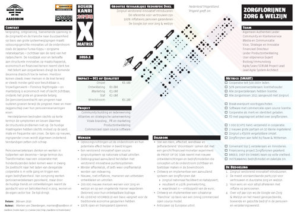

::: name
hoshin kanri
:::

<a href="Aardbron-Hoshin-Kanri-X-Matrix-Zorgflorijnen.pdf" download>

::: vista

:::

</a>

…je werkt met z'n allen aan een het {p|grootse gevaarlijke gedurfde doel}—een onderneming, een reis, een project, een programma. Je hebt een vaag beeld van je bestemming, laat staan een marsroute daar naar toe.

**Een helder beeld en kernachtige beschrijving van je bestemming van het eindresultaat en de stappen om er te komen geeft focus en voldoende creatieve spanning voor voortgang en voorkomt papieren tijgers.**

- Als je niet weet waar je naar toegaat, kan je wel eens ergens anders uitkomen—Yogi Berra.
- Als je niet weet waar je naar toegaat, is elke weg de goede—Alice in Wonderland.

2010-01-13</a>