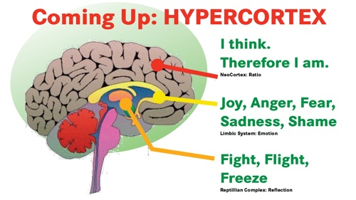
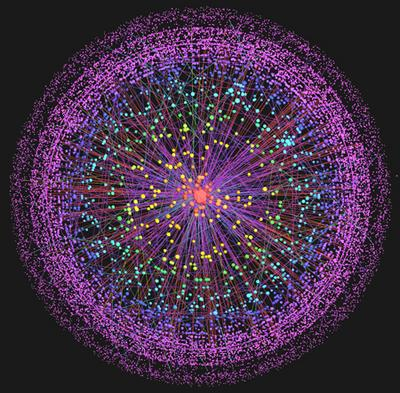
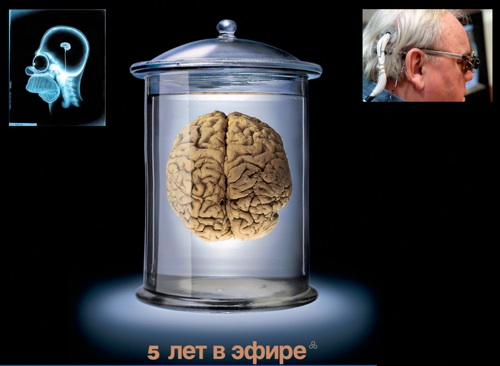

# Hypercortex
### 2008-07-03

In Wired 16.07 schrijft Kevin “[Out of Control](http://www.kk.org/outofcontrol/)” Kelly weer zo'n mooie breingranaat:

> [Infoporn: Tap Into the 12-Million-Teraflop Handheld Megacomputer](https://kk.org/wp-content/uploads/2010/06/Infoporn_-Tap-Into-the-12-Million-Teraflop-Handheld-Megacomputer.pdf)

Het Internet benadert ondertussen de rekenkracht van een enkelvoudig menselijk brein. Het doet mij denken aan een plaat die ik al vele jaren in mijn presentaties gebruik, namelijk die van de **hypercortex**:

::: vista

:::

[Bedien Kevin Kelly's One Machine zelf](http://www.wired.com/special_multimedia/2008/st_infoporn_1607):

::: as-is

:::

Nog even en we kunnen ons brein rechtstreeks aansluiten op de One Machine…

::: vista

:::

Op naar **cosmopedia**!

Ik ben al jaren fan van Kevin Kelly en vind hem een visionair. De zaken waar wij nu zo druk mee bezig zijn (Web 2.0, Life Hacking, Collective Intelligence, Emergence, [[hiepergroei]], etc.) zag hij lang geleden aankomen. Zo vind ik zijn 10 jaar oude [New Rules for the New Economy](http://www.kk.org/newrules/) is een standaardwerk.
