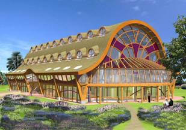

# Innovatieplatform Noord-Nederland
### 2007-04-25

::: vista

:::

Ans Reurekas wijst me op het ~~[Innovatieplatform Noord-Nederland](http://www.innovatieplatformnoordnederland.nl/)~~. Een prachtig initiatief:
> Het Innovatie Platform Noord-Nederland (IPNN) is opgericht als katalysator en vergaarbak voor alle ideeën en ontwikkelingen die een positieve bijdrage zijn voor onze samenleving. Zo wil het platform een basis zijn voor krachtige en positieve groei in de ontwikkeling van onze samenleving in deze eeuw.

Ik heb wat langer stilgestaan bij het ~~[Organisch Gezondzijnscentrum](http://www.innovatieplatformnoordnederland.nl/)~~ vanwege mijn enorme interesse in [The Nature Of Order](http://wiki.aardrock.com/The_Nature_Of_Order) en de bijbehorende The Timeless Way Of Building. Iets wat een belangrijke rol speelt in het ~~[Aarde-project](http://aardsource.org/)~~.

Verder vraag ik me af hoe we al deze wonderschone initiatieven elkaar nog meer kunnen laten versterken door ze te bundelen tot een **alleshelende laserstraal**. Nu gefragmenteerd, maar door een nationaal platform te bieden kan elk individueel project en initiatief nog meer gaan stralen en zich uiten. Het ~~[NNN-project](http://id-platform.nl/)~~ kan daar een belangrijke rol in spelen. Doe mee!

Ik vind de de website van Innovatieplatform Noord-Nederland wel wat moeilijk lezen. Heel veel dichte lappen tekst. En ik krijg telkens een andere pagina. Sla Jacob Nielsen's [Writing for the Web](http://www.useit.com/papers/webwriting/) er eens op na.
