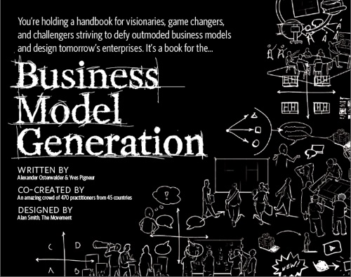

# Innoveer je bedrijfsmodel
### 2009-11-16
::: vista

:::

Elke dag ontstaan er talloze nieuwe bedrijfsmodellen. Er ontstaan hele nieuwe industrieën en oude industrieën hebben het erg moeilijk. Dat is niet zo vreemd. Het consumentengedrag is 360 graden veranderd, de financiële crisis laat nog steeds zijn sporen na en het internet lijkt alles gratis aan te bieden.

**Hoe zit het met jouw business model? Is de houdbaarheidsdatum nog niet overschreden? En hoe zit dat over 2 tot 5 jaar? Wat zijn de sterkten en zwakten? Waar liggen de kansen? Kan je nieuwe modellen bedenken? Wat kun je van anderen leren? Kun je de kansen verzilveren? Hoe past dit binnen je strategie?**

Daarom: **Vergroot je inzicht inzicht in wat bedrijfsmodellen nu eigenlijk zijn. Maak je bedrijfsmodel inzichtelijk aan de hand van het *{business model canvas}*. Leer zo de dynamiek van jouw ecosysteem te begrijpen. Ontwerp bedrijfsmodellen met nauwkeurige instrumenten en technieken. Maak jouw bedrijfsmodel passend binnen het huidige competitieve landschap. Je canvas is je gereedschap je leert technieken om daarmee je huidige bedrijfsmodel te kunnen innoveren.**

~~Registreer~~ je voor ‘Innoveer je business model’ en **Patrick van der Pijl** en **Jelle Bartels** ontvangen je op **25 november** met open armen in het Lloyd Hotel in Amsterdam.
