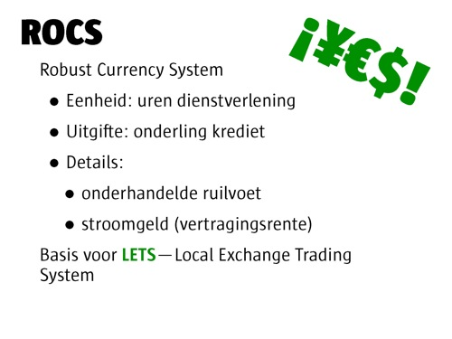

# Invoering van ecogeld
### 2008-10-28

Lach maar.

> Eerst negeren ze je. 
> Dan maken ze je belachelijk. 
> Daarna vallen ze je aan. 
> Dan win je.
> > —Mahatma Gandhi

De [[voordelen van ecogeld]] zijn zó aantrekkelijk dat het vreemd is dat de invoering ervan zo lang op zich laat wachten. De financiële crisis van 2008—die m.i. tijdens het barsten van de internetbel rond 2000 al ingeluid werd—biedt hier echter mooie kansen voor.

::: vista

:::

Het moeilijkste gedeelte van het scheppen van een munteenheid in jouw gemeenschap is **die munteenheid geaccepteerd en gebruikt te krijgen**. **Geloofwaardigheid** is daarbij de kritische succesfactor.

<!--more-->

Drie sleutelelementen voor een succesvolle implementatie zijn:
1. **De juiste tijd**—*Kairos* (Grieks voor ‘perfecte tijd’) versus *chronos* (Grieks voor ‘tijd’) kan hét verschil maken tussen succes en falen. De huidige wereldwijde financiële crisis klinkt als hét juiste moment. Versterk dit met het samengaan van de juiste groep mensen die besluiten iets positiefs te doen voor hun gemeenschap.
1. **Kwalitatief plaatselijk leiderschap**—De belangrijkste eigenschap voor het starten van een plaatselijke munteenheid is waarschijnlijk wel plaatselijk leiderschap. Iemand of een groep met visie, ondernemerskwaliteiten en charisma die de geloofwaardigheid en het vertrouwen van de buurt heeft. Het beste leiderschap vindt plaats als aan het einde de mensen kunnen zeggen dat ze het zelf gedaan hebben.
1. **Deugdelijk ontwerp**—Een **robuust munteenheidssysteem**—ROCS of Robust Currency System—bundelt de sterkste elementen van alle verschillende geldsystemen tot een zeer krachtige geheel met de volgende kenmerken:
    - Eenheid: uren diensverlening
    - Uitgifte: onderling krediet en wederzijdse tegoeden
    - Details:
      - onderhandelde ruilvoet—het ene uur is meer waard dan het andere
      - ‘[[stroomgeld]]’ (vertragingsrente)
    - Basis voor LETS—Local Exchange Trading System

Daarnaast dient het leiderschap zich zo snel mogelijk overbodig te maken zodat het systeem en haar ontwikkeling en veerkracht een zelfstandig leven kan leiden, onafhankelijk van de oprichters.

Stappen om ecogeld in te voeren:
- Zet een dergelijk systeem op als kleinschalig pilotproject op het internet tussen een kerngroep van (lokale, nationale of internationale) ondernemingen.
- Garandeer een open systeem van publieke dienstverlening.
- Richt een alliantie van ondernemingen op om het waar te maken en geniet van de effectieve manier voor zakenlieden om te ontkomen aan het voortdurende conflict tussen de priositeiten van de aandeelhouders en hun eigen persoonlijke zorgen op de lange termijn.

De [[geschenkenconomie katalyseert gemeenschapszin]] dus kun je je afvragen wat het effect is als je elementen van [[Heel onze Aarde met geld]] toevoegt aan initiatieven zoals ~~[Buurtlink](http://buurtlink.nl)~~.

Bron: [[Het geld van de toekomst]].