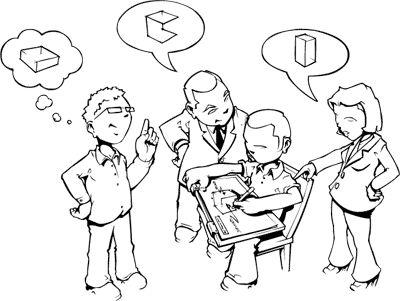
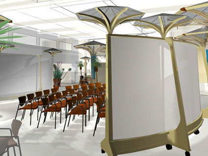
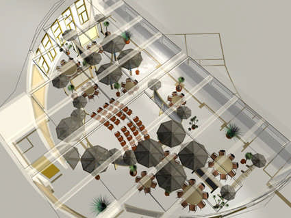
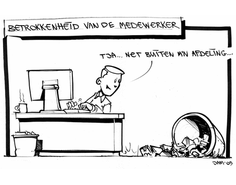
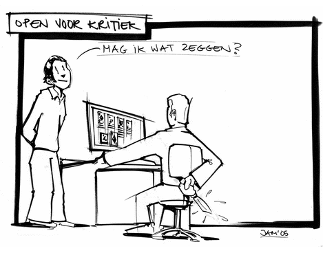
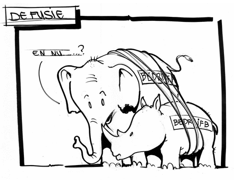

# JAM in het Co-creation lab
### 2008-04-06
::: vista

:::

**Co-creatie** is een cruciaal element van de [[Doorbraakversneller]]. Frits Oukes van XpStagers heeft zelfs een een mobiel lab met meubilair voor open innovatie en co-creatie ontworpen en gerealiseerd.

::: vista

:::

Een inspirerende en rustgevende omgeving waarin deelnemers zelf actief worden. Samen met het **beelddenken** Dennis Luijer & Crew van JAM ontstaat zo makkelijk een gemeenschappelijk beeld en schept het een nieuwe serieuze speelplaats voor zakelijke zingeving.

::: vista

:::

## Visueel Denken
 Het is moeilijk meer voor te stellen: communicatie zonder visualisatie. Dialoog, discussie, beslissen of het overbrengen van een boodschap gaat nu eenmaal beter met beelden om dit ondersteunen.

::: as-is

:::

De visualisaties, illustraties en tekeningen worden vaak live tijdens een sessie of presentatie gemaakt. Zo ontstaat snel een helder groepsgeheugen waarin de essentie van het proces, de bedoeling of de visie gevangen wordt. Energie gaat en blijft stromen.

- **Visueel Notuleren**—Geen lappen tekst, maar treffende tekeningen als notulen bevorderen de uitwisseling van ideeën en gedachten door deze te live te tekenen. Door een paar relevante visuele ankers voorafgaand aan een workshop of brainstorm komt het geheel snel op gang.
- **Praatplaat**—Een 'praatplaat' van complexe processen of projecten en wilde ideeën zijn beter te volgen als deze goed in beeld worden gebracht. De verschillende disciplines kunnen hierdoor veel beter met elkaar communiceren en hun verschillen overstijgen.

::: as-is

:::

## The Art of Hosting
 Het produkt van het co-creation lab vermenigvuldigt, visueel denken en "the art of hosting" levert een zeer groot scheppend vermogen. Het stellen van vragen die er toe doen en het scheppen van een open, vrije atmosfeer zijn hiervoor cruciaal. Een meedogenloos liefdevolle facilitator versoepelt het proces en katalyseert baanbrekende creatieprocessen.

Co-creëren doe je samen. [[Contact|Neem contact op voor een intakegesprek.]]

----
#### Externe links

- ~~[Co-creation Lab](http://www.cocreationlab.com/)~~® is een handelsmerk van XpStagers B.V.
- [JAM Visueel Denken](https://jamvisualthinking.com)
