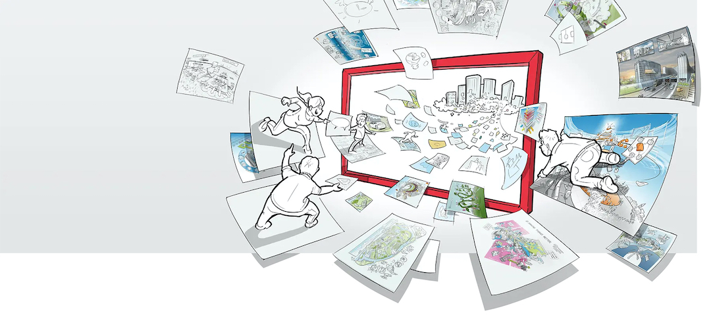

# JAM School over Visueel Denken
### 2009-11-16

::: vista

:::

::: context
de wens is de vader van de gedachte. Een aantal nieuwe ideeën en innovaties dienen zich aan.
:::
::: wish
Hoe geef je jouw idee zo concreet mogelijk vorm zodat de {recreatie} en verspreiding ervan moeiteloos gaat, en daarmee het enthousiasme ervoor?
:::
::: therefore nl
Weef de kracht van beelden door je taal zodat je ideeën letterlijk tot de verbeelding spreken.
:::
::: rationale
Beelden zijn een uitermate krachtige middelen die soms moeilijk getransformeerd kunnen worden. Tegelijkertijd kan je niets nieuws bereiken zonder daarbij een ondersteunend beeld te creëren (zelfs onbewust).

**Verbeelding** heeft zowel betrekking op het maken van nieuwe beelden als het loslaten van bestaande beelden.
Spreken in beelden, {metafoor} en {idioom} is uitermate krachtig, helder, moeiteloos en effectief en blijft goed hangen. {beeldspraak} wakkert vaak de collectieve geest en het collectieve verlangen naar de zee aan.

Oefen je in het aandachtig en in detail bestuderen van dingen zodat je je bewust wordt van de goudmijn aan beelden die je vanaf je geboorte hebt verzameld zodat je ze makkelijk op kan roepen en ermee kan spelen om zo nieuwe beelden te vormen. {begin met het eindresultaat} en visualiseer het in een {praatplaat}.

~~[**Kortingscode ‘aardbron’ geeft €100 korting** op de toegangsprijs van €495 voor JAM School](http://jamschool.eventbrite.com/)~~ in **Amsterdam** op **1 december 2009**, georganiseerd door JAM Visual Thinking en met **Wouter Boog**, **Jeroen Meijer** en **Patrick van der Pijl**.

Meer op [JAM Visual Thinking](https://jamvisualthinking.com).
:::