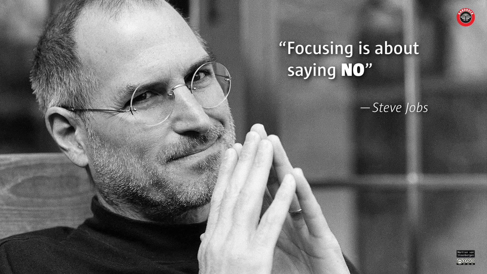

::: name
just say no
:::

::: as-is

:::

::: context
working and living with others.
:::

::: wish
Spending your limited time on the things that really matter creates a more intentional and solid yes, builds trust and coherence.
:::

::: therefore
Listen to the other’s request and provide an understanding “No”, along with its motivation. Find a solution and track progress. {seven phrases narcissists hate} even tackle the hard cases.
:::

::: rationale
If you believe that you must keep your promises, overdeliver and treat every commitment as though it’s an opportunity for a transformation, the only way you can do this is to **turn down most opportunities**.

No I can’t meet with you, no I can’t sell it to you at this price, no I can’t do this job justice, no I can’t come to your party, no I can’t help you. I’m sorry, but no, I can’t. Not if I want to do the very things that people value my work for.

No is the foundation that we can build our yes on.

Here are nine practices to say a strategic no in order to create space in your life for a more intentional yes.
1. Know your no. Identify what’s important to you and acknowledge what’s not.
1. Be appreciative.
1. Say no to the request, not the person.
1. Explain why.
1. Be as resolute as they are pushy.
1. Practice.
1. Establish a pre-emptive no.
1. Be prepared to miss out.
1. Gather your courage.

Say no to all issues that do not align with values, goals and norms—that fall outside the tolerance of your self or your organization.

- To say “Yes” is about quantity.
- To say “No” is about quality.
- To say “No” gives certainty, dependability, safety and sureness.

Approach (similar to {consent} process):
- Actively listen to the other’s question.
- Say “No’”.
- Show understanding for any response or reaction.
- Provide a focused motivation of your “No”.
- Find a solution.
- Track progress.

Make it easy and safe for people to say “No” to you, too. Otherwise, first time you notice your plans are wrong is when it is too late.

Each time you say yes, remember to also say no to something else.

When you first try this, you may worry that people…
- are going to get mad at you;
- will dislike you;
- will stop asking for you to help or work with them.

It turns out this is a false truth living in your head. People end up respecting you for being clear about my priorities and boundaries. And the requests, well, it seems like you’ll be getting even more than ever being harder to reach.

> Saying “yes” to one thing is simultaneously saying “not right now” to many things.
> > —@wovchko

> You have to say no to a lot of good things in order to be able to say yes to a lot of great things
> > —_unknown_

::: constitution
Complements {seven phrases narcissists hate}
:::
### Sources

~~~js
const sources = [
{ 
  title: "Six Guidelines for Saying No to a Stakeholder",
  authors: "Mike Cohn",
  site: "Mountain Goat Software",
  url: "https://www.mountaingoatsoftware.com/blog/six-guidelines-for-saying-no-to-a-stakeholder"
},
{
  title: "Don’t just do something, stand there!",
  authors: "Marvin Weisbord, Sandra Janoff",
  site: "Pearl Language",
  url: "http://pearllanguage.org/Don’t_just_do_something,_stand_there!"
},
{
  title: "The Power of Doing Less",
  authors: "Fergus O’Connel",
  site: "Amazon",
  url: "https://www.amazon.co.uk/Power-Doing-Less-Fergus-′Connell/dp/0857084216"
},
{
  title: "Essentialism: The Disciplined Pursuit of Less",
  authors: "Greg McKeown",
  url: "https://gregmckeown.com/book/"
},
{
  title: "The Power of “No”",
  authors: "Dan Harper",
  site: "LinkedIn",
  url: "https://www.linkedin.com/pulse/power-dan-harper"
},
{
  title: "Nine Practices to Help You Say No",
  authors: "Peter Bregman",
  site: "HBR",
  url: "http://blogs.hbr.org/bregman/2013/02/nine-practices-to-help-you-say.html"
},
{
  title: "Learning to Say “No” Is Part of Success",
  authors: "Ed Batista",
  site: "HBR",
  url: "http://blogs.hbr.org/2013/11/learning-to-say-no-is-part-of-success/"
},
{
  title: "No is essential",
  authors: "Seth Godin",
  site: "Seth’s Blog",
  url: "http://sethgodin.typepad.com/seths_blog/2014/05/no-is-essential.html",
},
{
  title: "The power of saying no",
  authors: "Tim Harford",
  url: "http://timharford.com/2015/01/the-power-of-saying-no/",
},
{
  title: "Stop trying to please everyone",
  authors: "Ron Ashkenas, Matthew McCreight",
  site: "HBR",
  url: "https://hbr.org/2015/07/stop-trying-to-please-everyone",
},
{
  title: "Please say “NO”",
  authors: "Steve Hayes",
  site: "Medium",
  url: "https://medium.com/unruly-engineering/please-say-no-3d2a12ba4d0d",
},
];
import {sourceList} from "./components/aids.js"
~~~

${sourceList(sources)}