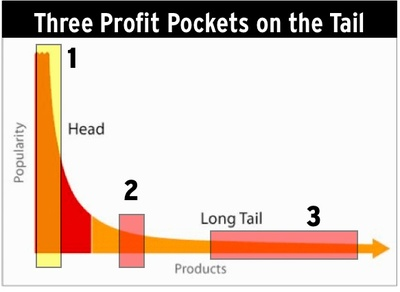

# Kwispel de Langstaart der Liefde
### 2008-08-01

Door [Kevin Kelly](http://kk.org):
> Ik geef er de voorkeur aan om de Langstaart als een staart van een ander dier te zien. We hebben het ongrijpbare wezen waar ze toe behoort onjuist geïdentificeerd. Het is niet de Langstaart van het Beest van Commerciële Winsten. In tegendeel, het is **de Langstaart van de Draak der Liefde**. De liefde van creëren, van scheppen, van maken, van verbinden, van onredelijke passie, van het verschil maken, van iets doen waar we zelf om geven, de liefde van verbinden, geven, leren, produceren en delen.

---

Seth Godin heeft Chris Anderson's idee van de **Langstaart** ([The Long Tail](https://www.amazon.com/Long-Tail-SmarterComics-Chris-Anderson/dp/1610660064/ref=sr_1_5?dib=eyJ2IjoiMSJ9.47wMEFzIt3zuhBuYpGRO-7ylwMZZN6q00vkG22fIAFIdehQCJmDv5VESlKIh6M0jLzb00pwNt5je51EINw2wqg.n6bcm7arMcJwscg4WZOgE-nOgYAOT7jjJwjRKatqaiQ&dib_tag=se&keywords=long+tail+seth+godin&qid=1734186060&sr=8-5)) geëxploreerd. Zoals gewoonlijk brengt Seth helderheid en licht in dit vaak onbegrepen idee. Recent plaatste hij een ontleding van de drie "winstpotten" binnen de Langstaart die hij alvolgt illustreerde:

::: vista

:::

Er is een hinderlijke omschakeling die Seth (en bijna ieder ander) maakt wanneer ze de Langstaart uitleggen.

In pot nummer 1, de kop van de curve, spreekt Seth in termen van de creator van een werk. In pot nummer 2, het midden van de curve, spreekt hij ook in termen van de creator. Maar zodra hij in de Langstaart, pot nummer 3 van de curve, komt schakelt hij om van creator naar aggregator van het werk van andere creatoren.

Waarom is dat zo? Wat gebeurt er met de creator? De creator laat men vallen zodra we in de buurt komen van de Langstaart winstpot omdat de Langstaart niet winstgevend is voor de creator. De Langstaart is alleen maar winstgevend voor het publiek en de aggregatoren.

Ik ben er niet echt zeker van dat de "fractale Langstaart die werkt binnen de Langstaart" (elk onderwerp heeft zijn eigen Langstaart), genoemd in Seth's vorige artikel, veel helpt, anders dan dat je zelfs in jouw nis zo dicht mogelijk bij de kop wilt zijn. Dat is een open deur. Een aggregator zijn is zelfs voor een creator geen optie. Er zijn bijna geen creators die ik ken die productief genoeg zijn om een voldoende hoeveelheid nieuwe zaken in hun eigen werk te aggregeren. Aggregatoren zijn per definitie geen creatoren.

Dus als men de verschillende secties oversteekt—van de korte kop naar de lange staart—dient men consistent te zijn en het vanuit het gezichtspunt van de aggregator te bekijken. Ik denk dat het een vergissing is om die twee punten te vermengen.

Ik heb hier al een tijd mee lopen worstelen. Het enige voordeel dat ik kan zien voor de creator in de Langstaart is dat aggregatoren een langstaaartdomein kunnen verzinnen of produceren die er daarvoor niet was. Net zoals Seth's [Squidoo](http://www.squidoo.com/) doet. Voordat Squidoo of Amazon of Netflix voorbijkwamen was er geen enkele markt voor veel van de creaties die ze nu distribueren.

De propositie die Langstaartverzamelaars kunnen bieden aan creatoren is indrukwekkend maar eenvoudig: je hebt de keuze tussen een piepklein publiek in een piepkleine nis (met nanowinst) of in het geheel geen publiek. Voordat de Langstaart jouw meesterwerk om zoutwatervis uit de Rode Zee voor het aquarium te kweken zich uitbreidde had je geen betalende fans. Nu heb je er misschien 100.

Honderd lezers/kijkers/luisteraars economisch niet zo interessant. Er is geen zakelijke vergelijking die aanhoudende winst oplevert door voortdurende creatie door zo weinig kopers. (Het kan natuurlijk de zaken van aggregatie boven het niveau van creatie ondersteunen.) Maar **de nis in de markt die de Langstaart creëert werkt perfect in het gebied van passie, enthousiasme, obsessie, nieuwsgierigheid, geestverwantschap, liefde en de gifteconomie. In de uitwisseling van fysieke energie, aansporing, betekenis van leven en redenen om voor te leven is de Langstaart een weldaad.**

Dat geldt niet voor winsten. Economisch gezien, hoe meer de Langstaart zich uitbreid—hoe meer zaken er zijn die strijd voeren om onze beperkte aandacht als publiek—des te moeilijker is het voor een creator om winstgevendheid te verkopen. Ofwel, **des te langer de staart, des te slechter voor de verkoop**. Als we **de Langstaart** echter als een ander type markt zien, als **een markt van enthousiasme en verbinding**, en als de Langstaart zich dan uitbreid neemt de kans toe dat twee enthousiastelingen elkaar ontmoeten. Dus hoe langer de staart hoe beter. De eerste twee potten van de curve proberen de winst te maximaliseren. **De laatste pot van de Langstaart probeert passie en verbinding te maximaliseren.**

Er is nog een ander indirect voordeel van de Langstaart. Omdat jouw creatie nu bestaat in een markt (waar het daarvoor in het geheel niet bestond) kan het, als je geluk hebt, beginnen aan een opwaartse migratie in de richting van de kop. Met creativiteit ben je mogelijk in staat om jouw creatie uit de de economische neerslachtigheid van de Langstaart naar sectie nummer 2 te brengen, waar {duizend echte fans} en ander succes van het middenniveau ligt. Zoals ik beargumenteer in {duizend echte fans} is dit de plek waar je wilt zijn als creator. Seth noemt dit de pot van "het winstgevende succesvolle nisproduct" en ik ben het met hem eens dat het deze pot nummer 2 in plaats van pot nummer 1 is waar je je op wilt richten.

Maar als je sectie 3 eerlijk volgens dezelfde metrieken als sectie 1 en sectie 2 evalueert—de dollarwaarde voor de creator—dan is de Langstaart een woestijn voor winsten. Alleen als je wisselt van perspectief heeft het zin om deze pot na te jagen. In pot 3 moet je het óf bekijken vanuit het perspectief van opperheer aggregator, óf bekijken vanuit een territorium met een alternatieve economie, een die niet op de dollar loopt. Een nieuwe regio met haar eigen dynamiek.

Met andere woorden, Squidoo en Amazon en Netflix maken de Langstaart heel blij. Maar een blije Langstaart maakt nog geen blije creator.

Ik geef er de voorkeur aan om de Langstaart als een staart van een ander dier te zien. We hebben het ongrijpbare wezen waar ze toe behoort onjuist geïdentificeerd. Het is niet de Langstaart van het Beest van Commerciële Winsten. In tegendeel, het is de Langstaart van de Draak der Liefde. De liefde van creëren, van scheppen, van maken, van verbinden, van onredelijke passie, van het verschil maken, van iets doen waar we zelf om geven, de liefde van verbinden, geven, leren, produceren en delen.

Het is belangrijk om te weten welke staart we kwispelen.

index: true
---

Ik houd me aanbevolen voor verbeteringen van deze vrije vertaling van [Kevin Kelly: The Technium: Wagging the Long Tail of Love](http://www.kk.org/thetechnium/archives/2008/07/wagging_the_lon.php).

Succes en plezier,
> Martien.
