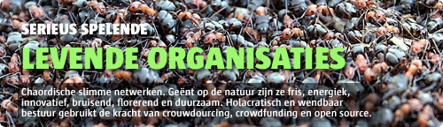

# Levende organisaties
### 2008-07-03

::: vista

:::

::: context
je wilt je bestaande organisatie behoorlijk laten groeien, bijvoorbeeld met een levend web van loyale deelgenoten of partners.
:::

::: wish
Wensen voor een dergelijke organisatie zijn:
- Gezien worden als **leidend, inspirerend en levend voorbeeld** en choreograaf op het gebied van het nieuwe organiseren—florerende, resonerende organisaties en gemeenschappen (communities).
- Door de markt gevraagd worden om **levende, spelende [autopoetische](http://aardnoot.nl/autopoiesis) organisaties en netwerken** te implementeren hetgeen leidt tot een gezonde business.
- Laten schitteren van de onweerstaanbare wereld van het **organiseren van morgen**—energiek, nieuw, fris, duurzaam, verantwoord, responsief, adaptief, plat en **geënt op de natuur**.
- Een **sterk merk** neerzetten in en buiten Nederland.
- **Opschalen** en in de markt zetten **van organisatorische innovaties** waarbij **identiteit**, **informatie** en **relaties**—en de bijbehorende technieken en technologie—een cruciale rol spelen.
- Een **florerend en gezond partnernetwerk** van ZZP-ers, free lancers en kleinbedrijven in het leven roepen—op basis van **vrijheid in verbondenheid**.
- Een **magneet, landingsplaats en voedingsbodem** zijn voor talent—sommigen nu nog verborgen en gevangen in grote(re) organisaties.
:::

::: therefore
- Zet alles **open**: alles wat we doen, tot en met strategie en beleid volledig {open bron} (open source), mits het de continuïteit niet in de weg zit. Het doorbreken van innovaties is een eigenschap van open systemen.
- Schoei besluitvormingsprocessen op een nieuwe leest dit past bij de nieuwe tijdsgeest—**[[holacratie]]** (geen OR nodig!).
- Zet **{crowdsourcing}** in en vorm **{deelgenootschappen}** (community owned).
- Reken af op basis van combinatie van resultaat (succes) en inzet.
- Zet een web van **{praktijkgemeenschappen}** (Communities of Practice) op waar de eigenschap ‘leven’ van de organisatie zetelt.
- Richt alle **processen** (marketing, engineering, business) in volgens [[holacratie]] (**agile, chaordisch en systeemdenken**).
- Vang ervaringen, kennis en wijsheid in de vorm van **{pareltaal}** en **Excellence Guides**. Vorm zo een (nieuwe) natuurlijke en menselijke **organisatietaal**.
- Zoek samenwerking met verlichte individuen en (kleine) organisaties op basis van wederzijds (economisch) voordeel en op alle gebieden (juridisch, fiscaal, organisatie, marketing, sales, ontwikkeling, personeel).
- Ontwikkel passie, richting en energie door een heldere gemeenschappelijke bedoeling (zin), beeld (visie), missie, waarden en deugden.
:::

::: rationale
## Levende organisaties

Levende, holacratisch bestuurde chaorganisaties zijn wendbaar en duurzaam. Levende organisaties richten zich op het met succes verbinden van techniek en organisatie, en op basis van biologische fundamenten.

Verborgen overeenkomsten tussen het biologische, psychologische en sociale leven. Het **starten, groeien en floreren van communities** en **praktijkgemeenschappen**. Kenmerkende eigenschappen verweven in een prachtige **{pareltaal}** die je helpen de **creatieve en collectieve kracht van gemeenschappen** in te zetten voor **baanbrekende innovatie** en **voortbestaan op de lange termijn**.

Levende en bruisende organisaties zijn:
- open;
- wendbaar;
- veerkrachtig;
- energiek;
- inspirerend;
- innovatief;
- een plek waar je graag speelt.

Er tekent zich een toekomstbeeld af waarbij organisaties meer en meer **zelf-organiserend, zelf-genererend, zelf-helend, zelf-vernieuwend, zelf-ontwikkelend en zelf-redzaam** worden. Kritische elementen voor haar succes—**voortbestaan op de lange termijn**—zijn:
- **[[identity|Identiteit]]**—zingeving, betekenis;
- **Relaties**—verbindingen;
- **Informatie**—vormgeving;

Op een gezonde manier ingericht geeft deze organisatievorm het gevoel van **veiligheid**—wederzijds vertrouwen en kwetsbaarheid.

Er zijn weinig of geen professionele diensten die andere organisaties helpen met het ontwikkelen van deze **complexe niet-lineare netwerkorganisaties**. Een gat in de markt dus.

**Betekenis** en **zingeving** zijn essentieel voor mensen. Om de betekenis van iets te begrijpen, moeten we het in verband brengen met andere dingen in de omgeving, het verleden of de toekomst van dat iets. **Niets is op zichzelf betekenisvol**. Indien de context van een idee of uitdrukking of wens relaties met onszelf omvat, krijgt het idee of uitdrukking of wens voor ons persoonlijke betekenis. Dit diepere betekenisnivo omvat een emotionele dimensie en kan zelfs volledig voorbij gaan aan de rede.

## Strategische groeivragen
 Stel je wilt je partnerweb uitbreiden en laten groeien en je schrijft daarvoor een **strategiedocument**. En je wilt niet zomaar een beetje groeien, maar echt onstuimig groeien, een **groeistuip**. Bijvoorbeeld een verdubbeling van de omzet in twee jaar tijd. Dan helpt het enorm om in je strategiedocument goede antwoorden te hebben op de volgende enorme bak vragen:
1. **Voor wie** is dit strategiedocument bedoeld?
1. Wat is de **bedoeling** van het strategiedocument?
1. Welk **effect** of **eindresultaat** verwacht je van het strategiedocument, en wanneer?
1. Hoe is **{crowdsourcing}** strategisch in te zetten voor de groei van het partnerweb?
1. Hoe past een {community-owned} (**{deelgenoten}**, mede-eigenaren) partnerweb in de strategie en hoe kunnen partners mede-eigenaar worden (behalve door aankoop aandelen) zodat het een **joint enterprise** wordt?
1. Hoe wordt de **zelfgeneratie**, **zelforganisatie**, **zelfvernieuwing** en het **zelfherstel** van het partner ecosysteem geborgd?
1. Waaraan kan je zien dat het partnerweb een **autopoietisch sociaal netwerk** is?
1. Welke cultuur kenmerkt het partnerweb en door welke netwerkvorm en communicatieprocessen wordt betekenis gegenereerd?
1. Wat is de **gemeenschappelijke betekeniscontext** waardoor elk individu een identiteit als lid van het sociale netwerk verwerft en waardoor het sociale netwerk haar eigen grenzen—**{cultureel membraan}**—genereert?
1. Welke structurele veranderingen zijn nodig binnen de huidige organisatie om de doelstellingen te verwezenlijken?
1. Welke doorbraken—**[emergentie](http://aardnoot.nl/emergentie)**—of metamorfoses voorzie je in de ontwikkeling van de huidige organisatie en haar partnerweb?
1. Welk integrale stelsel van sociaal verworven **gemeenschappelijke waarden, overtuigingen en gedragsregels**—samen de regels van betekenis of **semantische structuur** vormend, en daarmee ook het **organisatiepatroon** van het netwerk—:
1. #bepaalt de reikwijdte van aanvaardbare gedragingen in het partnerweb?
1. #creëert onder de leden van het sociale netwerk een **identiteisgevoel** dat op een **sterk collectief besef van saamhorigheid** berust—dé bepalende factor van een gemeenschap?
1. Op welke manier brengt het sociale netwerk een **gemeenschappelijk corpus van kennis** voort?
1. Hoe worden **beslissingen** genomen en **keuzes** gemaakt in het sociale netwerk? Een gemeenschap zal **veel effectiever** kunnen **handelen** indien iemand bevoegd is tot het nemen of vergemakkelijken van beslissingen als er belangentegenstellingen in het spel zijn. Dergelijke sociale regelingen verschaffen de gemeenschap een **groot evolutionair voordeel**.
1. Hoe **open** is het netwerk voor de buitenwereld en hoe tolerant is het ten aanzien van **toetreding van nieuwe mensen** en de **ontvankelijkheid voor nieuwe ideeën** en, op grond daarvan, het manifest vermogen tot leren en zich aanpassen aan nieuwe omstandigheden?
1. Hoe helpt het systeem met de optimalisering van de erin werkzame mensen?
1. Op welke wijze versterken wederkerig engagement van de leden, gezamelijk ondernemen, en, in de loop van de tijd, een gemeenschappelijk repertoire van werkwijzen, stilzwijgende gedragsregels en kennis elkaar?
1. Welke sterke besef onder de leden laat hen **voelen** dat zij tot de organisatie behoren zodat zij zich vereenzelvigen met haar prestaties en vele **praktijkgemeenschappen** vormen?
1. Welk inzicht hebben de (zakelijke en emotionele) leiders in de wisselwerking tussen de formele, geplande structuren en de informele, zelfgenererende netwerken, teneinde het **creatieve potentieel** en het leervermogen van dat ecosysteem te maximaliseren?
1. Hoe ondersteunt en versterkt de leiding de **informele praktijkgemeenschappen** zodat het geheel **springlevend** blijft en de **creatieve potentie tot volle bloei** komt?
1. Welke sociale ruimtes en activiteiten worden er ontplooid voor een **bloeiende, informele communicatie**?
1. Welke betekenisvolle stoornissen (van buitenaf of van binnenuit) laat het netwerk toe waardoor het zich laat beïnvloeden en indien nodig structurele veranderingen op gang brengen? Levende systemen kiezen altijd zelf waar zij aandacht aan zullen schenken en hoe zij er op zullen reageren. Als mensen hun instructies modificeren, reageren zij creatief op een stoornis en kunnen **verandering moeiteloos implementeren**.
1. Welke **betekenisvolle impulsen** geeft de leiding zelf af om het geheel te sturen?
1. Op welke manier schept de leiding een voedingsbodem (arbeidsklimaat) waarop de collectieve creativiteit zich volop kan ontplooien?
1. Hoe worden dwarsverbanden, associaties en samenwerkingen tussen deelgenootschappen aangewakkerd tot **symbiotische relaties**?
1. Op welke manier wordt de individuele kennis aan het licht gebracht en uitgebreid door sociale interactie waarin **impliciete kennis wordt getransformeerd naar expliciete kennis** waarbij geldt: **delen is vermenigvuldigen**? Mensen putten voldoening uit het delen van kennis met vrienden en collega's. Werken voor een organisatie die zich op **het delen van kennis** toelegt, **is een enorm motiverende kracht**. Niet omdat dan de organisatie winstgevender zal zijn, maar omdat we meer het gevoel hebben dat **ons leven de moeite waard is**.
1. Welke ontvankelijkheid om zich te laten 'storen' is er voorhanden binnen de organisatie om een innovatie—een nieuwe ordening—te laten doorbreken, te laten verschijnen?
1. Welk **actief communicatienetwerk** is er, met tal van **terugkoppellussen**, ter versterking van de activerende gebeurtenissen?
1. Welke verschijnselen van **spanning, chaos, onzekerheid of crisis** worden er ervaren die **de voorbode zijn van het doorbreken van een nieuwe ordening** of het totaal ineenstorten van de huidige? De ontvankelijkheid van een organisatie voor nieuwe begrippen, technologieën en kennis is een goede graadmeter voor haar **levendigheid, soepelheid en leervermogen**.
1. Welke **kunstenaars**—door ervaring vertrouwd met de spanningen en crisistoestand vlak voordat iets nieuws doorbreekt—zijn actief betrokken bij het proces?
1. Wat is het **visioen** dat de initiatiefnemers voor ogen hebben—de plek waar nog niemand geweest is?
1. Hoe is het **visoen gevisualiseerd** en naar welke **metafoor** is dat visioen vertaald zodat het iedereen plotseling scherp voor ogen staat, en zodanig onder woorden is gebracht dat het door iedereen wordt begrepen en omarmd? Het verlangen naar de zee…
1. Hoe wordt het systeem aangesloten op meer van zichzelf?
1. Hoe worden activiteiten in de marge gedoogd: **experimenten en eigenaardigheden** die een wissel trekken op hun begrispvermogen?
1. In hoeverre wordt **het stellen van vragen** continu aangemoedigd en worden **innovaties beloond**?
1. Hoe worden externe consultants of adviseurs in de arm genomen om te fungeren als **katalysator**?
1. Hoe worden **successen gevierd**—hoe klein ook?
1. In hoeverre wordt experimenteren aangemoedigd en wordt leren op een even hoge prijs gesteld als succes—en dus ook gevierd?
1. In hoeverre is de **macht gedistribueerd** over het sociale netwerk?
1. In hoeverre gebruiken leiders hun **macht om anderen macht te geven** zodat verschillende leiders naar voren komen op het moment dat zij nodig zijn om de diverse stadia van een doorbraakproces te vergemakkelijken of te katalyseren?
1. Op welke manier wordt de mate waarin praktijkgemeenschappen **levend zijn**, of het welzijn van haar deelgenoten of de ecologische duurzaamheid van haar producten en diensten **gemeten**?
1. Welke **biologische tijd** tikt er onder de processen die zorgen voor **slow management** en rust in de tent?

[Dompel je nog meer onder in **levende organisaties**](http://wiki.aardrock.com/Levende_organisaties), maar verdrink niet.
:::