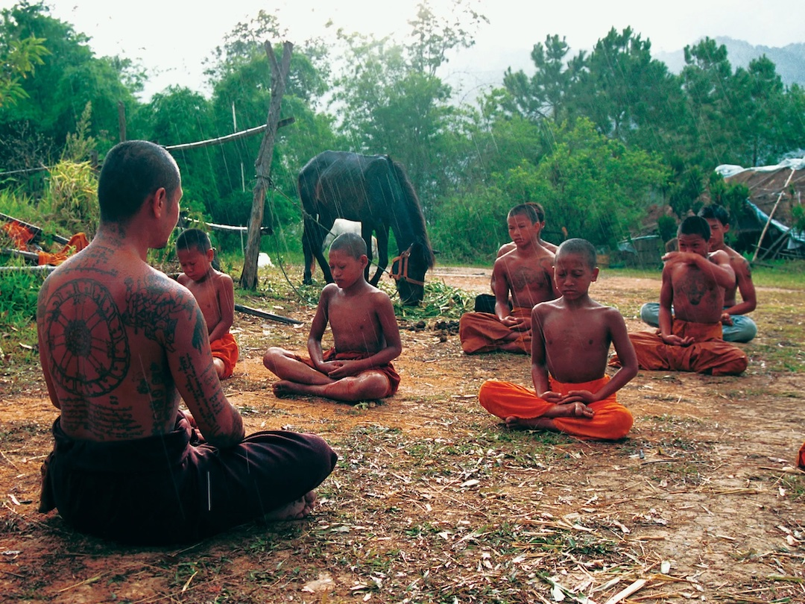

# Living is an art to be learned
### 2007-10-03
::: vista

:::

De film [Buddha's Lost Children](https://www.buddhaslostchildren.com) begint met een prachtige uitspraak van wijlen ~~[Shin Yatomi](http://www.shinyatomi.com/)~~ die direct de snaar raakt bij het ~~[Baobab](http://baobab.aardbron.nl)~~ project:
> **Living is an art to be learned.**

Dank je wel Shin.

En dank je wel makers van [Buddha's Lost Children](https://www.buddhaslostchildren.com). Ik heb er nu weer een mooie Buddhist bij.
