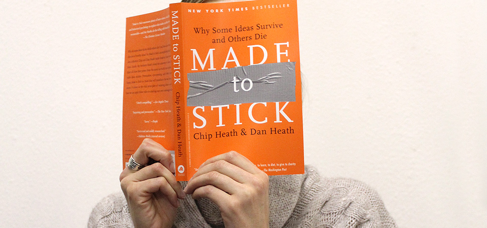

# Made to stick
::: as-is

:::

Tijdens het [[Creativity World Forum 2008]] lichtte Dan Heath het door zijn broer en hem geschreven boek “Made to stick” toe. Over broodje aap verhalen zoals het gebruik van de regenworm in hamburgers van McDonald's, maar ook het feit dat de Chinese Muur vanuit de ruimte te zien is. Kortom, dingen die blijven plakken, die iets betekenen, die iets veranderen.

De {verhalenverteller}—één van [[De Tien Gezichten van Innovatie]]—speelt daarbij een cruciale rol. Sommige [fabels van Aisopos](http://nl.wikipedia.org/wiki/Fabels_van_Aisopos), zoals die van de haas en de schildpad, worden al 2500 jaar doorverteld. Hetzelfde geldt voor spreekwoorden en gezegden. Da's mooi voor {pareltaal}, want dat maakt intensief gebruik van {idioom}, maar dit even terzijde.

De zes sleutelelementen voor plakkerigheid zijn:

1. **Eenvoud**—vertel het aan een kind van vier zodat iedereen het kan begrijpen.
1. **Onverwacht**—verstoor het verwachte en gangbare en laat jet onverwachte leven.
1. **Tastbaar**—prikkel alle zintuigen: horen, voelen, proeven, zien, ruiken.
1. **Geloofwaardig**—zodat ze je serieus nemen.
1. **Emotioneel**—maak bang, boos, blij, of bedroefd zodat je het kan herinneren.
1. **Verhalend**—zodat het makkelijk doorverteld kan worden.

Zo liet Antanas Mockus, voormalig burgemeester van Bogotá, mimespelers het verkeer regelen en veranderde zo de kijk op en het gedrag van de 6,5 miljoen, soms ongehoorzame, burgers van Bogotá.

**Emotie** geeft de impact en borgt de herinnering zoals vijvoorbeeld bij **Stop the bullets. Kill the gun.**

James March identificeert twee beslismodellen voor jouw gedrag:

1. Consequentie; versus
1. Identiteit.

Daarbij vraagt ‘den mensch’ zich bij het nemen van beslissingen, vaak onbewust, af:

- Wie ben ik?
- Wat is dit voor situatie?
- Wat doen anderen in zo'n situatie als deze?

De Belgische campagne [Bob de held](http://www.bob.be/) is een prachtig voorbeeld en is ondertussen in 17 Europese lidstaten gevoerd—“Daar kun je mee thuiskomen.” De Bob-campagne doet een beroep op de identiteit van het publiek en spoort verantwoordelijk gedrag aan. Jij gunt je vrienden vandaag een prettige avond, een ander bewijst jou de volgende keer dezelfde dienst.

**Tastbaar** wordt een verhaal met veel zintuigelijke details:

<ol>Een stel vrienden gaat een weekend stappen in de grote stad. In een bar laat een van hen zich al snel versieren door een mooie vrouw. Hij gaat met haar mee. “Ik bel jullie morgen wel in het hotel”, zegt hij tegen zijn vrienden. Dat doet hij ook, maar hij klinkt niet zo gelukkig. Hij ligt in een kamer van een ander hotel en voelt zich niet al te goed. Zijn vrienden gaan er meteen heen en treffen hem aan op het bed. De lakens zitten onder het bloed. Als ze hem overeind helpen, zien ze een groot vers litteken op zijn buik. In het ziekenhuis blijkt dat hij een nier mist. Aan de hechtingen te zien was deze diefstal echt vakwerk…</ol>

Onderscheid je door tastbare verhalen te vertellen. Vaagheid en abstractheid vervelen. Vertel een {rivierverhaal} om op een krachtige manier je ambities te verbeelden en je ‘groeven’ of patronen op de proef te stellen en {start een rumoer} voor maximale {recreatie}. Mens, organisatie en samenleving gaan meer stromen als ze elkaar hun rivierverhalen op een pakkende en plakkende manier vertellen.

Zo, nu maar weer eens een {parel}tje.
