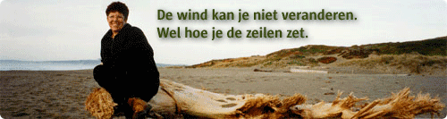

# Margaret Wheatley over duurzaam leidinggeven
### 2010-01-14

::: vista

:::

Krachtig leiderschap is het antwoord in deze onvoorspelbare tijd. **Maar dan wel anders!**

[Margaret J. Wheatley](http://www.margaretwheatley.com/) autoriteit op het gebied van Duurzaam Leiderschap zal op 19 januari 2010 leiders haar inzichten brengen “hoe het vooral anders kan”. We gaan met Margaret een dagreis maken, een nieuwe wereld van mogelijkheden ontdekken en een nieuwe wetenschap ten behoeve van een krachtig leiderschap voor deze turbulente tijden ontdekken.

Over hoe we in deze tijd het “anders” kunnen organiseren en hoe we het toe kunnen passen in ons dagelijks werk. Over community als universeel antwoord op elk probleem.

Kortom:
- Kom los van oude patronen.
- Ontdek een nieuwe wereld van mogelijkheden.
- {omarm verandering|omarm onzekerheid}.
- Boek {succes door fouten}.

Op **dinsdag 19 januari** komt u om **10.00 uur filevrij** aan in het **Kontakt der Kontinenten in Soesterberg** en vertrekt u om **20:30 uur weer filevrij naar huis**, na het diner.

~~[Registreer je bij De Spirituele Management Tafel](http://www.smtnederland.nl)~~. **5 voor 4**: kom je met je management team van 5 personen dan is de 5e gratis.