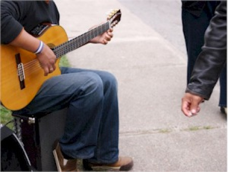

# Mensen willen graag betalen
### 2008-08-02

Door Kevin Kelly.

Ja, alles wordt gratis, maar in mijn ervaring willen mensen betalen. Dat willen ze echt! Mensen, massa's mensen, zullen spul grijpen dat gratis is. Ze zullen spul dat gratis is uitbproberen dat ze nooit aan zouden raken als ze hadden moeten betalen. Ze zullen altijd, door de bank genomen, graviteren naar de laagste prijs, en wat is er lager dan gratis? <!--more-->

::: as-is

:::

Maar als mensen de middelen hebben geven ze er de voorkeur aan om de makers van producten en diensten die ze waarderen te betalen. Betaling:
1. Is een manier van verbinden.
1. Is een teken van waardering.
1. Is een stem.
1. Geeft loyaliteit en verbintenis met de maker aan.
1. Voelt goed voor de betaler om te ondersteunen.

Mensen kopen spullen, maar waar we naar hunkeren zijn relaties. Betaling is een elementaire soort relatie. Zeer primitief, maar echt.

Er zitten wat waarschuwingen in deze drang om te betalen.

Betalen dient supereenvoudig te zijn, idiot-proof en wrijvingsloos. Er mogen geen drempels zijn. Des te makkelijker het is om te betalen, des te enthousiast wilen mensen betalen.

De prijs dient redelijk te zijn. Redelijk in relatie met vergelijkbare spullen die gratis zijn!

Het voordeel van betalen dient duidelijk en transparant te zijn. Om dit te produceren heb je creativiteit nodig en het kost werk om het eenvoudig over te brengen. Betalen wordt gehinderd tenzij de voordelen van betalen vanzelfsprekend zijn.

Is er enig bewijs voor de wil om te betalen? Onlangs las ik een [Engelse enquete](http://arstechnica.com/news.ars/post/20080616-survey-young-adults-willing-to-pay-for-musicon-their-terms.html) die gesponsord is door British Music Rights (vertegenwoordigen daarmee muzikanten en uitgevers van muziek) die suggereert dat fans graag willen betalen. Volgens deze studie blijken de respondenten een onbeperkte dowload service vrij van DRM (Digital Rights Management) te willen te hebben die legaal toegankelijk is voor een maandelijkse contributie—een manier van betalen (voor muziek) die nog niet bestaat.

Fans willen graag betalen als het makkelijk en voordelig is.

Martien zegt: Kortom, **gemak, genot, gewin** blijkt extreem waardevol.

Vrije vertaling van [People Want To Pay](http://www.kk.org/thetechnium/archives/2008/08/people_want_to.php) van [Kevin Kelly](http://kk.org/) door Martien van Steenbergen.