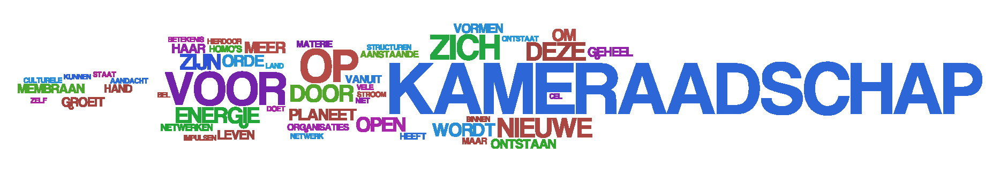

# Metamorfose
### 2008-05-05

::: vista

:::

> **Van rups naar vlinder op wereldschaal—Hoe aan de vooravond van de aanstaande orde het kameraadschap van het millennium ontstaat.**

## Leven

In een uithoek van het Universum, in een verlaten eenzaam sterrenstelsel zwerft een **kleine blauwe planeet** in een onbeduidend zonnestelsel. De blauwe planeet kenmerkt zich door een bijzondere eigenschap: er is **leven aan boord**. Het vele water maakt de planeet blauw, en slechts een zevende is land. Overal zie je leven.

Op die planeet vinden we een nietig stukje grond dat slechts 0.02% van de totale oppervlakte vertegenwoordigd. De dieren die daar leven vertegenwoordigen slechts één procent van de planetaire biotoop. De verst ontwikkelde dieren op die planeet, **homo habilis**, zijn in als beste staat om **creatief energie om te zetten in materie** met de meest uiteenlopende en bizarre verschijningsvormen. Op dat kleine stuk lage land leven vooral veel vrijdenkers. **Schepselen en scheppers**.

Verder hanteren die homo’s iets wat ze “**taal**” noemen en werken ze intensief met symbolen, concepten en memes—besmettelijke informatiepatronen en de basis voor culturele evolutie, en soms revolutie.

## Wijze dwazen
 Aan de vooravond van de dertiende baktun—een periode van 395 zonnejaren of 144,000 dagen—komen een aantal wijze dwazen, kunstenaars van de aanstaande orde, gedreven door hun onvrede met de gevestigde orde, bij elkaar en smeden ze een plan. De **volgende orde** dient zich al aan en sluimert en woedt inmiddels als een **veenbrand in de onderstroom**.

De een is vrijmoedig kunstenaar van het enthousiasme en worstelt met zijn plek in het Universum en zijn waarde voor het Universum. De ander is onbevreesd opruimer en duikt regelmatig op om het geheel in harmonie te houden, maar heeft ook wat interne dissonanten op te lossen. Weer een ander is taalkunstenaar en woordenschepper en doet daarmee stof opwaaien, maar is te lief en aardig. Velen dreigen ten onder te gaan op deze voor hen boosaardige planeet. Tijdens een van de samenscholingen in de bossen besluiten ze een nieuwe meedogenloos liefdevolle en radicale cel op te zetten die de komende memes breed onder de aandacht gaat brengen.

## Cultureel membraan
 Deze kameraadschap documenteert haar **waarden, grondbeginselen, persoonlijkheid en identiteit**. Hierdoor ontstaat een **cultureel membraan**: een **open, doch organisatorisch gesloten systeem**, een membraan, een bel waarbinnen veilig nieuwe netwerken en structuren kunnen ontstaan. Dit **open gesloten micromilieu** geeft de **eerste levensvorm aan het organisme** van de kameraadschap. Binnen dit open gesloten micromilieu worden gerichte acties en reacties ondernomen. Hierdoor kunnen bepaalde zeldzame samengestelde elementaire organisatorische bouwstenen in grote aantallen worden gevormd. Tot deze bouwstenen behoren vooral ook bouwstenen van het membraan zelf waardoor het totale membraanoppervlak hand over hand toeneemt.

## Radikaal open
 Al hun belevingen, praktische kennis, kunde en ervaring wordt met zorg, aandacht en precisie in symbolen, taal, concepten en informatiepatronen opgeslagen en publiek gemaakt. Een **open kennislichaam met een vrije informatiestroom naar binnen en buiten**.

Door deze **volkomen transparantie** kunnen externe organismen, vriend en vijand, delen ervan die zinnig zijn en betekenis hebben voor hen, in hun context, in zich opnemen. Net zoals het planetaire bacteriologische netwerk datzelfde al millennia doet op microscopische schaal. Het kameraadschap heeft **aantrekkingskracht** onder geestverwanten, en omdat deelname aan het kameraadschap open staat voor iedereen die zich kan vinden in de grondbeginselen nemen steeds meer homo’s deel aan het kameraadschap.

Het **stofwisselingssysteem** van het kameraadschap zorgt voor een gezonde en open uitwisseling van energie en grondstoffen met de omgeving. Reputatie, geld, energie, diensten, grondstoffen, giften, en andere middelen vormen een **voortdurende stroom van energie** tussen alle vormen van organisatie, zo ook voor dit kameraadschap. Dit open netwerk van energie en materie is in haar kern uitermate eenvoudig, maar door de miljarden verbindingen ontstaat een zeer complex geheel. **Simplexiteit** in optima forma. Zo ontstaat een **innige interne samenhang** binnen het kameraadschap. Tegelijkertijd groeit er een evenzo innige samenhang met de omgeving van deze goedaardige radicale cel.

## Betekenisvolle impulsen
 De kameraadschap laat zich niet dirigeren of sturen, maar bepaalt zelf door welke interne of externe impulsen het zich graag laat verstoren. Ontdekkingen en herinneringen vanuit de **wetenschap**, vanuit de **spiritualiteit**, vanuit de **kunst**, vanuit de **technologie** en met name vanuit de **natuur** vormen een **niet-aflatende bron van inspiratie**. Elk signaal dat ze op hun **antennes** binnenkrijgen en dat betekenis heeft in hun context wordt geanalyseerd en krijgt een plek in het geheel. Het begin van de **holarchie**.

Ze voelen zich geroepen om zich te gedragen als een **enzym**, als een **katalysator** voor het versnellen van het **doorbreken** van de komende orde. Zo vormt het kameraadschap een netwerk van boodschappers en informatiebronnen. Als katalysatoren groeien ze een complex netwerk van boodschappers dat op alle belangrijke plekken in de rest van de biotoop reacties op gang brengt en enorm versnelt.

Tegelijkertijd zorgen ze op deze manier voor het ontstaan van grotere, lossere en meer algemene verbanden en versterking van de vele duizenden geestverwante individuele cellen en kleine clusters die als los zand verspreid liggen over dat nietige stukje laagliggende land. Tijd- en lotgenoten klonteren meer en meer samen. En, zoals het een goed katalysator betaamt, worden ze daarbij zelf niet verbruikt. Eerder het tegenovergestelde: hun kameraadschap groeit en groeit, en **het aantal katalysatoren neemt hand over hand toe**.

## Onstuimige ontwikkeling
 Die katalyse, die versnelling, is van levensbelang voor de directe samenleving en de biotoop van de kameraadschap. De planeet als geheel is aan het opbranden als op de huidige manier wordt doorgeleefd. Het voortbestaan van vele levensvormen op die planeet is in gevaar. Niet dat dat iets uitmaakt voor het Universum, maar toch.

Langzaam en zeker groeit de kameraadschap. Homo’s komen en homo’s gaan. Structuren worden evensnel hersteld als afgebroken, en **zo vernieuwt de kameraadschap voortdurend**. Als een **zinderende stroom van structurele veranderingen**. Dit terwijl het **organisatiepatroon** zélf gehandhaafd blijft.

De **open stroom van energie en materie** wordt gekoesterd en gecultiveerd. Zou de aandacht voor deze stroming te lang verslappen, dan vervalt het kameraadschap in een chaotische nietsbeduidende ruis. Er wordt dus veel energie gestoken in het **tuinieren** van de kameraadschap en haar organisatiepatroon en energiestromen zodat het geheel zich ver van haar ruisachtig evenwicht kan **handhaven en doorontwikkelen**.

Deze **uitermate simplexe netwerken van netwerken** kenmerken zich als **zelforganiserende en zelfvernieuwende levende systemen**. Het open karakter van de kameraadschap blijkt een levensbelangrijke voorwaarde te zijn voor de ontwikkeling en evolutie van het kameraadschap.

Het kameraadschap groeit en groeit en tot de dynamiek van de dissipatieve structuur van de kameraadschap behoort specifiek ook het **regelmatig spontane ontstaan van nieuwe ordeningsvormen**.

## Verdubbelende Verdubbelingen

De energiestromen van het kameraadschap nemen hand over hand toe en zorgen al snel voor een toestand waarin de stabiliserende krachten niet langer in staat zijn de integriteit van het culturele membraan in stand te houden. Het systeem stevent af op een splitsing. Zo valt de bel uiteen in twee of meer kleinere bellen.

Telkens als een cel zich deelt worden alle elementen doorgegeven—het culturele membraan van **beginselen, waarden, persoonlijkheid, en identiteit, het kennislichaam**, de enzymen, kortom **het volledige simplex van netwerken van netwerken wordt gedupliceerd in de nieuwe cel**.

Na zo’n splitsing blijven de kenmerkende eigenschappen van de kameraadschap herkenbaar. **De bel heeft geheugen**. De verschillende bellen zullen nu met elkaar wedijveren om energie. Door een vorm van natuurlijke selectie worden sommige vormen versterkt en geselecteerd op grond van hun **evolutionaire voordelen**.

Zo kan elke bel op zichzelf doorontwikkelen en zich gaan onderscheiden van de andere. Vanuit deze splitsing kan de kameraadschap zich vertakken tot een geheel **nieuwe dynamische balans** waarin nieuwe structuren en nieuwe vormen kunnen ontstaan.

Het aantal splitsingen dat de kameraadschap zo doormaakt zorgt voor steeds simplexere verschijningsvormen van de kameraadschap.

## Symbiogenese
 Zo nu en dan treden ook **versmeltingen** op van verschillende bellen. Dit resulteert soms weer in de **synergie van gunstige eigenschappen**, als een voorafschaduwing van het latere verschijnsel. **Symbiogenese**—het ontstaan van nieuwe levensvormen door middel van een symbiose van organismen.

De kameraadschap beseft zich dat deze processen van groei en replicatie alleen zullen optreden indien energie en materie door het culturele membraan heenstromen. Naast de persoonlijke energie van de leden dienen ook andere vormen van energie voortdurend door de celwand te stromen. Een **stroom van geld**, gereedschappen en bouwmateriaal zijn dus van doorslaggevend belang. Daarom wordt veel aandacht besteed aan een gezonde en levensbelangrijke geldstroom.

Tientallen, honderden, duizenden bellen ontwikkelen en evolueren zich zo voortdurend. Nieuwe samenwerkingsverbanden ontstaan vanwege **de neiging van verschillende organisaties om in sterke samenhang met of zelfs in elkaar te leven**. Deze symbiose leidt langzaam en zeker tot nieuwe vormen van leven—**symbiogenese**—de voornaamste evolutieroute voor hogere organismen.

## Radikaal enzym
 In de rol van radicaal enzym richt het kameraadschap zich als **katalytische boodschappers** voornamelijk op de processen die tot de spontane verschijning leiden van nieuwe ordeningsvormen. De bijbehorende structuren zijn daarbij van minder belang en eerder een zij-effect.

Langzaam en zeker strekt het effect van de kameraadschap zich uit en groeien draden ervan binnen in andere organisaties en lichamen op een symbiotische manier.

Het kameraadschap **modificeert aan de lopende band overtuigingen en opvattingen** in de buitenwereld en **schept zo nieuwe contexten voor de leefomgeving** waarin ze is ontstaan. Hierdoor krijgen impulsen en verstoringen, die eerder geen betekenis hadden, ineens **betekenis** voor andere organisaties, instituten en ondernemingen. Vervolgens helt het kameraadschap deze impulsen op een gezonde wijze te **integreren** in diezelfde organisaties.

## Meedogenloos liefdevol
 Het kameraadschap richt zich in het bijzonder tot diegenen die bevoegd zijn tot het nemen of vergemakkelijken van beslissingen als er belangentegenstellingen in het spel zijn. Het verschaft die gemeenschap een **groot evolutionair voordeel** waardoor de overlevingskans in de aankomende orde vele maken groter is dan bij gemeenschappen waar zo’n individu ontbreekt.

Ook het kameraadschap zelf heeft het benoemen van deze **meedogenloos liefdevolle beslissers** omarmd als een van de organisatorische grondbeginselen. Deze homo’s worden gekozen door de gemeenschap vanwege hun wijsheid en ervaring als solide grondslag voor collectief handelen. **Wijs en effectief handelen**.

Ondertussen groeit het **openbare kennislichaam** en de kameraadschap met grote stappen en zijn er groeistuipen te herkennen. **De geest van het kameraadschap waart over het lage land** en meer en meer laten andere organisaties zich inspireren en begeesteren door het kameraadschap. Hierdoor voelen ze zichzelf ook meer en meer **deelgever** van dit kameraadschap.

Op een gegeven moment wordt het belang van de kameraadschap door haar omgeving als zo belangrijk onderkend dat honderdduizenden individuen de handen ineen slaan en een fonds inrichten die de energiestroom in de vorm van geld van het kameraadschap borgt en garant staat voor haar **duurzaamheid en veerkracht**. Zo worden ze **mede-eigenaar** van de op handen zijnde aanstaande ordening.

Dit tot steeds groter ongenoegen van de gevestigde orde die er alles aan doet om de vergroting van de winst ten gunste van de aandeelhouders te maximaliseren ten koste van **de planeet als geheel**.

Aanvallen, vijandige overnames, subversieve handelingen, smeergeld, ja alles wat je doet in een levensbedreigende situatie, wordt ingezet om te voorkomen dat de aanstaande orde en de **nieuwe organisatiepatronen doorbreken**.

Elke weerstand is echter vergeefs. De nieuwe orde zal onvermijdelijk doorbreken en haar volledige omarming en harmonieuze integratie is aanstaande.

## Holarchie
 Baktun 12, de transformatie van materie en de triomf van het materialisme slaat om. Een frisse en vernieuwde wetgeving, een enkelvoudig universeel verzekeringsapparaat, een landelijk fonds voor collectieve investeringen dat de belasting vervangt door verlichiting en een nieuw holacratisch bestuur zijn gevormd.

Een volledig **open source** initiatief voor gemeenschappelijke software—”**executeerbare kennis**”—voor bedrijf en overheid is bloeit alle kanten op. Voor een fractie van de kosten en moeite wordt **duizendvoudig betere software** gekweekt die de vrij beschikbare energie uit het veld letterlijk **informeert**—vorm geeft.

Een nieuwe, eerste, holarchie is geboren, klaar voor de dertiende baktun, het tijdperk van de vijfde zon, het tijdperk van de ether en de doorbraak naar de **noosfeer**.
