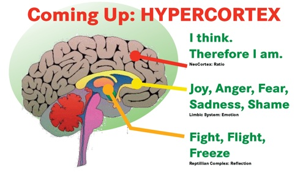

# Noösfeer
### 2010-03-19

::: vista

:::

Onze Aarde is als een ui: een geneste verzameling van ringen of schalen: lithosfeer, biosfeer, atmosfeer, technosfeer, cybersfeer en noösfeer. Noëtica bestudeert met name in ons collectieve bewustzijn opkomende noösfeer.

Noëtica—van het Grieks νοητικός ‘mentaal’ en *νοεῖν* ‘denken’ (van *νοῦς*)—is een tak van metafysische filosofie die zich richt op de studie van de geest en intuïtie en haar relatie met het goddelijke intellect. Een van de belangrijkste doelen is het bestuderen van de effecten van opvattingen, overtuigingen en de intentie met betrekking tot het menselijk bewustzijn.

Alle definities van noëtische wetenschappen komen uit op de kracht van de (menselijke) geest:

> **Noëtische wetenschap is de ‘verstandsleer’ waarbij mensen met een bundeling van hun geestelijke vermogens macht kunnen uitoefenen op de materie.**

Nog één evolutionaire stap verder kom je bij de wijsheidsleer—sofotica.

[Amit Goswami](http://aardnoot.nl/Amit_Goswami) vat het kernachtig samen en zegt in zijn boek [The Self-Aware Universe](http://aardnoot.nl/The_Self-Aware_Universe) in wezen:
> **‘consciousness matters’**—**bewustzijn materialiseert**; letterlijk.

De kwantumfysica en -theorie verzamelen steeds meer bewijs voor het ‘[observer effect](http://en.wikipedia.org/wiki/Observer_effect_(physics))’—de golfdeeltjes ‘storten ineen’ tot hun deeltjesvorm als gevolg (de intentie) van hun observator. Het antwoord op de vraag ‘Wordt de materiële wereld beïnvloed als veel mensen hun aandacht op hetzelfde richten?' is dus ja.

Ook Deepak Chopra claimt: [[De ziel van leiderschap|ziel ≡ geest ≡ bewustzijn]]. Jouw herinneringen zijn letterlijk ‘gelokaliseeerd’ in jouw brein, ze zitten niet echt ín jouw brein. **Jouw brein is een zendontvanger.** Wanneer we elkaars bewustzijn delen zijn we verliefd en raakt en roert het ons. Onze **intentie manifesteert de mogelijkheden** die ons **bewust zijn**. Je ziel is een veld van oneindige mogelijkheden.

### Noëtica
 Noëtica resoneert rondom de volgende kernbegrippen:
- **omegapunt**—bewustzijn van de *Eenheid van Alles wat Is*;
   - onbekende bestemming van de menselijke evolutie;
   - in het werk van [Pierre Teilhard de Chardin](http://nl.wikipedia.org/wiki/Pierre_Teilhard_de_Chardin) het klimatologisch convergentiepunt (harmonische convergentie) van de menselijke evolutie als emergentie van het hieperpersoonlijke;
   - door de Tijdwet gedefinieerd als punt van volledig superbewustzijn;
   - universele telepathie ingesteld als norm voor de menselijke mentale conditie;
   - haar dageraad is winter-noordelijke/zomer-zuidelijk zonnewende van 2012;
   - haar voltooiing in de Tzolkin—ook wel de Harmonische Module genaamd, of de Heilige telling der dagen; het Mayaanse weefgetouw, welke de 20 solaire zegels met de 13 maantonen verweeft—is op ‘[Gele Galactische Zaad](https://www.mytzolkin.com/?page=1&aDTS=1374789600,1734217200&hl=nl)’ (26 juli 2013) ook bekend als de ‘droombetovering’ van galactische cultuur;
- **lithosfeer** (*lithos* = steen)—omhulsel van planeet Aarde;
   - korst van inerte massa van planeet Aarde;
- **biosfeer** (*bios* = leven)— omhulsel van het leven;
   - alle vormen van leven van een meter onder de oppervlakte tot enkele honderden meters in de atmosfeer;
- **cybersfeer**—omhulsel van informatie en kennis;
   - virtuele ruimte waarin de integratie naar het omegapunt plaatsvindt; en
- **noösfeer** (*nous* = bewustzijn)—omhulsel van de geest;
   - bewustzijnsgebied dat door de mens wordt opgeroepen zou naar omegapunt opschuiven;
   - mentale envelop of veld van Aarde, discontinue en boven de atmosfeer;
   - onbewust tot de ontdekking en toepassing van de Tijdwet;
   - geactiveerd door de registratie van de menselijke biomassa in correcte 13:20 frequentie via de universele adoptie van de Dertien Maankalender;
   - beschrijving van de getransformeerde toestand van de biosfeer;
   - samenvallend met het einde van de geschiedenis;
   - voorwaarde voor universele telepathie volgend op de ineenstorting van de technosfeer en toepassing van de Tijdwet;
   - synchroon met de programma's van Aarde's octahedrale kern.

::: as-is

:::
::: as-is

:::

Teilhard de Chardin—een antropoloog uit het midden van de 20e eeuw—ontwierp een allesomvattend raamwerk. Teilhard werd geïnspireerd door een weinig bekend werk, De Biosfeer, van Vladimir Ivanovitsj Vernadski. Teilhard veralgemeniseerde Verdanski's concept door **de evolutie van onze planeet te zien als ingesloten sferen**.

Eerst de lithosfeer, die alle inerte materie van deze planeet weergeeft. Vervolgens de biosfeer met alle levensvormen. De biosfeer lijkt op een dichte schil van biomassa rond inerte materie en ligt fysiek ingesloten in een dunne laag van een paar meter beneden tot enkele honderden meters boven het Aardoppervlak—inclusief het water en de lagere gebieden van de atmosfeer voor vogels, insecten in de lucht en micro-organismen.

Pas in de 21e eeuw gaven de mensen de illusie op dat zij zich konden losmaken van de natuur. We komen meer en meer tot het besef dat er is slechts één levensvorm op aarde is—de **biosfeer**:

> **De gehele menselijke soort speelt in de biosfeer eenzelfde rol als een orgaan in ons eigen lichaam**.

De volgende laag—de **noösfeer**—is meer etherisch. Het is de ruimte waarin alle vormen van bewustzijn, inclusief menselijk bewustzijn, op elkaar inwerken. Wat Teilhard zag was dat, naarmate de mensheid zich meer bewust werd van de onderlinge afhankelijkheid, zij ook zou groeien in het bewustzijn van haar Eenheid.

Teilhard dacht dat het doel van de menselijke evolutie wat hij noemde het ‘**omegapunt**’ zou zijn, een **kosmisch bewustzijn van Eenheid** dat rekening hield met alle verscheidenheid.

## Cybersfeer
 Ondertussen hebben we de middelen—de **cybersfeer**—om deze verschuiving in bewustzijn te versnellen.

Toen computertechnici in de 20e eeuw dachten dat zij een gewoon computernetwerk maakten, schiepen zij in feite een extra dimensie en een nieuw soort ruimte.

De cybersfeer is het verband tussen Teilhards noösfeer en haar bestemming. Het is de virtuele ruimte waarin de integratie van het menselijk bewustzijn zich kan manifesteren. Het speelt een rol gelijk aan de rol die de lithosfeer heeft gespeeld voor de biosfeer. Alle levensvormen gebruiken direct of indirect inerte chemische componenten van de lithosfeer en herschikken die om hun eigen fysieke levensondersteunende systemen te maken. **De cybersfeer is de voedingsbodem voor de noösfeer** zoals de lithosfeer de voedingsbodem is voor de biosfeer.

Vijfhonderd miljoen jaar geleden leidde een plotselinge mutatie in de biomassa tot de Cambriaanse explosie: eencellige levensvormen gaven een uitbarsting van biologische diversiteit te zien en er kwamen vele ingewikkelde meercellige organismen tot stand.

Honderden miljoenen jaren later ontstond de fotosynthese en, nog later, leidde de gelijktijdige opkomst van seksuele voortplanting en individuele dood tot andere mijlpalen. Kennelijk ondergaat de evolutie zulke kwantumtransformaties of [[metamorfose]]s.

De cybersfeer bevrijdt het leven van de beperkingen van langzame moleculaire recombinatie waardoor ze kan reizen met de snelheid van het licht.

De cybersfeer ontketent een nu een uitbarsting van hogere kennis, intelligentie en potentieel wijsheid met de mens als intrument, als medium.

## Cosmopedia
Piere Lévy noemt de kennissfeer in zijn boek [Collective Intelligence](http://aardnoot.nl/Collective_Intelligence) **cosmopedia**. De cosmopedia maakt het navigeren van kennis moeiteloos. De kennis vouwt zich voortdurend om jouw huidige behoefte heen. Het is alsof je over de oceaan van kennis zeilt en een spoor achterlaat. Lezen is schrijven in cosmopedia.

Collectieve intelligentie is gedistribueerde intelligentie waarbij het totaal groter is dan de som der delen. Cosmopedia is het substraat voor de noösfeer, voor de collectieve wijsheid. Niemand weet alles en iedereen weet iets.

De voorspoed van een gemeenschap is afhankelijk van de vaardigheid waarmee men over de cosmopedia navigeert. Onze levende kennis, wijsheid, vaardigheden en creativiteit worden hand over hand erkend en herkend als de primaire bron van alle rijkdom. Een onomkeerbaar proces.

Het Internet benadert ondertussen de rekenkracht van een enkelvoudig menselijk brein waardoor de kennissfeer of cosmopedia zich ontwikkelt tot een [[hypercortex]].

::: as-is

:::

Elke nieuwe sfeer beheerst, overheerst de voorgaande. De technosfeer heeft zich factoren sneller ontwikkeld dan de biosfeer. De infosfeer en kennissfeer doen daar nog een schep bovenop. De snelheid waarmee noösfeer als een warme deken over ons heen wordt gelegd zal menigeen verbazen. De opkomst en aanwezigheid van elke sfeer is onomkeerbaar. Verzet tegen haar ontstaan is zinloos.

Aarde is geen planeet, geeneens een biosfeer, maar een kosmos waarin de mensheid communiceert met dieren, planten, landschappen en geesten. Aarde is de ruimte waarin de mens, de stenen, groenten, beesten en goden elkaar ontmoeten, spreken en scheiden in een oneindig proces van re-creatie.

De mensheid is de soort toegewijd aan Aarde, de kosmos van communicerende dieren en planten, toegewijd aan de chaosmos van [[metamorfose]].

De infosfeer, kennisfeer en noösfeer zijn **u-topia, geen-plaats, Nergensland**. Het kent geen belichaming. Het is zich aan het realiseren, virtueel en in potentie al aanwezig, wachtend op haar geboorte. Net onder de oppervlakte ontstaan haar sporen. Het flikkert zelfs voordat het haar kans krijgt om zich te ontvouwen naar zelfstandigheid. Ze is onomkeerbaar.

De lithosfeer is de steentijd van de geest. De steen is niet langer silex maar het silicon van microprocessoren en optische fiberkabel.

De intentie van het collectieve intellect is niet om Aarde te vernietigen, noch het territorium, noch de markteconomie. In tegendeel, het op de lange-termijn overleven van de voorgaande sferen wordt zonder twijfel mogelijk gemaakt door de opleving, letterlijk, van een nieuw bestaansvlak voor de mensheid.

Elke nieuwe sfeer overstijgt en omvat de voorgaande. Aarde is een ui.

> **De mens is het medium, stommerd.**

::: as-is

:::

Uit het Universum ontvangen we inspiratie en ideeën die wij als schepselen en scheppers, creatoren letterlijk **vormgeven**—informeren—door energie te vertragen naar vaste vorm—wij laten het **aarden**. Vanuit die aarding sturen wij wensen, verlangens en **intenties** het Universum in. Het Universum trekt vervolgens alle registers open om die intenties te manifesteren. Zo is de kringloop van eeuwige creatie en entropie rond.

## Hamer, zaag en munt
**Sommige dingen doe je beter met een zaag, andere met een hamer.** In het Stenen Tijdperk gebruikten de mensen hetzelfde stuk gereedschap voor veel verschillende doeleinden: een fragment van een gebroken steen kon voor van alles gebruikt worden, van het doden van een prooi tot het snijden van leer en het schoonmaken van de nagels.

Gedurende de 19e en 20e eeuw lijkt er eenzelfde vasthoudendheid te zijn geweest door te proberen hetzelfde monetaire hulpmiddel—de nationale munteenheden—voor van alles te gebruiken, van wereldhandel tot het betalen van iemands studie of van de ouderenzorg.

Om een andere metafoor te gebruiken: dit zou gelijkstaan aan aan te nemen dat het zenuwstelsel de enige informatiedrager in het menselijk lichaam is en geen aandacht te schenken aan de rol van de bloedsomloop, van het lymfestelsel en van een groot aantal biochemische reacties.

Net zoals koning Midas alles wat hij aanraakte veranderde in goud, zo verandert het kapitalisme alles wat in haar baan komt in handelswaar. Kapitalisme is onomkeerbaar.

De vroege 21e eeuw kenmerkt zich als een onstuimige tijd waarin drie tsunami's elkaar in rap tempo opvolgen:
- **Tsunami van Waardeverschuiving**—zet oude modernistische metrieken zoals winst, groei en bruto national product om naar de de waarden van het Tijdperk van Integratie;
- **Tsunami van Informatie**—verschaft aan ongekende aantallen mensen ongekende toegang tot kennis; en
- **Tsunami van Geld**—vult oude systemen van nationale munteenheden aan met nieuwe geldsystemen die cohesie en [[samenlevenskunst]] katalyseren.

Met rasse schreden komen we tot het inzicht dat het idee van ‘één munt voor alles’ snel moeten verlaten. Steeds meer mensen willen hun ‘baan’ verruilen voor ‘werk’ waardoor ze gepassioneerd uit kunnen blinken in hun talent.

Het aantal **cultureel creatieven** groeit exponentieel. Het aantal ZZP-ers neemt hand over hand toe. Onze oude schaarse nationale munteenheden zijn niet ontworpen om zo’n explosie van willekeurige creativiteit te ondersteunen. Onze **roestende goudstaven** zijn aan vervanging toe.

Deze golven leiden tot een versnelde verandering van ons economisch stelsel. De cybersfeer schept haar eigen cybereconomie—de grootste en snelst groeiende economie ter wereld. De cybersfeer injecteert nieuwe economische speelregels en geldsystemen in het bestaande systeem. **Wie niet met zijn tijd meegaat, gaat mettertijd.**

Laten we de munteenheid afstemmen op de behoefte die in een bepaalde situatie is ontstaan in plaats van met ons huidige stelsel als een soort ‘**Gouden Hamer**’ alles in een spijker te willen veranderen.

In de cybersfeer is de omwisselbaarheid tussen verschillende muntstelsels is technisch triviaal. Duizenden, miljoenen verschillende systemen werken naadloos samen als een organisch geheel. Elk component evolueert zich voortdurend om zich aan te passen aan de eisen en mogelijkheden van de omgeving waarin het werkzaam is—[[vrijgeld]] pur sang.

Metrieken zoals BNP, winst en groei verouderen in rap tempo en verschrompelen voor onze ogen. Nieuwe meetmethoden voor waardesysteming die **waarde en waardering** helder en inzichtelijk maken beginnen aan een stroomversnelling. Frisse nieuwe geldsystemen hebben de potentie als [[Doorbraakversneller]]™, katalysator voor de [[metamorfose]] naar het Briljanten Millennium.

Werkt het geldsysteem voor jou of werk jij voor het geldsysteem?

## Alomtegenwoordig, alwetend, almachtig
De cybersfeer en noösfeer zijn alomtegenwoordig (omnipresent) en alwetend (omniscient) en vormen de voedingsbodem voor onze collectieve wijsheid. Zodra wij als collectief, als zwerm uitblinken in wijze beslissingen en keuzes groeit onze verantwoordelijkheid en vrijheid ontluikt onze almachtigheid (omnipotent). [[Wetenschap bewijst bestaan van God|Zijn wij God? Zijn wij Allah? Zijn wij Boeddha?]]

> Alles wat wij zijn is het resultaat van onze gedachten…
> > —Boeddha

---

Heel toevallig: tijdens het samenstellen van dit artikel wilde ik in het woordenboek termen opzoeken die met *sofo* (wijsheid) beginnen. Ik sla het woordenboek redelijk willekeurig ongeveer bij de s open en het eerste woord dat me in het oog springt rechtsbovenaan de pagina is **singulariteit**.

**[[Toeval bestaat]]**.

---

### Meer

- [Noosphere Collective](http://www.noosphereforum.org/collective/)
- [Foundation for the Law of Time](http://lawoftime.org/)
- [Institute of Noetic Sciences](http://www.noetic.org/)
- [Spiralscience.net—Connecting Science and Spirituality](http://www.spiralscience.net/)
- [Noosphere II Introduction](http://www.lawoftime.org/noosphere.html)
- [Biosphere-Noosphere Transition](http://www.lawoftime.org/noosphere/transition.html)
- [Planet Art Network Nederland](http://www.tortuga.com/eng/network/netherlands/index.php)
- [My Tzolkin Maya Kalender](http://www.mytzolkin.com/)
- [Het Geld van de Toekomst » Een bezoek aan de campus van Stanford](http://aardnoot.nl/Het_geld_van_de_toekomst/Een_bezoek_aan_de_campus_van_Stanford)
- [[Metamorfose|Aardbron » Metaformose]], Van rups naar vlinder op wereldschaal—Hoe aan de vooravond van de aanstaande orde het kameraadschap van het millennium ontstaat.

### Wetenschappers
 Wetenschappers die zich met deze ‘materie’ bezighouden of -hielden:
- [Ervin László](http://nl.wikipedia.org/wiki/Ervin_Laszlo);
- [Rupert Sheldrake](http://nl.wikipedia.org/wiki/Rupert_Sheldrake);
- [Amit Goswami](http://www.amitgoswami.org/);
- [Pierre Teilhard de Jardin](http://nl.wikipedia.org/wiki/Pierre_Teilhard_de_Chardin);
- [Buckminster Fuller](http://nl.wikipedia.org/wiki/Buckminster_Fuller);
- [Vladimir Ivanovitsj Vernadski](http://nl.wikipedia.org/wiki/Vladimir_Vernadski).