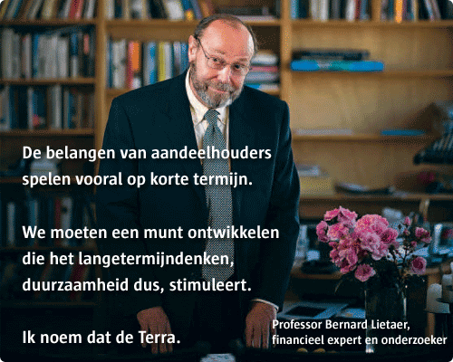

# Op zoek naar een nieuw idee van ‘geld’
### 2009-11-06

::: vista

:::

Bron: *[De Morgen](http://demorgen.be/), maandag 6 oktober 2009, pagina 10 en 11*

**In het boek *Verder dan morgen* interviewt Vlaams minister Kathleen Van Brempt binnen- en buitenlandse politici en wetenschappers over duurzaamheid, migratie en diversiteit, gezinsbeleid en de toekomst van de sociaaldemocratie.**

Hieronder een exclusieve voorpublicatie van haar gesprek met professor [Bernard Lietaer](http://aardnoot.nl/Bernard_Lietaer), verbonden aan het Center for Sustainable Resources van de University of California in Berkeley. Van 1978 tot 1983 werkte Lietaer bij de Nationale Bank van België, waar hij onder meer direct betrokken was bij de ontwikkeling van de euro.

---

::: as-is

:::

In Brazilië heeft hij een ‘onderwijsmunt’ gelanceerd, de Saber. Je kunt als kind Sabers verdienen door iemand iets te ‘leren’. Later kun je er je studie mee betalen. In Japan wordt ouderenzorg bekostigd met een tegoed dat je door de jaren heen hebt opgebouwd door vrijwilligerswerk te doen. De Belgische professor Lietaer zoekt naar iets dergelijks van globaal formaat: een duurzaam geldsysteem dat niet van de bankwereld afhankelijk is.

Zoals de meeste mensen ging ik er vanuit dat geld gewoon een ding is waarmee je betalingen kunt verrichten. Tot professor [Bernard Lietaer](http://aardnoot.nl/Bernard_Lietaer) me vertelde hoe maar liefst 98 procent van het ‘gewone’ geld vandaag niet wordt gebruikt voor betalingen van goederen en diensten, maar om te speculeren. De gevolgen daarvan zijn instabiele financiële markten, financiële crisissen, armoede en milieuproblemen.

“Er bestaat een verborgen hypothese dat geld iets neutraals is, dat het alleen maar een praktisch ding is, een middel om betalingen mee te verrichten. Maar geld is helemaal geen ding. Als ze je naar een verlaten eiland sturen met een zakmes en 1.000 euro in bankbiljetten of kredietkaarten, dan blijft op dat eiland je mes een mes, maar je geld wordt papier of plastiek. Het blijft geen geld. [[Geld is een afspraak]] in een gemeenschap. Je kunt ook andere afspraken maken. Airmiles zijn bijvoorbeeld een andere afspraak om betalingen te verrichten.”

> “**Elke euro is in feite begonnen als een banklening. Zo’n systeem is helaas een kaartenhuis.**”
> —[Bernard Lietaer](http://aardnoot.nl/Bernard_Lietaer)

**Airmiles zijn toch gewoon kortingbonnen, zoals de punten van Delhaize?**

“Het zijn commerciële *loyalty currencies*. Men probeert er de klant mee te binden. Ze hebben geen diepere sociale betekenis. In Japan is er bijvoorbeeld een andere munt, de [Fureai Kippu](http://aardnoot.nl/Fureai_Kippu), waarvan er 475 systemen operationeel zijn. Dat heeft wél een sociale betekenis. Die munt wordt gebruikt in de bejaardenzorg. Alles wat niet betaald wordt door de sociale zekerheid wordt wel gedekt door de [Fureai Kippu](http://aardnoot.nl/Fureai_Kippu).

Als je aankopen doet voor een bejaarde, kookt voor hem of haar, met iemand gaat wandelen, of iemand helpt een bad te nemen, kan dat betaald worden in Fureai Kippu. De uren die ‘vrijwilligers’ besteden aan bejaardenzorg, komen terecht op een tijdrekening, die werkt als een spaarrekening. Wanneer ik later zelf zorg nodig heb, kan ik van die middelen gebruik maken om iemand te betalen. Ik kan het geld ook naar mijn moeder sturen, zodat zij iemand kan betalen om haar te helpen. Er zijn in Japan honderdduizenden mensen die dat doen.”

**Dat klinkt heel sympathiek, maar wat is het voordeel ten opzichte van gewoon geld? Ik kan toch ook gewoon yens naar mijn moeder sturen?**

“Er zijn 1,8 miljoen Japanners die dagelijks hulp nodig hebben. Japan is, samen met Italië, de snelst verouderende samenleving ter wereld. Je hebt dus de keuze: als je oneindig veel geld hebt als overheid, kun je de kosten van die veroudering betalen in de gewone munt. Maar er zal een moment komen waarop er zoveel zorgbehoevende bejaarden zijn, dat je dat niet meer kunt. Dan begint de harde keuze. Ofwel moet je de belastingen verhogen tot boven de 100 procent, ofwel gebruik je de methode van Margaret Thatcher: de taart blijft even groot maar je verdeelt ze in steeds kleinere stukjes. De derde oplossing is een speciale munt scheppen die niet uit hetzelfde budget betaald wordt.”

**Hoe kan ik zeker zijn dat die munt een bepaalde waarde vertegenwoordigt? Als ik voor mijn buurvrouw zorg en ik stuur mijn tijdskredieten naar mijn oude moeder, dan wil ik dat het allemaal in orde komt.**

“Als je hier in België op vrijdag vis gaat kopen voor de buurvrouw, vraag je daar niets voor. Soms doen mensen wel eens iets in ruil, maar er bestaan geen afspraken over. Het gebeurt allemaal informeel.

In het [Fureai Kippu](http://aardnoot.nl/Fureai_Kippu) systeem formaliseer je iets wat dikwijls informeel geregeld wordt. De garantie dat je complementaire geld iets waard is, ontstaat uit de wederzijdse waardering. Dat is een heel andere houding dan bij gewoon geld.

“In de Verenigde Staten is er door het Maryland Institute for Ageing een studie gedaan naar het gebruik van [Timedollars](http://aardnoot.nl/Tijddollars). Dat is een gelijkaardig systeem, waarbij de waarde van de munt ook in tijd wordt uitgedrukt. In omgevingen waar een Timedollarsysteem werkt, is er meer voluntariaat. Er zijn dus meer mensen die vrijwilligerswerk doen, zonder gebruik te maken van die [Timedollars](http://aardnoot.nl/Tijddollars). In die omgevingen wordt vrijwilligerswerk immers meer gewaardeerd.”

**Is een systeem dat gebaseerd is op tijd niet fraudegevoelig? Als ik nu een uurtje met u ga wandelen, maar ik vraag u als goede kameraad om in te vullen dat ik twee uur gewerkt heb…**

*(opgewonden)* “Jij denkt nu zoals je zou denken in gewoon geld. Het zijn twee verschillende werelden. Als jij voor de verjaardag van je vriend een boek van 30 euro koopt, zeg je dan aan hem: ‘Dat heeft hier 30 euro gekost, hé vriend. Denk daar de volgende keer maar eens aan als je iets voor mijn verjaardag koopt.’ Nee, je zegt dat niet, omdat je weet dat dat niet hoort. Er is een andere manier van omgang met deze munteenheden. [[Geschenkenconomie katalyseert gemeenschapszin|Complementair geld gaat om veel meer dan financiële waarde]].

“Ik gebruik vaak een filosofische terminologie om dat uit te leggen. Ze is wat ongewoon om in economische systemen te gebruiken, maar ze maakt toch een en ander duidelijk. Het gaat om het yin-enyangprincipe uit het Chinese taoïsme. Ons normale geld is extreem yang. Het is competitief, concurrerend, hiërarchisch en concentrerend. Leg duizend euro op tafel en mensen beginnen erom te vechten. Yingeld werkt anders. Yin heeft te maken met begrippen als vertrouwen, gelijkheid, empathie, interpersoonlijke vaardigheden…

Het zuiverste yingeld is een cadeautje. Tussen die twee polariteiten heb je domeinen die meer yin zijn dan yang. Als ik een vriend help verhuizen en hij geeft me 20 euro, weiger ik die natuurlijk. Maar als hij me [Timedollars](http://aardnoot.nl/Tijddollars) of tijdseuro’s zou geven, is dat wel aanvaardbaar. Dat is een merkwaardig psychologisch mechanisme. Er bestaan empirische studies over deze gevallen in Duitsland. [[Geschenkenconomie katalyseert gemeenschapszin|Tussen vrienden is complementair geld aanvaardbaar, gewoon geld niet]].”

**De theorie is misschien eenvoudiger dan de praktijk. In uw yangsysteem wordt waardering uitgedrukt in euro’s. Iemand die briljant is in wiskunde wordt meer gewaardeerd dan iemand die briljant met kinderen kan omgaan. Want hij verdient méér…**

“Je legt de vinger op de wonde. Alles wat yang is, wordt in gewoon geld meer gewaardeerd dan wat yin is. Wij zeggen dat het allerbelangrijkste in ons leven onze kinderen zijn. Maar mensen die onze kinderen opvoeden of verzorgen, verdienen minder dan een informaticus of een *investment banker*. Alles wat van yin-aard is, wordt niet goed gewaardeerd in yanggeld. Dat is een algemeen verschijnsel.”

> “**Ideaal is een stelsel dat positief gedrag beloont, zoals recycleren, fietsen. Geld als incentive-systeem.**”
> > —Bernard Lietaer

**Ik wil nog even terugkomen op onze begindiscussie, met name dat geld niet neutraal is. Zoals veel mensen ga ik ervan uit dat geld bijna een natuurlijke orde is.**

“Dat is—naast de hypothese dat geld neutraal is—inderdaad de tweede hypothese, namelijk dat geld altijd zal blijven bestaan zoals het is, omdat het natuurlijk is. Maar dat is niet zo. In de Verenigde Staten denkt een meerderheid van de bevolking dat de regering geld creëert omdat George Washington op de bankbiljetten staat. Maar het is de privésector die geld creëert. Als de regering geld nodig heeft, moet ze dat innen via de belastingen of lenen bij de banken.”

**Hoe komt het dat een van de meest solide systemen zoals dat van de dollar vandaag in moeilijkheden komt?**

“Het probleem zit in de manier waarop geld gecreëerd wordt. Geld wordt geschapen door het banksysteem. Om het misschien een beetje te eenvoudig uit te leggen: als je een *deposit* hebt van een miljoen, kan een bank daar tien miljoen mee creëren.”

**Waardoor is dat geld gedekt?**

“Door geloof. En door de kracht van de staat om belastingen te innen in dit soort geld. Dat is iets heel merkwaardigs. De staat heeft het creëren van het geld geprivatiseerd; het gebeurt immers door de privésector. Maar de staat zorgt er wel voor dat de privésector haar monopolie op dit soort geld kan behouden door de burgers te verplichten hun belastingen in dat geld te betalen. Enkel in dat geld. Als je dat niet doet, vlieg je de gevangenis in.”

**Waar komt ons eerste miljoen vandaan?**

“Het is wat ingewikkeld. Je hebt zogeheten *fractional reserves* nodig. Dat betekent dat je slechts een gedeelte van die reserves—5 à 10 procent—moet bezitten om nieuw geld te geven als lening. [[Geld is een afspraak|Geld wordt eigenlijk uit het niets geschapen]]. Als je leent om een huis te kopen, dan crediteert de bank je rekening voor bijvoorbeeld 300.000 euro. Ze creëert dat bedrag uit het niets. Het wordt gegarandeerd door een onderpand, namelijk je eigen huis waarvoor je een lening hebt aangegaan. Je betaalt dat geld aan de persoon die je het huis verkoopt. Die zet het op zijn beurt op zijn bank. Die andere bank kan nu weer 10 keer meer geld scheppen door een andere lening. Het komt er dus op neer dat elke euro begonnen is als een banklening. Zo’n systeem is helaas een kaartenhuisje. Als een van de kaarten los komt te zitten, dreigt de boel in elkaar te storten.”

**We worden vandaag geconfronteerd met een financiële crisis in de VS. Leidt die tot een totale dollarcrash?**

“Het financiële systeem is zeer fragiel geworden en kan zelfs leiden tot een [[Als de dollar valt|dollarcrash]]. Paul Volcker, die vroeger hoofd was van de Federal Reserve, zei voor de zomer nog dat die kans 75 procent bedraagt in de volgende drie jaar. We zien nu dat het banksysteem zelf failliet dreigt te gaan. Het effect zal wereldwijd zijn. We zien nu geen crash die er in één klap komt, maar een systematische afbrokkeling van het systeem. We hebben de eerste brokken zien vallen. Maar het zal nog een hele tijd duren alvorens de banken hun balansen weer in evenwicht krijgen. Ik schat dat we nog een tiental jaar problemen zullen kennen. Als het hele banksysteem in de problemen komt, heeft dat een impact op de productie-economie, wat op zijn beurt gevolgen zal hebben voor de banken. De laatste keer dat we iets gelijkaardig hebben meegemaakt was in de jaren 30 van de vorige eeuw. Toen heeft dat geleid tot een wereldoorlog. Er is echter een andere oplossing, met name de introductie van geldsystemen die niet van de banken afhankelijk zijn.”

**Wat is volgens u het ideale systeem?**

“Het ideale systeem is een yinyangsysteem. Je hebt beide nodig. We moeten een systeem hebben dat competitief werkt. Ik wens dat computers gemaakt worden in een competitief spel. Dat zal betere computers opleveren. In het communistische Rusland is het geprobeerd om het met een niet-competitief systeem te doen, via planning. We weten waar dat is geëindigd. Ik geloof dus in competitie. Maar ik geloof ook dat competitie niet in alle domeinen moet bestaan. Het is dom om competitie en schaarste te hebben in de opleiding van kinderen, of voor zorgverstrekking, of voor het milieu. We proberen steeds om niet-competitieve spellen toch competitief te spelen.”

**Politiek is nog steeds het middel om de samenleving vorm te geven. Dus moet ze ook discussiëren over die verschillende manieren van aanpak?**

“Inderdaad, we moeten nadenken over wat coöperatief en wat competitief is. Maar zolang we het monopolie van het gewone geld behouden, zullen we een systematisch probleem hebben. Ik beweer niet dat complementaire munten de mirakeloplossing zijn. Ze zijn noodzakelijk, maar ze niet voldoende. Ik ben ervan overtuigd dat we het monopolie van het huidige geldsysteem moeten opgeven. En een van de redenen om dat te doen, zal een crisis van het geldsysteem zijn. In de jaren 30 hebben de regeringen geleerd dat ze het zich niet kunnen permitteren om het [[medeleven met Madoff|banksysteem te laten crashen]]. Daarom treden regeringen op als er een crisis is.”

**De belastingbetaler redt dus de banken.**

“Inderdaad. Ik voorspel dat we in de volgende crisis zullen ontdekken dat regeringen het zich niet meer kunnen permitteren om het banksysteem te redden. De hoeveelheden zullen te groot zijn. Wat er nu al gebeurd is met de *subprime*-hypotheken in de VS, gaat over 1,2 triljoen dollar verlies op een totaal van 6 triljoen aan derivaten. Het volgende probleem zal zich waarschijnlijk afspelen in de *bond insurance industry* (de effectenverzekering) en daar gaat het over 40 triljoen dollar, zes keer meer dan de *subprime*… Op een zeker moment zullen er discussies moeten ontstaan tussen de regeringen en het banksysteem.”

**Als u in mijn schoenen zou staan en u zou complementaire systemen willen ontwikkelen, hoe zou u dat dan doen?**

“Ik zou specifieke problemen aanduiden, zoals de vergrijzing of de milieuproblematiek en systemen ontwikkelen die positief gedrag belonen, zoals recycleren, fietsen, het openbaar vervoer gebruiken. Geld is een *incentive*-systeem. Je kunt bijvoorbeeld een complementaire munt ontwikkelen om het ‘leren’ te bevorderen. Ik werk nu aan zo een project in Brazilië. In de jaren 80 zijn er onderzoeken gebeurd naar de zogenaamde *pyramids of learning*. Als ik jou iets vertel, zal er slechts 5 procent van die gegevens blijven hangen. Als ik je een tekst geef om te lezen, zal er 10 procent blijven hangen. Als we samen een project ontwikkelen en erover discussiëren, onthouden we 50 procent van wat we gedaan hebben. Maar als jij iets aan mij uitlegt, onthou je daar 90 procent van! Met dat inzicht hebben we een munteenheid ontwikkeld die het leren moet stimuleren.

“In Brazilië zijn er bijvoorbeeld plaatsen aan de universiteit die onbezet blijven. We hebben daar de Saber gecreëerd, wat letterlijk ‘kennis’ betekent. Het is een onderwijsmunt die dezelfde waarde heeft als de nationale munt en die je kunt gebruiken om je universitaire studie te betalen. Het systeem werkt als volgt: je geeft de Saber aan kinderen van zeven jaar oud. De voorwaarde is dat ze een mentor kiezen van bijvoorbeeld tien jaar oud om hen iets te leren. De tienjarige doet hetzelfde met een twaalfjarige en zo verder tot het een achttienjarige bereikt die naar de universiteit wenst te gaan. De laatste kan de Sabers meenemen naar de universiteit om daar zijn studie mee te betalen, om studiereizen te maken… Iedereen doceert dus, met uitzondering van de allerjongsten. Bij iedereen blijft 90 procent van de kennis hangen. De Saber stimuleert dus het leerproces. Om iedereen in het proces te betrekken, kun je ervoor zorgen dat diensten die je met de Saber kunt kopen, niet betaalbaar zijn in de gewone munt. Je kunt zoiets bedenken op elk domein.”

**Conventionele munten zijn niet duurzaam, zegt u, omdat ze het kortetermijndenken stimuleren.**

“De belangen van aandeelhouders spelen vooral op korte termijn. Dat heeft te maken met de rente en de intresten op geld. Het zou interessant zijn om een munt te ontwikkelen die het langetermijndenken, duurzaamheid dus, stimuleert. Het gaat om een wereldmunt die niemands nationale munt is. Zo vermijd je dat je munt onderhevig is aan internationale conflicten.

“Vandaag heeft zo’n internationale munt nog geen kans, althans niet zolang de dollar de rol speelt die hij vandaag speelt. Maar indien de dollar crasht, ontstaat er een opening voor nieuwe wereldmunten. Ik noem dat de Terra. De Terra wordt gebacked door een korf van de belangrijkste grondstoffen zoals olie, graan, koper, tin, enzovoort. Zo wordt de Terra ook inflatiebestendig, want ook de inflatie wordt berekend aan de hand van een korf van goederen en diensten.

Een tweede belangrijke kenmerk is dat er een [[stroomgeld|duurzaamheidsvergoeding]] wordt geheven op de Terra, de zogenaamde [[stroomgeld|circulatierente]]. Wie de Terra houdt, wie dus zijn geld parkeert, betaalt een parkeerticket van 3,5 tot 4 procent per jaar. Omwille van die [[stroomgeld|negatieve rente]] heb je er belang bij om de Terra te laten circuleren. Zo stimuleer je de handel en de investeringen. Vergeet niet dat vandaag al 10 tot 15 procent van de wereldhandel gebeurt zonder nationale munten, via ruilhandel. Die groeit vandaag drie keer sneller dan handel die met conventioneel geld wordt betaald. Wat de Terra doet, is dat bestaande systeem standaardiseren. Ik ben ervan overtuigd dat in de toekomst een munt zoals de Terra een noodzakelijke voorwaarde is om duurzaamheid op wereldvlak te ontwikkelen.”

index: true
---

Kathleen Van Brempt, Verder dan morgen, gesprekken met zicht op de toekomst, is uitgegeven bij Houtekiet. Interviews met Michael Braungart, Job Cohen, Bernard Lietaer, Kjell Erik Øie, Sunder Katwala, Rik Pinxten, Marion van San en Katja van Putten. 19,95 euro

