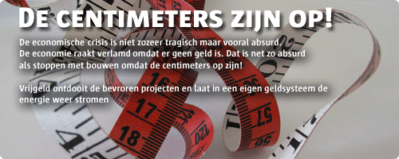

# Oud versus nieuw geld
### 2008-10-28

::: vista

:::

Ondertussen liggen financieel directeuren van financiële instelling met psychosomatische klachten en burn-out in het zorgcentrum of thuis. Dus niet alleen onze Aarde brandt op, onze mensen ook. Heel jammer, want deze mensen zijn vaak goede leiders en bestuurder. 't Zou mooi zijn als deze mensen geholpen worden door anderen die al genieten van de [[voordelen van ecogeld]].

[[Het elfde schijfje]] en [[renterot]] voeden de honger naar een nieuw geldsysteem dat **samenwerken aanwakkert en concurrentie ontmoedigt**. Wenselijke eigenschappen van dit soort geldsystemen zijn:
- Efficiënt en veilig electronisch betaalsysteem.
- Omwisselbaar in plaatselijke uitgaven zodat je tegoeden in de (virtuele) gemeenschap om kan zetten in voedsel en andere dagelijkse behoeftes.
- Niet-nationaal—afwezigheid van nationale grenzen zodat (virtuele) gemeenschappen ook over fysieke grenzen heen hun zin kunnen geven. Een Nederlander dient in staat te zijn om een Indiase onderneming ook te vergoeden in andere munteenheden dan euro's, dollars of rupees.
- Zelfregulerend, zelforganiserend en zelfhelend.
- Ondersteunend bij het scheppen van gemeenschappen.

Geldsystemen die concurrentie bevorderen versus geldsystemen die samenwerking bevorderen.

||||
|--:|---|:--|
|PARASITAIR|→|SYMBIOTISCH|
|DEEL**NEMER**|→|DEEL**GEVER**|
|OPBRANDEN|→|BRUISEN|
|SLAVERNIJ|→|VRIJHEID|
|GRAAIEN|→|GEVEN|
|LOON|→|PASSIE|
|GESLOTEN|→|OPEN|
|OPPOTTEN|→|STROMEN|
|CENTRAAL|→|‘PEER-TO-PEER’|
|CONCURREREN|→|COÖPEREREN|
|SCHAARS|→|VOLDOENDE|
|RENTE|→|‘STROOMGELD’|
|BANKSCHULD|→|REPUTATIE|
|FIAT-GELD|→|‘ZELF’GELD|
|NATIE|→|GEMEENSCHAP|

Lees ook [[geld als instrument voor massaheling]].

Bron: [Het geld van de toekomst](http://aardnoot.nl/Het_geld_van_de_toekomst), [Bernard Lietaer](http://aardnoot.nl/Bernard_Lietaer).
