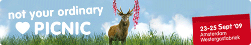
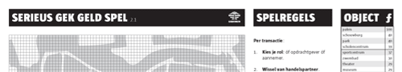

# PICNIC 2009 Money Lab
### 2009-09-14

::: vista

:::

Op woensdag 23 september organiseren De Waag Society en Imagine IC tijdens ~~[PICNIC 2009](http://www.picnicnetwork.org/)~~ een ~~[Money Lab](http://www.picnicnetwork.org/page/53096/en)~~ in samenwerking met [[Aardbron]]. In het ochtendprogramma presenteren experts de actuele genetwerkte en globale monetaire orde en haar alternatieven. Het ochtendprogramma is open voor alle PICNIC-bezoekers.

Het ochtend- en middagprogramma worden aan elkaar gelijmd door het [[Serieus Gek Geld Spel]].

Tijdens het middagprogramma gaan de handen uit de mouwen om de ~~[Bijlmer Euro](http://www.bijlmer.softhook.com/)~~ praktisch in elkaar te knutselen. De Bijlmer Euro onderzoekt en inspireert multi-etnische vertrouwensgemeenschappen door nieuwe en aanvullende monetaire stelsels te introduceren in de superdiverse Amsterdam Bijlmer.

We zoeken effectieve en strategische antwoorden op:
1. Hoe kan RFID-technologie de Bijlmer Euro werkend krijgen?
1. Hoe dienen eurobiljetten gemerkt te worden om ze te kunnen volgen in gemeenschapswinkels.
1. Hoe kan de (technologie) van de Bijlmer Euro op een sociaal duurzame manier geïmplementeerd worden?
1. Hoe krijgen we gemeenschappen en lokale winkels mee in dit project? Neem deel aan het Money Lab en geef vorm aan nieuwe duurzame vertrouwensgemeenschappen.

::: vista

:::

## Sprekers

- **Christian Nold**—Artiest, ontwerper en onderwijzer, werkend aan nieuwe participatieve modellen voor gemeenschapsrepresentatie.
- **Anthony Citrano**—Cultureel Analist, Activist, Entrepreneur, The Cosmic Tap.
- **Oliver Dudok van Heel**—Directeur, The Lewes Pound CIC (Community Interest Company)
- **Martien van Steenbergen**—Ecosoof en {wijze dwaas}, Aardbron.
- **Bas Withagen**—Back-end Developer, Waag Society.

**Wouter Boog** from [[JAM School over Visueel Denken|JAM Visual Thinking]] will create a visual recording of the afternoon workshop that will function as a group memory and ‘{praatplaat}’.

## Case Studies

- ~~[Bijlmer Euro](http://www.bijlmer.softhook.com/)~~
- [Lewes Pound](http://www.thelewespound.org/)

### Money Lab
 Het Money Lab is een samenwerkingsverband tussen [ImagineIC](http://www.imagineic.nl/), [Waag Society](http://www.waag.org/) en ~~[PICNIC](http://www.picnicnetwork.org/)~~ met bijdragen van [[Aardbron]].

Ben je geïnteresseerd? Stuur dan een bericht aan **evelyn [at] imagineic.nl**.

### PICNIC Labs
 PICNIC labs zijn een deel van het wildzoemende PICNIC Festival. Ze brengen internationale denkes en makers in een intens cocreatieproces samen en stuwen het veld voort door op een speelse manier diverse expertises en ervaringen te combineren.

Er zijn labs op het gebied van duurzaamheid, ‘augmented cities’, alternatieve geldsystemen en meer. De labs trappen af met een plenair panel (THINK) en vervolgen met een praktisch gerichte sessie (MAKE; alleen voor genodigden) en presenteren de uitkomsten in de hoofdzaal (PITCH).