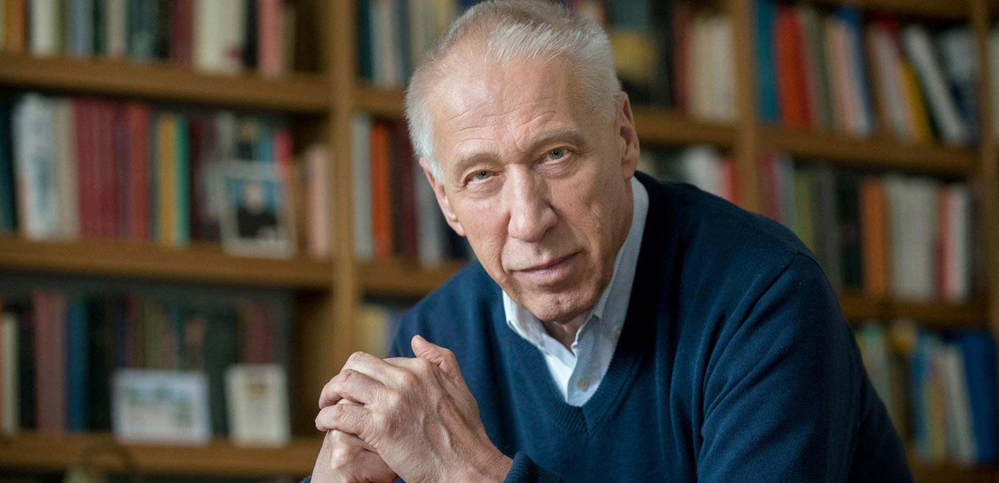

# Pleidooi voor een laatmoderne levenskunst—Joep Dohmen
### 2007-03-24
::: vista

:::

Pikte net het staartje op van een [pleidooi voor een laatmoderne levenskunst](http://aardnoot.nl/images/f/f6/Pleidooi_voor_een_laatmoderne_levenskunst-booklet.pdf) van filosoof [Joep Dohmen](https://joepdohmen.nu) en [Sjors Frölich](https://nl.wikipedia.org/wiki/Sjors_Fröhlich) en tijdens het programma [Cappuccino](https://nl.wikipedia.org/wiki/Cappuccino_(radioprogramma)).

Boeiend. En met een [[Aloha|hoog Aloha-gehalte]].