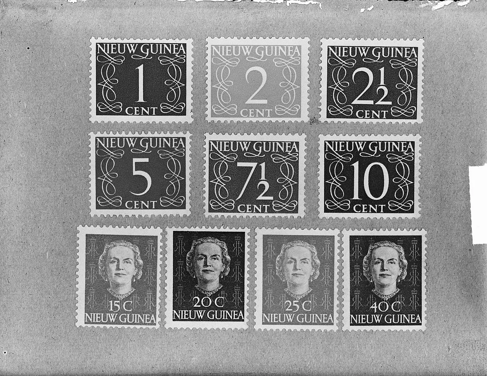

# Postzegels waardevast
### 2010-09-15

::: vista

:::

Postzegels hebben voortaan een cijfer, meldt TNT Post.

Postzegels hebben voortaan een cijfer: 1 voor post t/m 20 gram en een 2 voor post van 20 tot en met 50 gram. **Maakt dat postzegels waardevast?** Interessant.

Stel ik koop nu 250.000 postzegels van €0,44. Daar moest ik tot 1 september 2010 €110.000,— voor betalen. Vandaag, 15 september 2010, moet ik daar met €0,46 per zegel overigens €115.000,— voor betalen. Die postzegels leg ik netjes in een goede kluis.

Stel, over 10 jaar moet je voor dezelfde postzegels €0,57 betalen (o.a. door inflatie). Hé, ik heb nog een stapeltje van 250.000 postzegels liggen. Ik verkoop ze voor €0,56. De koper heeft dan een voordeel van 250.000 centen, ofwel €2.500,—. Zakelijk altijd interessant. Mijn voordeel is 250.000 dubbeltjes (€0,56 – €0,46), ofwel €25.000,—.

Kortom, zij postzegels vanaf nu inflatievrij of waardevast?!

Beleggen in postzegels, een waardevaste belegging? Beter dan beleggen in goud?

Wat doe ik fout in mijn redenering?