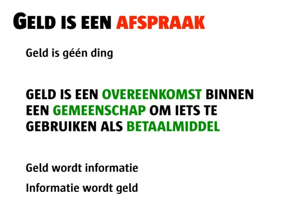
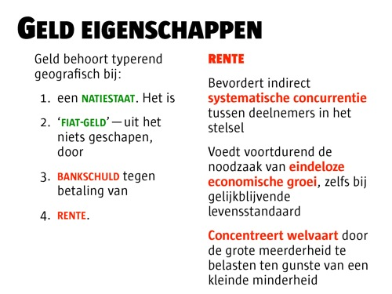

# Renterot
### 2008-10-28

::: vista

:::
[[Het elfde schijfje]] illustreert treffend de desastreuze gevolgen van rente of interest:
1. Interest bevordert indirect **systematische concurrentie** tussen deelnemers in het stelsel.
1. Interest voedt voortdurend de noodzaak van **eindeloze economische groei**, zelfs bij gelijkblijvende levensstandaard. Het loont om *vandaag* bomen te kappen, het hout te verkopen en het geld op de bank te zetten. Het geld groeit harder dan de bomen en holt zo onze Aarde uit.
1. Interest **concentreert welvaart** door de grote meerderheid te belasten ten gunste van een kleinde minderheid. Rijker worden rijker. Armen worden armer. De kloof ertussen scheurt steeds sneller open.

Rente zoals we dat nu kennen en gebruiken drijft gezinnen, gemeenschappen en naties dus uit elkaar en brandt onze Aarde op.

::: vista

:::

[[Geld is een afspraak]] en hetzelfde geldt voor een concept zoals rente. [[Invoering van ecogeld|Robuuste geldstelsels]] die rente op schulden inruilen voor [[stroomgeld]] blijken die ontrafelende eigenschappen niet te hebben. In tegendeel, ze **bevorderen gemeenschapszin en samenwerking** juist en verleggen de focus van winst op korte termijn naar duurzaamheid op lange termijn.

## Alternatieven: LETS en Time Dollars
 Het wemelt ondertussen van complementaire geldsystemen. LETS, Time Dollars, Air Miles, en zo voort. In principe zoeken ze naar mogelijkheden om dingen voor elkaar te doen.

Bedrijven kunnen bijvoorbeeld condities stellen in het accepteren van Time Dollars, maar er is één fundamentele algemene conditie: **de negatieve rente**.

Geld moet rollen, het is immers een ruilmiddel. Wanneer jij je Time Dollars vasthoudt, moet je daar rente over betalen (vergelijkbaar met vermogensbelasting in Nederland). Ik noem dat [[stroomgeld]]. Het wordt dus aantrekkelijk om ze uit te geven. Het spoort je aan je facturen snel te betalen want hoe langer ze openstaan, hoe meer je erop verliest.

### Coöperatief en toekomstgericht
 Het systeem van Time Dollars is:
1. **Coöperatief** i.p.v. competitief: nu gaat het erom: wat is je produktiekracht? Over 20 jaar ’werkt’ nog maar 20% van de mensen, die andere 80% kan zichzelf dus niet meer identificeren met hun produktiekracht. Wél kunnen ze anderen laten delen in hun passie en daar wederdiensten voor terug krijgen.
Het competitieve systeem blijft ernaast bestaan – we willen niet Rusland imiteren – het is beter een auto te kopen die competitief is gebouwd. Of je brengt een sportief wedstrijdelemenent in zoals bij de Olympische spelen om de innovativiteit en creativiteit om te winnen aan te wakkeren.
1. **Ecologisch verantwoord**: als je met de Time Dollars alles gedaan hebt wat je je kunt bedenken, ga je dingen doen die op termijn geld besparen of opleveren. Bomen planten of het equivalent ervan, je huis isoleren bijvoorbeeld.

Bron: [Het geld van de toekomst](http://aardnoot.nl/Het_geld_van_de_toekomst), [Bernard Lietaer](http://aardnoot.nl/Bernard_Lietaer).