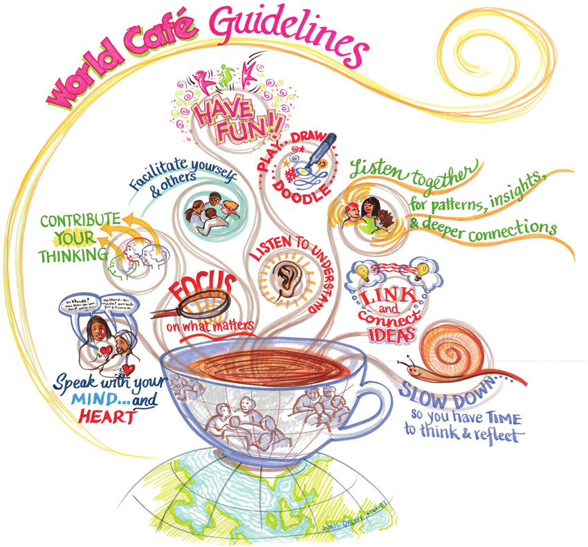

# Samenscholing over alternatieve waardesystemen
### 2009-11-16

::: nota-bene
**UITVERKOCHT!**—Tot onze vreugde is deze gratis samenscholing ‘uitverkocht’. [[contact|Laat ons weten]] als je er persé toch bij wilt zijn of als je uitgenodigd wilt worden voor een volgende.
:::

Op **7 december 2009** organiseren Ronald van den Hoff van [MINDZ](http://www.mindz.com/) en [[contact|Martien van Steenbergen]] van [[geld|Aardbron]] bij [Seats2Meet in Utrecht](http://www.seats2meet.com) een bijeenkomst voor genodigden over **~~[Alternatieve Waardesystemen](http://www.mindz.com/events/Alternatieve_waardesystemen)~~**:
> **Binnen sociale netwerken vindt er veel waardeuitwisseling plaats. Vaak gebeurt dit met gesloten portomonnees. We noemen dat sociaal kapitaal. Op dit moment laat zich dat lastig meten. Daarnaast is er de 'oude' economie waar het geldsysteem steeds wankeler wordt. Tijd om na te denken over nieuwe oplossingen, ofwel over een nieuw waardeuitwisselingssysteem.**
> Tijdens deze middag gaan we niet alleen de discussie aan over nieuwe systemen, maar gaan we ook aan de slag om er daadwerkelijk een op te zetten, zodat deze geimplementeerd kan worden in bijvoorbeeld Mindz.com.
> Dit evenement is **alleen op uitnodiging**. Dus als je uitgenodigd bent kan je je **~~[registreren bij Mindz](http://www.mindz.com/events/Alternatieve_waardesystemen/register)~~**.

Om 14:00 uur trapt Ronald van den Hoff af met zijn visie op Alternatieve Waardesystemen. Geestverruimende middelen worden toegediend door het met ons allen het [[serieus gek geld spel|Serieus Gek Geld Spel]] te spelen, gefaciliteerd door Martien van Steenbergen.

Na de verfrissende pauze duiken we om 16:00 uur het {wereldcafé} in met de {brandende vragen} zoals hieronder beschreven als tafelthema.

## {wereldcafé} met brandende vragen

Hieronder staat een voorstel voor de tafelthema's op volgorde van prioriteit—{vragen die er toe doen} en {2x2-vragen}. Je wordt aangespoord om het geheel te corrigeren, bij te sturen en aan te vullen. Ventileer vooral ook gegronde bezwaren en nieuwe voorstellen zodat we uiteindelijk zoveel mogelijk {instemming} hebben over de thema's.

::: vista

:::

- 1 rentmeester per tafel:
   - ‘eigenaar’ van de inhoud;
   - maakt nieuwe gasten in ‘no time’ bekend met de inhoud van de tafel tot op dat moment;
   - doet aan het einde van het {wereldcafé} verslag van de {SMART} voorstellen die zijn ontstaan;
- 3 deelgevers per tafel (dat is inclusief de rentmeester); dat betekent dat met 21 deelgevers er 7 tafelthema's behandeld kunnen worden
- 15 minuten per ronde
- 4 rondes totaal (totaal dus 60 minuten voor het {wereldcafé}); dit betekent dat elke deelgever zich met maximaal 4 tafelthema's bezig kan houden;
- {SMART} voorstellen door elke rentmeester tussen 17:00 en 18:00 uur worden geplakt op een {now how wow}-poster
- borrel en nazinderen

## Duizend echte fans
Hoe werven, koesteren en groeien we {duizend echte fans} in 2010? {duizend echte fans} waar we rechtsreeks mee in verbinding staan, die een Google-alarm op de gemeenschap hebben staan, die 100 km rijden voor de volgende samenscholing, die elk bevlogen hun eigen netwerk aansteken. {duizend echte fans} die gemiddeld 1 euro per dag aan je besteden?

Ontwerp een viraal (communicatie)plan dat in 2010 {duizend echte fans} verenigt.

## Stroomkringen
Hoe voorkomen we dat waarde zich gaat concentreren op enkele plekken waardoor andere plekken droog komen te staan? Anders gezegd, hoe zorgen we ervoor dat het geld blijft stromen? Stroomkringen zijn van levensbelang voor alle levende systemen, ook voor waarde- en ecosystemen.

Ontwerp een aantal stroomkringen binnen de Nederlandse economie, regionaal of nationaal, waarin de kredieten blijven stromen.

## Eén miljoen Nederlanders
Verzin manieren waarop we 1 miljoen Nederlanders in 2010 de vrijgeldervaring van hun leven kunnen geven?

## Vrijgeld BV
Hoe krijgt Van der Valk het voor elkaar om met veel minder geld veel meer te doen? Hoe verlicht Van der Valk de rentedruk waar jij meer onder lijdt? Hou houdt Van der Valk geld in de knip dat jij in jouw toko nodig hebt voor belastingen en betalingen.

Eén van de 101 motieven van Van der Valk om alle bedrijvigheid tussen het boerenbedrijf en het restaurant binnen het eigen concern te brengen dat het een handige manier is om heel veel geld te besparen. Van der Valk is restaurateur, hotelier, importeur, transporteur, opkoper, boer, adminsitrateur en opleider. In dit eigen interne ecosysteem bespaart Van der Valk al het geld dat anders nodig is voor betalingen in de handelsketen beschikbaar voor andere doeleinden. Net zoals bij [[de hoer, de boer, de slager, de waard en de toerist]]. Bovendien bespaart Van der Valk voortduren de rentekosten over geld dat anders onderweg is tussen de verschillende ondernemingen. Tussen al deze onderdelen circuleert eigen ‘geld’ middels afrekeningen binnen één boekhouding.

Verzin een vergelijkbare fusie of joint venture en bijpassende rechtsvorm tussen voorstanders die baanbrekende innovatieve waardesystemen willen omarmen en de voordelen van Van der Valks bedrijfsmodel voor zich laten werken.

## Mindz munt
Hoe ziet de ideale Mindz Munt eruit? Welk waarderings- en reputatiesysteem koestert een duurzame emotionele verbintenis tussen alle ‘Mindzers’? Welke ontwerppatronen spelen daarbij een cruciale rol?

Ontwerp het geld-, waarde- en reputatiesysteem voor de Mindz-gemeenschap.

## De Galliërs
Wat maakt dat kleine dorpje in Frankrijk zo sterk dat ze het tegen de Romeinen op durven en kunnen nemen? Welk vurig verlangen verenigt ze? Waardoor staan ze samen sterk en zijn zij ls geheel veel meer dan de som der individuen?

Hoe kunnen wij, als pioniers van nieuwe waardesystemen, onze verschillen overstijgen en onze krachten bundelen zodat we de gewenste impact hebben in de Nederlandse samenleving?

## ¥€$! Middelen!
Wat hebben we precies nodig als we een aanvullend waardesysteem willen ontwerpen, bouwen en invoeren? Hoe dienen we de wetgeving wijzigen zodat we vrijgeld kunnen implementeren? Hoe maken we het écht en gaan we van praten naar poetsen?

Waar halen de mensen, middelen en finaciering voor de realisatie van aanvullende waardesystemen vandaan en hoe borgen we de continuïteit van het initiatief?

## Speculatiegaatje
Wist je dat 98% van alle financiële transacties zich afspelen in de ‘onechte’ economie en maar 2% gebruikt wordt voor het toevoegen van waarde in de echte economie? Waar vinden we de speculanten en investeerders met (beginnende) gewetensbezwaren, die hun kennis, kunde en ervaring op dit gebied in de geest van Robin Hood voor onze samenleving in willen zetten.

Hoe kunnen we in die enorme zak speculatief geld een piepklein gaatje boren dat onze initiatieven financiert?

## WzGD?
Wat zou Google doen om aanvullende waardesystemen grootschalig te laten omarmen door de bevolking?

## Leuker kunnen we het niet maken?
Hoe kunnen we én een aanvullend waardesysteem grootschalig invoeren én voldoen aan alle wettelijke verplichtingen?
