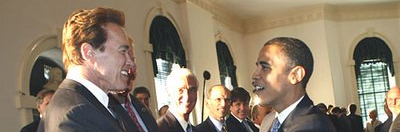
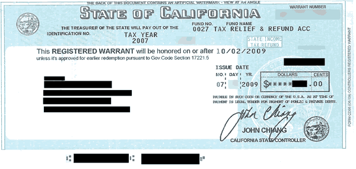

# Schwarzenegger aan Obama: Kijk en leer
### 2009-07-20

::: vista

:::

Volgens de San Diego Union-Tribune hebben zowel de Republikeinen als Democraten vrijdag 11 juli 2009 wetgeving omarmd die Californische ‘IOUs’ (‘wisselgeld’ of schuldbewijzen) wettig betaalmiddel maakt voor alle belastingen, toeslagen en andere betalingen die verschuldigd zijn aan de staat.

Hiermee gebruikt Californië de schuldbewijzen effectief als eigen munt. Als deze wet wordt aangenomen dan kan Californië, net zoals de Federale Overheid, dit direct aan haar tekorten besteden. Zodra schuldbewijzen geaccepteerd worden als betaling voor overheidsbelastingen krijgen ze direct waarde.

::: vista

:::

Wat je in feite hebt is een staat die onder de neus van de schatkist een eigen soevereine munt maakt. Al struikelend banen ze zich zo een weg en ontdekken ze de ware natuur van hedendaags geld. Wat men in eerste instantie ziet als een noodmaatregel om een gat te stoppen kan goed verankerd raken zodra overheden zich realiseren dat ze hiermee een manier hebben om te ontsnappen aan de eisen van een evenwichtige begroting.

In tegenstelling tot de meest traditionele economische denkwijze, waarbij we denken dat we belasting betalen om inkomsten te creëren, werkt dit onder een fiat muntsysteem in feite de andere kant op. De overheid hoeft geen geld uit te geven en verhoogt geen fondsen om de overheid te ‘betalen’ maar manipuleert de totale vraag in feite door belasting.

De belasting geeft de munt zijn waarde voor zover de belastingen functioneren om de vraag naar overheidsuitgaven van fiatgeld te creëren, niet om per se de inkomsten te verhogen. Het geld krijgt haar waarde doordat vereist wordt om daarmee belastingverplichtingen te voldoen. Dit geld bestaat al en wordt niet ‘gecreëerd’ door de inkomsten.

Het belangrijkst is dat de federale regering haar monopolie behoudt op grond van de huidige monetaire regelingen. Dit heeft ingrijpende wettelijke gevolgen als Californië hiermee succesvol belasting kan betalen. In de eerste plaats zijn zeker aanzienlijk minder staatsobligatie-emissies nodig als dit wetsvoorstel wordt aangenomen.

De wisselkoers tussen Californische schuldbewijzen en de Amerikaanse munt is interessant om te zien. De schuldbewijzen dienen tenminste hetzelfde, maar liever meer dan de Amerkiaanse munt op te brengen om goed te werken. Volgt New York in het kielzog van Californië?

Het lijkt op een terugkeer naar de [13 kolonieën](http://nl.wikipedia.org/wiki/Dertien_Koloniën) met allerlei zwevende surrogaatvaluta. Gezien de dreiging die het vertegenwoordigt voor de heersende economische belangen op Wall Street is het moeilijk te geloven dat de ‘Rubinieten’ onder de Democraten dit zomaar laten gebeuren. Het is een begrijpelijke reactie op een federale overheid die nog steeds de belangen van de rentenierklasse verkiest boven die van de overgrote meerderheid van de Amerikanen door de nadruk te leggen op ‘fiscale duurzaamheid’ terwijl totale vraag in het proces teniet wordt gedaan.

Er zijn politieke voordelen voor Obama door zich te ontdoen van de ketenen van het conventionele (en verkeerdgerichte) economische denken: Als de federale regering zonder twist instemt met dit voorstel van de staat Californië voorkomt het een groot politiek dilemma voor Obama: helpt hij Californië en stelt hij zich daarmee open voor de roep om hulp van andere staten—wat zijn adviseur David Axelrod niet wil—of laat hij Californië haar gang gaan en verliest daarmee 56 electorale stemmen in de volgende verkiezingen?

Door Californië toe te staan hun eigen probleem met de voorgestelde wetswijziging ‘op te lossen’ vermijdt Obama dit dilemma. En gezien het feit dat, tenminste vanuit het perspectief geld, hij en zijn team waarschijnlijk niet doorgronden hoe destabiliserend dit voor het huidige systeem is, is het mogelijk dat ze Californië gewoon haar gang laten gaan totdat de consequenties van de invoering volledig doordringen.

Dit wetsvoorstel vertegenwoordigt een diepe breuk met alle federale wetten. Het is bijna onvermijdelijk dat hierdoor een soort wettelijke uitdaging ontstaat omdat het een grote bedreiging vormt voor de monopolitsiche bevoegdheden van de federale regering op de valuta.

Dit is weer een geval waarbij Obama's onoplettendheid over de gevolgen van de fiscale crises voor de staat hem achtervolgd. Deze situatie zou niet zijn ontstaan als Obama een eenvoudig plan voor inkomstenverdeling met de staten had omarmd zodat het fiscaal beleid van de staten in harmonie met zijn voorstellen zouden werken. Dit in plaats van de impact van de federale fiscale stimulans te verzachten, zoals aanbevolen door een aantal prominente economen zoals James K. Galbraith van de Universiteit van Texas.

Het zal interessant zijn om te zien hoe dit zich afspeelt. Als Californië ervoor gaat, zal de natie dan volgen? Zullen we uiteindelijk worden geconfronteerd met het spektakel van ‘President Schwarzenegger’ die de drugsproductie van de ‘Emerald Triangle’ (de drie Californische provincies die de meeste marihuana produceren) probeert te legaliseren om belasteninkomsten te genereren en waardoor we de grenzen sluiten voor de rest van deze puinhoop? Schwarzenegger wilde altijd al president zijn, maar dan zou de Grondwet moeten worden veranderd. Misschien is dit zijn weg naar de president van de achtste grootste natie?

Vrij naar [Schwarzenegger to Obama: Watch and Learn](https://neweconomicperspectives.org/2009/07/schwarznegger-to-obama-watch-and-learn.html) door Marshall Auerback.