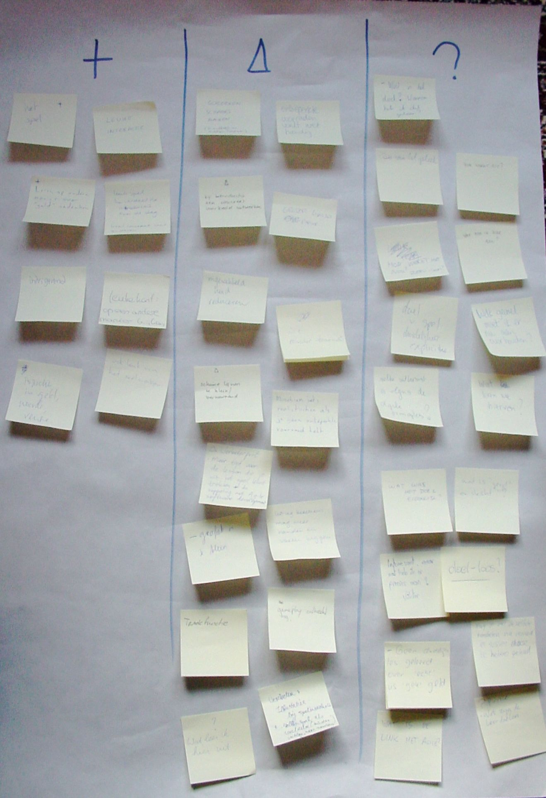

# Serieus Gek Geld Spel tijdens Agile Holland
### 2008-10-28

Tijdens de Agile Holland Herfst 2008, de eerste conferentie van deze gemeenschap, hebben we met ongeveer 50 mensen het [[Serieus Gek Geld Spel]] gespeeld.

Als introductie zette het verhaal uit [Het geld van de toekomst](http://aardnoot.nl/Het_geld_van_de_toekomst) van [Bernard Lietaer](http://aardnoot.nl/Bernard_Lietaer) over [[Het elfde schijfje]]—over de verstorende werking van rente op schulden—de toon.

### Flitsretro
Willem van den Ende en Nicole Belilos verzorgden aan het eind van de dag een ‘flitsretrospectie’ met de volgende ‘goed-beter-puzzel’:

::: as-is

:::

Goed:
- Leuke interactie.
- Goed voor het netwerken.
- Veel contact met anderen.
- Het spel zelf.
- Intrigerend.
- Inzicht in geld, waarde en rente.
- Leren om op een andere manier over “geld” na te denken.
- Op een andere manker kijken.
- Leuk spel.

Lering:
- Wat leer ik hier niet?

Beter:
- Verdeel na introductie over de dag.
- Grafiek groter.
- Schuine lijnen in grafiek te klein, verwarrend.
- Grotere lijnen op papier.
- “Omzet” bij de x-as zetten.
- Trade functie.
- Illustraties bij spelintroductie.
- Rollenspel als voorbeeld.
- Leidt eerst het publiek door een compleet voorbeeld van 1 of 2 transacties.
- Minder uitleg, meer voordoen.
- Bij introductie een concreet voorbeeld uitwerken.
- Voordoen, samendoen, zelf doen.
- Gameplay ontbreekt nog.
- Uitleg en betekenis mag meer handen en voeten.
- Meer tijd voor de lessen die je uit het spel kunt trekken.
- Koppeling met Agile Development duidelijker leggen.
- Misschien iets realistischer als je geen onbeperkte voorraad hebt.
- Onbeperkte voorraden voelt niet handig.
- Goederen schaars maken—het is nu te makkelijk om te verkopen en te verdienen.

Puzzels:
- Wat is de link met Agile?
- Wat zijn het (leer)doelen, en is de zin van het geheel? (10x)
- Waarom heb ik dit gedaan?
- Geen duidelijke les geleerd over “echt” geld versus “gek” geld.
- Minder transacties.
- Eenvoudiger maken.
- Mag je met de zelfde handelen na iemand er tussendoor te hebben gehad? Ja.
- Interessant, maar wat heb ik er precies aan?
- Wat is “goed” en “slecht”?
- Welke uitkomst is volgens de agile principles?
- Welk gevoel moet ik hier nu aan overhouden?
- Doel van het spel duidelijker en explicieter.
- Hoe werkt het nou? Zero-sum?

Met dank aan Willem en Nicole voor deze flitsretro aan het eind. En alle deelnemers van het spel, Michael Franken en Marc Evers voor de gelegenheid. Kortom, iedereen die er energie in en aandacht aan heeft besteed.
