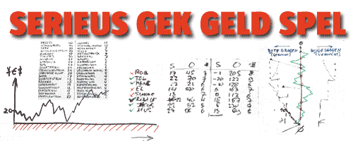

## Serieus Gek Geld Spel

::: vista

:::

Welkom bij het [[Serieus Gek Geld Spel]].

Het [[Serieus Gek Geld Spel]] simuleert handel met zowel conventioneel geld—geld uitgeven door overheden en centrale banken—als met gemeenschapsgeld. Het onthult de belangrijkste verschillen tussen deze twee soorten geld en toont hoe ze samenwerken.

De bliksemversie van het spel neemt je in minder dan een uur mee door de **emotie van geld** en maakt onverwachte energie vrij.

::: warning
Door het spelen van het Serieus Gek Geld Spel leer je anders kijken en kan je mensvaardigheid beïnvloedt worden. Met mate gebruiken.
:::

Druk ter oriëntatitie eerst de [Serieus Gek Geld Spel Handelskaart](http://aardbron.nl/wp-content/uploads/2008/10/serieus-gek-geld-spel.pdf) af (PDF, 44 KB).

Het [[Serieus Gek Geld Spel]] **gaat niet over winnen of verliezen**. Sterker nog, **er is helemaal geen competitie**. Het leidt je stap voor stap door de elementaire ideeën van gemeenschapsgeld en is een **rudimentaire simulatie van de nabije toekomst**. Het [[Serieus Gek Geld Spel]] laat je snel en speels de basisconcepten ervaren van gemeenschapsgeld en leert je het onderscheid tussen [[oud versus nieuw geld]].

Alles wat je doet is artikelen kopen en verkopen van een standaardlijst en bekijken wat het geld doet.

Terwijl het geld komt en gaat toont het spel je:

- hoe conventioneel geld en gemeenschapsgeld van elkaar verschillen;
- de effecten van het verschil tussen beide geldsystemen;
- de waarde van het gebruik van beide geldsystemen; en
- hoe je gemeenschapsgeldsystemen zonder risico kunt gebruiken.

Het [[Serieus Gek Geld Spel]] is de snelste, makkelijkste en meest betrouwbare weg naar begrip van gemeenschapsgeldsystemen. Tijdens het spelen in groepen heb je tegelijkertijd ook veel lol. Het netwerken en leggen van nieuwe verbindingen is een aangenaam bijverschijnsel van dit spel.

### Wat kost het?

Natuurlijk kost het spelen wat van je waardevolle tijd, maar niet zo heel veel. Met alles spelers in één ruimte kost het je ongeveer 1 tot 2 uur van start tot finish. Meer als je er zin in hebt, maar in het algemeen niet minder).

Dus het kost een paar minuten van je tijd, je hebt veel plezier en je leert nieuwe mensen kennen en je leert een paar belangrijke sleuteleigenschappen van een complementair geldsysteem dat samenwerking boven concurrentie verkiest.

Te mooi om waar te zijn? Helemaal niet. Maar geloof ons niet: neem de proef op de som en speel het spel om erachter te komen.

### Hoe speel je het?

Het doel van het spel is om de concepten van gemeenschapsgeld bij je te introduceren, en om je te laten zien hoe je het kan gebruiken.

Je wordt verondersteld een lid van een gemeenschap te zijn.

Net zoals in de echte wereld verdien je en geef je uit door een serie van transacties tussen jou en een ander.

- Je doel is om zoveel mogelijk artikelen met de hoogste prijs in elke %-categorie aan te schaffen.
- > Je start met €200 denkbeeldig “federaal” geld in €—monopoly geld—uitgegeven door de fictieve overheid of de centrale bank, en nul florijnen (ƒ).
- Tijdens elke handeling of transactie ben je óf koper óf verkoper.
- > Als koper kies je het artikel dat je wilt kopen uit de lijst.
- > Als verkoper heb is het gevraagde artikel altijd leverbaar. Er is geen tekort aan artikelen. Als verkoper ben je wel beperkt tot de verkoop van maximaal 12 artikelen.
- Jouw spel is compleet zodra je exact één artikel uit elk van de 10%-categoriën uit de lijst hebt aangeschaft.
- > Net zoals in de echte wereld variëren je inkomsten als verkoper en zijn ze onvoorspelbaar. Tegelijkertijd dien je je inkomsten zo goed als mogelijk te regelen, voortdurend op zoek naar de aanschaf van het duurste artikel uit een %-categorie.
- > Je variabele inkomsten en de beperkte hoeveelheid conventioneel “geld” maken het onwaarschijnlijk dat je het duurste artikel in elke categorie kunt aanschafen. Desondanks blijft dat je doel zodat je lering tijdens het spel optimaal is.
- Federaal geld (€) kan nooit in het rood staan. Lenen mag ook niet.
- Jouw bankrekening voor gemeenschapsgeld (ƒ) is positief (krediet) of negatief (belofte) gebaseerd op je handelsverleden.

Er zijn twee zaken ter overweging om het spel beter te maken voor je:

- Doe je best om het duurste artikel (de som van de € en ƒ waarde, uitgedrukt in €) in elke categorie te kopen.
- > Dit is geen aansporing tot gedachteloos consumeren. Pogen om 10 van de duurste artikelen aan te schaffen maken duidelijk hoe de verschillende vormen van geld jouw inspanningen wel en niet ondersteunen. Als je zonder dit doel speelt leer je niet veel van het spelen.
- Speel alsof het spel “echt” is. Speel het als een serieus spel.
- > Wanneer je lokaal met vrienden, buren en lokale bedrijven handelt wil je niet te ver afwijken van het midden van de handelskaart totdat je wat meer omzet hebt gemaakt en wat verder op de kaart zit.
- > Het is een kwestie van reputatie en zorgvuldigheid—in de echte wereld blijven wijze handelaren uit het rode gebied van de handelskaart om een goede reputatie in de gemeenschap te behouden. De terughoudendheid van andere handelaren om teveel gemeenschapsgeld te accepteren (te blauw te worden) voorkomt ook te grote spanning tussen positieve en negatieve balansen. De meest effectieve manier om systeemstabiliteit te waarborgen is:
- > > **caveat vendor**—verkoper wees op je hoede

### Spel en werkelijkheid

Het spel gaat alleen maar over het uitwisselen van geld (speelgeld) en te ervaren wat er gebeurt. Het is een oud en bekend verhaal: je inkomsten zijn variabel—soms goed, soms slecht—en je roeit met de riemen die je hebt.

Echter, terwijl het spel op sommige manieren de werkelijkheid benadert zijn er belangrijke verschillen:

1. Je koopt van een andere speler en ze hebben altijd wat je wilt hebben voor de afgesproken prijs.
1. Het doel is om te demonsteren wat ''geld'' doet, niet wat ''mensen'' doen. Daarom hoef je prijzen, kwaliteit of de reputatie van de verkoper niet te overwegen. Het spel wordt op basis van een eenvoudige instructieset gespeeld die de spelers een beperkt aantal keuzes biedt—“Wat wil ik kopen?”, “Heb ik voldoende geld?”. Het echte leven is een stuk gecompliceerder voor de meesten van ons.
1. Je kunt maar één artikel uit elke categorie kopen.
1. Dit is een vlokomen kunstmatige beperking die aan het spel is toegevoegd om te tonen hoe gemeenschapsgeld zich verhoudt tot locale arbeid, terwijl nationaal geld in het algemeen nodig is voor geïmporteerde goederen of diensten, en wat dat betekent voor handelsbalansen, de omgeving en consumentenkeuze. Deze regel vereist tevens dat de spelers het bereik van beiden munteenheden tot het uiterste testen—sommige artikelen kosten hoofdzakelijk ƒ en anderen hoofdzakelijk €.
1. Bij elke transactie vindt zowel overdracht van € als ƒ plaats.
1. De ene overdracht is in gemeenschapsgeld, ƒ, en de andere is in federaal geld, €, die de nationale munteenheid vertegenwoordigt. In de echte wereld zullen de meeste transacties ook op deze manier verlopen.
1. In de echte wereld word alleen de ƒ afgehandeld door de “ccsp” (Community Currency Service Provider). Je betaalt de “federalen” via de banken, pin, credit cards en baar geld. Een ccsp handelt alleen het “zachte” geld af, niet het “harde” geld.
1. Tijdens het spel met alle spelers in ezelfde ruimte houd je alleen de ƒ-handelingen op je handelskaart bij.
1. Het spel is eindig. Het leven gaat door.

**Zin om het [[Serieus Gek Geld Spel]] te laten organiseren en faciliteren tijdens een samenscholing?** [[contact|Neem dan contact op met Martien van Steenbergen]].