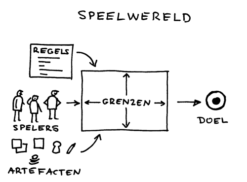

# Serieus spel
### 2010-05-14

{serieus spel}, een {parel} uit {pareltaal} in boekvorm (PDF):
- <a href="Pareltaal-Serieus-Spel-3.pdf" download>Serieus Spel (Normaal)</a>
- <a href="Pareltaal-Serieus-Spel-3-booklet.pdf" download>Seriesu Spel (Booklet)</a>

De motivatie voor het [[Serieus Gek Geld Spel]]—pak ‘serieus spel’ en schuif er ‘gek geld’ tussenin.

---

::: vista

:::

::: context
geleid door het {grootse gevaarlijke gedurfde doel} in de vorm van een {hoshin kanri} ontwerp je een nieuw systeem of onderzoek je een bestaand systeem.
:::
::: wish
Je wilt glashelder inzicht de impact van een systeem dat daardoor mogelijk zelfs een paradigmaverschuiving teweegbrengt. Je wilt de impact van haar regels en afspraken op de mens en haar omgeving duidelijk voelen zodat je de juiste ontwerpkeuzes maakt. Je wilt de diepste storingen en gevoeligheden van systemen begrijpen.
:::

Vang de essentiële regels en afspraken in een interactieve spelvorm en speel het spel met een {breed, diep en dwars} team zodat je het systeem aan den lijve voelt. Besteed aandacht aan de regels en aan degenen die daar de macht over hebben. zien is geloven, dus neem een {proef op de som} en toets het systeem aan de {beginselen} en het {grootse gevaarlijke gedurfde doel}.

::: rationale
Er is niets zo effectief om het leren te versnellen als ondergedompeld worden in een fysiek spel. Hoe eenvoudiger hoe beter, nog beter met weinig of geen middelen. Zo low-tech mogelijk. Je ziet dan bij sommigen écht het kwartje vallen—een prachtig moment.
:::
