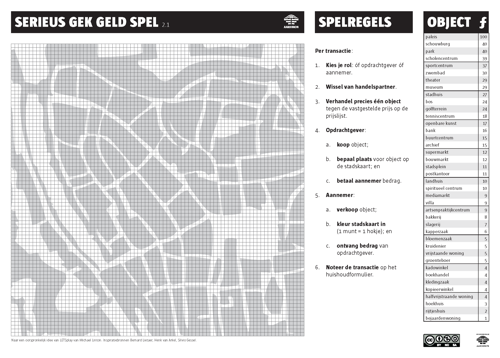

# Serious Funny Money Game
### 2009-09-01

::: vista

:::
The twin brothers Sinbad and Aladdin have lived in good harmony for many years, but now king Midas, their father, is dying. Having anticipated his death for quite some time, they agreed to divide the country in halves and either rule one part individually once their father had passed away.

::: as-is

:::

The three of them have designed **a profound new monetary system**, which Aladdin will put to the test in his country, while Sinbad will continue using the current system, the one we use too.

Starting from scratch, they will create a brand new capital city in just ten years, and the monetary systems that leads to the most beautiful, flourishing, and exalting society will be adopted into both countries. Which one would you like to live in?

::: vista

:::

The Serious Funny Money Game is not about winning or losing, nor about speculation. It is about the art of living together, catalyzed by **a cool and healthy monetary system that fosters collaboration and cohesion** rather than competition and efficiency. This serious game guides you through the fundamental ideas of community currencies and is a rudimentary simulation of the near future.

While your money comes and goes, the game shows you:
- how conventional and community currencies differ in fundamental and structural ways;
- the emotional and behavioral effects of both monetary systems on us and our planet; and
- the value of smart and sensible monetary systems for the art of living together.

Fun and networking are the pleasant side-effects of this serious game. Meaningful, directional, useful and joyful.

::: warning
Playing this game may change your view on life permanently. It can and probably will shift your paradigm.
:::

Also [[Serieus Gek Geld Spel|available in Dutch]].
