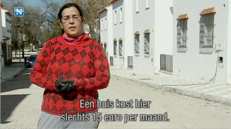

# Spaans dorp immuun voor crisis
### 2012-04-18

**Het kan dus wel!**

::: vista

:::

Ook vandaag heeft Spanje het zwaar. De rente schiet opnieuw boven de zes procent. Economen vrezen dat Spanje de eurozone en de euro opnieuw aan het wankelen brengt.

Echter, **het Andalusische dorpje Marinaleda biedt dapper weerstand aan de crisis. De gemeente met 2700 inwoners lijkt ongevoelig voor de enorme problemen waar andere Spaanse dorpen mee geconfronteerd worden.**

Europacorrespondent Saskia Dekkers doet samen met VRT-collega Sven Tuytens verslag.

Bron: [Nieuwsuur » 2012-04-16 » Spaans dorp immuun voor crisis](http://nieuwsuur.nl/video/363144-spaans-dorp-immuun-voor-crisis.html).