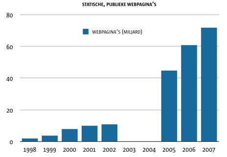
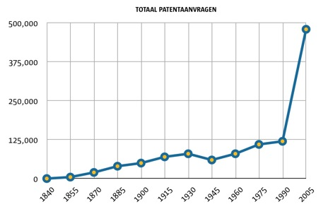
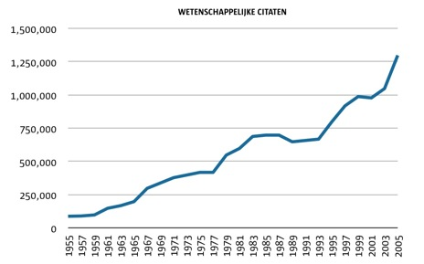
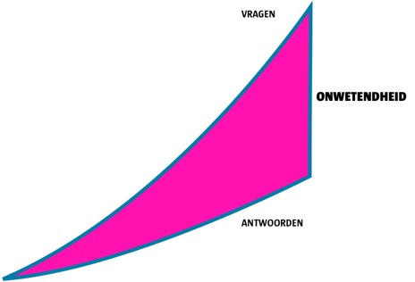

# Steeds sneller steeds dommer
### 2008-10-07

Bron: [The Expansion of Ignorance](http://www.kk.org/thetechnium/archives/2008/10/the_expansion_o.php) door [Kevin Kelly](http://www.kk.org/).

Informatie is het snelst groeiende fenomeen van dit moment. **Informatie expandeert zich tien keer sneller dan elk ander handgemaakt of natuurlijk product op deze planeet**.

Volgens een berekening van Hal Varian, een econoom bij Google, en Kevin Kelly maakten, is de wereldwijde informatie de afgelopen decennia met 66% per jaar toegenomen. Vergelijk die explosie met de snelheid waarmee zelfs de meest overvloedige handgemaakte spullen—zoals beton of papier—die de afgelopen decennia gemiddeld slechts 7% groeiden.

::: as-is

:::

Overal nemen we de expansie van informatie waar. Minder zichtbaar, moeilijker te volgen, maar net zo explosief is de expansie van kennis. Het aantal wetenschappelijke artikelen dat elk jaar gepubliceerd wordt is al meer dan 50 jaar bezig met een stevige groei. Ook het aantal patentaanvragen is de laatste 150 jaar gegroeid. Gebaseerd op deze ruwe meetwaarden **groeit kennis exponentieel**.

::: as-is

:::

 

::: as-is

:::

Als de kennis exponentieel groeit raken onze puzzels snel op. Door ons versnellend tempo van leren verklaren een aantal schrijvers dat we zijn aangeland in het tijdperk van “**het einde van de wetenschap**”. In het licht van de huidige natuurkunde—waar 96% van alle materie en energie in ons universum van een onbekende soort is die we donker noemen—is dit standpunt moelijk voor langer dan een nanoseconde vast te houden. Het is duidelijk dat “**donker**” een verzachtende omschrijving is voor **onwetendheid**.

We hebben echt geen idee waaruit grootste deel van het heelal bestaat. Als we een sonde diep in een cel, ons brein of zelfs onze aarde prikken stuiten we op een vergelijkbare staat van onkunde. We weten geen snars.

Tegelijkertijd is het ook duidelijke dat we veel meer weten over het heelal dan een eeuw geleden. Deze kennis wordt praktisch toegepast in consumentenproducten zoals GPS en iPods en een gestage toename in onze eigen levensverwachtingen. De voordelen van onze vooruitgang komt van gereedschappen en technologie. Telescopen, microscopen, fluoroscopen en oscilloscopen stellen ons in staat om op nieuwe manieren te kijken. Zodra we met die nieuwe instrumenten kijken ontdekken we ineens veel nieuwe antwoorden.

**Toch levert de paradox van de wetenschap voor elk antwoord twee nieuwe vragen op.** Meer antwoorden, meer vragen. Telescopen en microscopen expanderen niet alleen wat we weten, maar ook wat we nog niet weten. Ze maken het ons mogelijk om ons onbenul te bespioneren. Nieuwe en betere instrumenten maken nieuwere en betere vragen mogelijk. Al onze kennis over subatomaire deeltjes komt voort uit de vragen die zijn ontstaan nadat we een atoomkraker hebben verzonnen.

::: as-is

:::

Dus zelfs **als onze kennis exponentieel groeit, groeien onze vragen exponentieel sneller**. En zoals wiskundigen u kunnen vertellen is de kloof tussen twee exponentiële krommen zelf ook een exponentiële kromme. Die kloof tussen vragen en antwoorden is onze onwetendheid, en die groeit exponentieel. In andere woorden, **wetenschap is een methode die vooral ons onbenul vergroot**.

Kortom, **we worden steeds sneller steeds dommer**.

Wat dat betreft gaan we steeds meer op computers lijken—computers zijn ook dom, maar wel heel snel dom.

We hebben geen reden te verwachten dat dit in de toekomst teruggedraaid zal worden. Hoe ontwrichtender een technologie of instrument, hoe ontwrichtender de daardoor gekweekte vragen. We kunnen verwachten dat toekomstige technologiën zoals kunstmatige intelligentie, gecontroleerde kernfusie en kwantum computing—om er maar een paar aan de nabije horizon te noemen—**een spervuur van duizenden nieuwe enorme vragen** op ons loslaten. Vragen die wij zelf nooit eerder bedacht zouden hebben. Het is een veilige gok om te stellen dat we onze grootste vragen nog niet gesteld hebben.