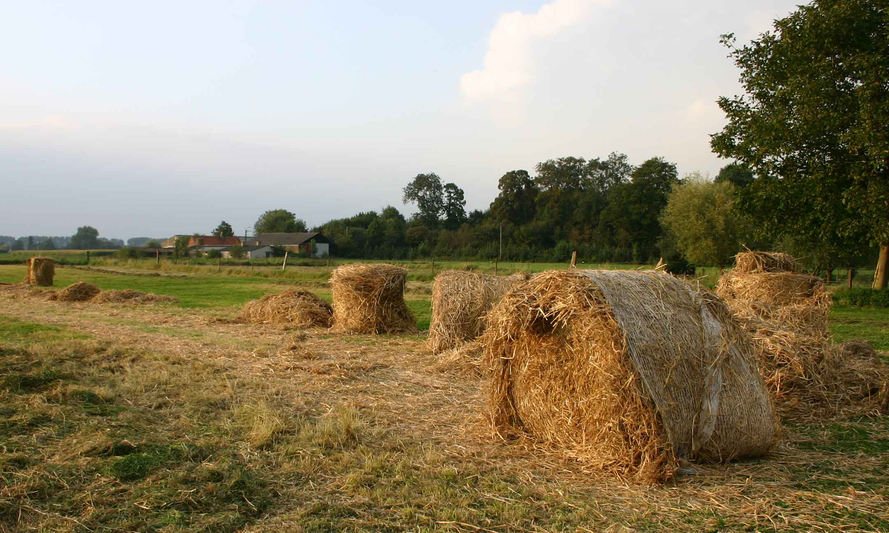

# STRO-analyse financiële crisis
### 2012-03-30
::: vista

:::
Uit de [STRO](http://strohalm.nl)-krant van kerst 2011.

1. Je kan met geld zaken doen en er rijkdom mee opslaan.
2. Als veel rijken hun geld even niet willen laten stromen, stagneert de economie.
3. Rente verleidt geld om in om loop te blijven. Centrale banken zorgen daarom zoveel mogelijk voor een positieve rente en zijn extra alert op inflatie.
4. Door positieve rente stroomt geld van arm naar rijk, waar het geld zich concentreert.
5. Positieve rente lokt hogere winsten uit en maakt grond en huizen duurder en dat versterkt het proces van geldconcentratie.
6. Geld dat tegen positieve rente in omloop komt groeit de gemiddelde geldhoeveelheid.
7. Als banken geld scheppen is er behoefte aan onderpand aan eigendomstitels. Op een eindige wereld is het lastig om steeds nieuw eigendom te creëren.
8. Toen dat moeilijk werd, kwam de privatisering op, die nieuwe eigendomstitels opleverde.
9. Geholpen door de tijdens de privatisering populair geworden deregulering, werd een steeds groter deel van het zich concentrerende geld voor speculatie gebruikt. Dat werkt destabiliserend en maakt in veel gevallen de economie minder efficient.
10. Het aanbod van geld groeide, waardoor de rente daalde. De rente zakte en zakte en bereikte in het begin van deze eeuw unieke lage waarden.
11. Als er onvoldoende kopers zijn, of eigenlijk onvoldoende geld in handen van kopers is, dan dalen de winsten en gaan de rijken niet langer beleggen in productie, maar gaan op hun geld zitten. En bij punt 1 zagen we al dat dit problemen oplevert.
12. Door de lage rente durfden steeds meer mensen te lenen. Dat geld ging deels naar speculatie en stimuleerde ook de aankopen zodat punt 9 uitgesteld werd en producten nog steeds verkocht worden.
13. Je kan maar een tijdje aankopen doen met geleend geld. Toen de trucs in de speculatieve markt te ver gingen, ontstond in 2007 de kredieterisis.

**Er moet een alternatief komen voor het geldsysteem dat concentratie van vermogen afdwingt om aan steeds opvolgende crises te ontsnappen.**
