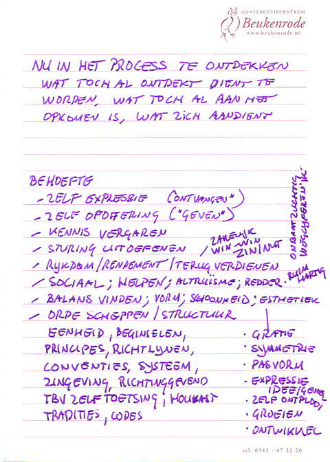

# Symbiose
### 2008-06-03

::: as-is

:::

Als je alle insecten zou uitroeien is binnen 30 jaar onze Aarde zo dood als een pier. Als je alle mensen uit zou roeien, floreert en bloeit de Aarde als nooit tevoren.

**Florerende en gezonde organisaties leven in harmonie samen met hun leefomgeving** en koesteren een optimale aansluiting (interface) tussen de habitat en zichzelf. Ze zijn dan goed op elkaar ingespeeld. [[Cradle to cradle]] zo je wilt. Als het goed is ontstaat er een gezonde en natuurlijke vorm van symbiose.

Net zoals organisaties, groot en klein, in de markt of samenleving staan, staan afdelingen en teams binnen grotere organisaties in hun leefomgeving of habitat. Volledige autonomie is natuurlijk een illusie—om te leven dien je de behoeften van je omgeving mee te nemen in zelforganisatie. Je omgeving en jij gaan altijd hand in hand. **Jij bent deel van het geheel en het geheel is onvolledig zonder jouw. Tegelijkertijd ben jij onvolledig zonder je omgeving.** En dit geldt recursief—fractaal—op alle schaalniveaus. Zo ontstaat een **simplexe holarchie**.

Wil jij—als individu, als groep, als team, als afdeling, als divisie, als bedrijf, als organisatie, als gemeenschap, of als samenleving—gewoon lekker in je vel zitten, dan helpt het om goede antennes te hebben voor de behoeftes van je leefomgeving. In feite laat je je graag sturen en leiden door je leefomgeving. Want **als het met jouw leefomgeving goed gaat, gaat het met jou ook goed**. En vice versa natuurlijk. Daarom dient jouw leefomgeving goed leiding te geven en dien jij leiding te willen ontvangen. En daarom verzin je allerlei **instrumenten om te meten hoe het met je leefomgeving gaat**, en pas je wat je doet daar voortdurend op aan.

::: vista

:::

Alles wat je als orgaan doet is natuurlijk puur uit eigenbelang. Dat levert een interessante paradox op: **je doet echt alles in het belang van je leefomgeving uit eigenbelang**. In gezonde situaties levert deze schijnbare tegenstrijdigheid een creatieve, scheppende spanning op waarin de **energie stroomt en bruist**. En in volledige harmonie en met een eigen ritme—**coherentie ten top**.

Zo ontstaat een prachtige, continu evoluerende vorm van terugkoppeling met **drie elementaire handelingen**:
1. leiding ontvangen;
1. doen (handelen); en
1. meten.

Het **doen** levert de resultaten en voordelen op die je leefomgeving waardevol vindt en nodig heeft. De producten en diensten die je in de markt zet bijvoorbeeld. Je kan het doen ook zien als een uitingsvorm, als **zelfexpressie**.

Kortom, hoe beter je in staat bent jezelf te geven aan je leefomgeving—in de vorm van producten en diensten—hoe waardevoller dat voor je leefomgeving is, en hoe meer jouw leefomgeving je teruggeeft. En **hoe beter je jezelf kan geven, hoe echter en authentieker je bent**. Je kan **volledig je hart volgen** en je letterlijk **overgeven aan je passie**. Dan zit je dus **lekker in je vel**.

::: vista

:::

## Eigen Identiteit
Natuurlijk wil je naar een leefomgeving vinden of kweken waar je de ruimte krijgt om je te ontwikkelen met je eigen waarden, je eigen principes, je eigen snelheid, je eigen ritme, je eigen sturing, je eigen regels, je eigen normen, je eigen werkwijzen, je eigen structuren. Dat is je identiteit. Dat kenmerkt jou. En je wilt natuurlijk ook je eigen ideeën en wensen uiten. Zelfexpressie als individu, als team, als bedrijf is een wezenlijke drijfveer.

Zie jouw **leefomgeving als een vruchtbare voedingsbodem** op basis waarvan je kan groeien en bloeien waarbij de bomen wél tot in de hemel kunnen groeien. En als je met een aantal anderen in een afdeling samenwerkt kan je dat op zich ook weer als een nieuwe, specifiekere en specialistischer, voedingsbodem zien. Kortom, van samenleving tot team en individu krijg je een **fraaie geneste (ook wel recursieve of fractale) stapeling**.

Omdat de aansluiting op je leefomgeving van levensbelang is besteed je daar veel aandacht aan. Die aansluiting is uitermate essentieel en is precies datgene wat jouw leefomgeving en jij gemeenschappelijk hebben. Daar moet je dus overeenstemming over hebben. Dat is tenslotte je communicatiekanaal. **Communicatie** is afgeleid van het Latijnse woord communis of ‘**gemeenschappelijk**’. Wil je echt lekker in je vel zitten, dan dien je dus continu aan het protocol en de **betekenis van informatie** over dat communicatiekanaal te werken.

::: vista

:::

Bij een communicatiekanaal heb je altijd een zender en ontvanger. Een spreker en een luisteraar. En dus niet een schreeuwer en een luisteraar. Schreeuwen werkt meestal averechts op goede luisteraars. **Fluisteren is vaak veel effectiever**. Fluisteren maakt de luisteraar alert en nieuwsgierig. Een goede zender fluistert helder. Zender en ontvanger zijn in principe twee verschillende rollen, elk met een eigen verantwoordelijkheid en met een eigen belang. De zender vertegenwoordigt de omgeving, de leiding. De luisteraar vertegenwoordigt jouw zelf, of jouw groep, of jouw team, of jouw afdeling, kortom jouw toko.

Verenig je die twee belangen in één individu, dan levert dat interne conflicten op en kan je niet meer authentiek denken en handelen. Je raakt verder verwijderd van je zelf. Vul daarom in een organisatie zender en ontvanger door twee verschillende individuen in. Laat je leefomgeving een luisteraar benoemen om te bewijzen dat je goed naar haar luistert. Dat wekt vertrouwen en geloofwaardigheid bij je leefomgeving. Ze voelt zich dan beter gehoord. Zo ontstaat de **dubbele, wederkerige koppeling**. En als zowel zender als ontvanger zich open en kwetsbaar opstellen gaat het helemaal stromen.

De luisteraar vertegenwoordigt jouw leefomgeving, de basis voor jouw bloei en groei. Primaire verantwoordelijkheid van die luisteraar is het in kaart brengen van de behoeftes en randvoorwaarden van jouw leefomgeving en die te vertalen naar jouw eigen waarden en beginselen, jouw eigen ritme, regels, werkwijzen en zo voort. Daarnaast is de luisteraar verantwoordelijk voor en aanspreekbaar op concreet meetbare resultaten voor de leefomgeving.

Andersom wil jij ook **gehoord worden door je leefomgeving**. Jouw leefomgeving heeft het meest aan de effecten en resultaten van jouw handelingen en wil daarom graag weten wat jou in de weg staat die resultaten te boeken en wil weten wat de behoeften zijn van jouw groep zodat het de voorwaarden kan scheppen voor een gezonde en vruchtbare voedingsbodem op basis waarvan jij kan floreren.

Kies daarom voor een zender die weet van de hoed en de rand en het interne reilen en zeilen en de behoeftes van jouw team of afdeling en dat als geheel kan vertegenwoordigen. Denk daarbij aan **primaire behoeften en drijfveren** zoals:
- **Zelfexpressie** (jezelf “ontvangen”);
- **Zelfopoffering** (jezelf “geven”);
- **Kennis vergaren** (om de kennis);
- **Sturing uitoefenen**;
- **Rijkdom**—in brede zin—rendement, terugverdienen, zakelijke win/win, zin, nut;
- **Sociaal**—helpen, altruïsme, redden, ruimhartig, onbaatzuchtig, wegcijferend;
- **Balans vinden**—vorm, schoonheid, esthetiek, gratie, symmetrie, pasvorm, expressie, idee, gevoel, zelfontplooiïng, groeien, ontwikkelen;
- **Orde scheppen**—structureren, eenheid, principes, beginselen, richtlijnen, conventies, systemen, zingevend, richtinggevend ten behoeve van zelftoetsing, houvast, tradities, codes.

::: vista

:::

En omdat, zoals gezegd, volledige autonomie een illusie is **gaat het pas stromen zodra je in symbiose werkt met je leefomgeving**. Zorg voor **net genoeg creatieve spanning** tussen jou en je leefomgeving om een **zinnige richting** te geven aan je handelen en niet-handelen. **Bewust zijn op zielsniveau**.

Ontstaat er **te veel spanning**, dan loop je het risico dat de oorspronkelijk creatieve spanning omslaat naar een destructieve spanning die **contraproductief** werkt. Je merkt dat direct aan verschijnselen zoals afhaken, negatief rendement, zware vermoeidheid, en distress en je merkt dat er **meer energie ingaat dan er uitkomt**. Pas op voor **burn out**. Je gaat dan op zoek naar een andere leefomgeving of komt in opstand, of, nog erger, vergiftigt en vernietigt zelfs je leefomgeving. Leefomgeving dood. Jij dood. En alles wat jou als voedingsbodem heeft **dood**.

Eén van de oorzaken van contraproductieve spanning is de persoonlijke voorkeur voor orde of chaos. Redelijk ongestructureerd (neigt meer naar chaos, met een gezonde dosis orde) redelijk gestructureerd (neigt meer naar orde, met een gezonde dosis chaos).

Het probleem ontstaat in het doorschieten naar de uitersten.
- **Extreme orde**—proces zonder resultaat:
  - Bureaucratie;
  - Grote en zinloze modellen en systemen;
  - Hiërarchische autocratie;
  - Geen terugkoppellussen;
  - Verbetervoorstellen maken het vaak erger;
  - Adembenemend: te weinig ruimte voor zelfexpressie.
- **Extreme chaos**—resultaat zonder proces—kweekt:
  - Kweekt individuele helden;
  - Volledig ontbreken van structuur:
  - Onplanbare processen;
  - Onduidelijke resultaten;
  - Geen architectuur of organisatie;
  - Onduidelijk wat waneer en hoe getest dient te worden;
  - Troebele acceptatiecriteria en succesfactoren en daarmee onmeetbaar;
  - Slechte kwaliteit;
  - Lage toegevoegde waarde;
  - Lage bevrediging van behoeften;
  - Lage moraal;
  - Vervelende verrassingen.
- **Holacratie** biedt een harmonieuze balans:
  - Flexibele balans in het chaordische gebied;
  - Speelt in op persoonlijke voorkeuren;
  - Overstijgt en omvat:
    - Sociocratie;
    - Egocratie;
    - Bureaucratie;
    - Infocratie;
    - Democratie;
    - Autocratie;
    - Theocratie;
    - Tribacratie;
    - Adhocratie.
  - Maakt het mogelijk flexibel met al deze cratiën om te gaan afhankelijk van de behoefte in een specifieke situatie.
  - Werkt zoals hierboven beschreven.

Holacratie vertoont veel natuurlijke en symbiotische eigenschappen die bijdragen aan een florerende, bruisende en uitbundige chaorganisatie met klinkende resultaten waarbij 's morgens fluitend naar je werk gaat en ook weer fluitend terug naar huis aan het eind van de dag.

----
Voor de liefhebbers is hier nog de PDF met de poster over Symbiose en Holacratie. Klik de plaat en download.
::: vista

:::