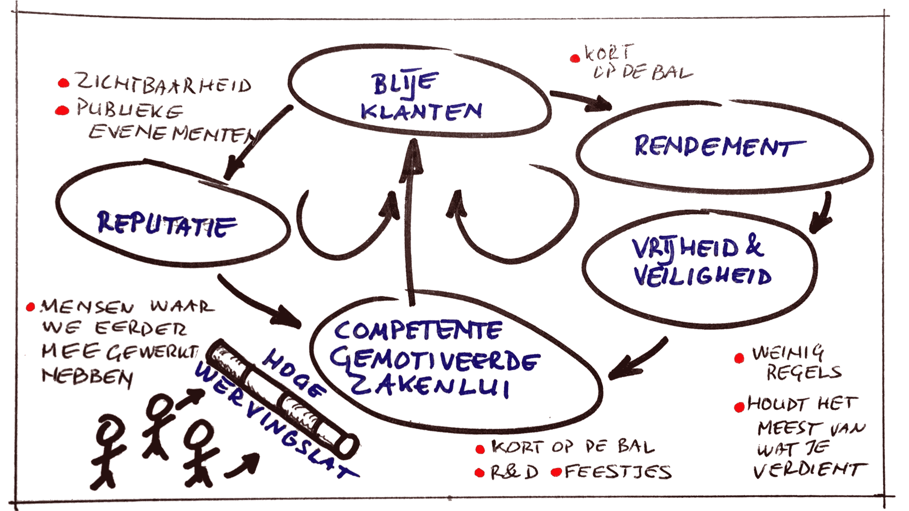

# Waarom dit model werkt (voor ons).

Na jaren van experimenteren is er een model ontstaan dat werkelijk goed voor ons werkt. Doorstroom van onze staf is nagenoeg nul, de [[geluksindex]] is meestal hoger dan 4 en de omzet per meemaker is ongeveer twee maal zo hoog als bij een doorsnee adviesbureau. Bovendien geven onze cliënten ons wonderbaarlijk goede recensies, zo goed dat we te nederig zijn ze hier te tonen.

Maar waarom? Waarom werkt dit zo goed voor ons? Hier is onze gok,  geïllustreerd in een systeemdiagram.

::: as-is

:::

De kernzaak zijn de twee lussen—versterkende lussen die krachtiger en krachtiger worden.

## Versterkende terugkoppellussen

### Linkerlus

1. Bekwame en  gemotiveerde consultants leveren beter werk af en dat leidt weer tot blijere klanten.
2. Blije klanten geven ons een goede reputatie.
3. Goede reputatie verhoogt onze motivatie en trekt nieuwe, bekwame mensen aan.
4. Terug naar 1.

### Rechterlus

1. Bekwame en gemotiveerde consultants leveren beter werk af, hetgeen tot blijere klanten leidt.
2. Meer en blijere klanten leiden tot meer rendement.
3. Meer winst geeft consultants de ruimte en gemoedsrust om meer tijd te investeren in nieuwe zaken in plaats van elk uur te besteden aan declarabele uren.
4. Meer tijd nemen om samen nieuwe zaken te onderzoeken en leren motiveert ons meer en maakt ons bekwamer.
5. Terug naar 1.

## Meet en beheer motivatie. Winst is bijvangst.

Het kernpunt is dat we ons richten op onszelf en onze klanten blij en gelukkig te houden, niet meer winst of groei. Goede reputatie en winst zijn slechts neveneffecten—bijvangst—van het onszelf en onze klanten blij houden.

## Werf schitterende mensen of werf niet.

Werving is cruciaal—het model werkt zolang we enorm kieskeurig zijn over we wie we aan boord trekken. Zodra we mensen aan boord halen die onder de maat zijn is het zeer goed mogelijk dat de versterkende lussen hierboven omklappen in verzwakkende lussen: slechte consultants → slechte reputatie → de beste consultants vertrekken → etc.).

We groeien liever te langzaam dan te snel, dus werven meestal alleen mensen waarvan we al weten dat ze schitterend zijn. We zijn een beetje lui op dat gebied en dankbaar voor de bedrijven die de junioren een plek bieden om zich te ontwikkelen en te leren.

Leer hoe wij [[werven]].
