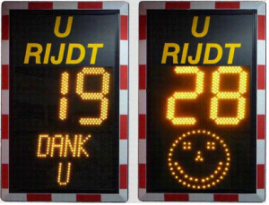

# Systeeminterventiepunten
### 2009-03-02

Mensen die systeemanalyse doen hebben een diep geloof in zogenaamde hefboompunten. Hefboompunten zijn plekken in een complex systeem—een menselijk lichaam, een onderneming, een organisatie, een economie, een samenleving, een ecosysteem—waar een kleine verschuiving in één ding grote veranderingen in de rest kan veroorzaken. Acupunctuurpunten voor systemen zeg maar.

De systeemgemeenschap heeft veel erfgoed over hefboompunten. Degenen die door de grote [Jay Forrester](http://nl.wikipedia.org/wiki/Jay_Forrester) van het MIT getraind zijn hebben een van zijn favoriete verhalen in zich opgenomen. “Mensen weten intuitief wat hefboompunten zijn. Telkens als ik weer een bedrijf geanalyseerd heb en een hefboompunt heb uitgeplozen blijkt terug bij het bedrijf dat **iedereen het hefboompunt in de verkeerde richting duwt**!”

Het klassieke voorbeeld van die intuïtie met terugwerkende kracht was Forrester's eerste model van de wereld. Forrester werd door de Club van Rome gevraagd te laten zien hoe de grote mondiale problemen—armoede en honger, vernietiging van het milieu, uitputting van hulpbronnen, stedelijke achteruitgang en werkloosheid—zijn verwant en hoe ze kunnen worden opgelost.

Forrester kwam met een duidelijk hefboompunt: **groei**. Zowel de bevolkingsgroei als de economische groei. De kosten van groei—zoals armoede, honger en vernietiging van het milieu—de hele lijst van problemen proberen we op te lossen met groei! De wereldleiders zijn terecht gefixeerd op de economische groei als hét antwoord op bijna alle problemen, maar ze duwen met al hun kracht in de verkeerde richting.

**Tegennatuurlijk**—Forrester's woord om complexe systemen te beschrijven. De systeemanalisten komen niet met snelle of eenvoudige formules voor het vinden van een hefboompunten. Onze tegennatuurlijkheden zijn niet zo goed ontwikkeld. Geef ons een paar maanden of jaren en we modelleren het systeem en zoeken het uit. Wij weten uit bittere ervaring dat wanneer we hefboompunten het systeem ontdekken, **vrijwel niemand ons zal geloven**.

Heel frustrerend. Stel je eens voor dat je in een vergadering over het nieuwe mondiale handelsregime zit—[NAFTA](http://nl.wikipedia.org/wiki/Noord-Amerikaanse_Vrijhandelsovereenkomst), [GATT](http://nl.wikipedia.org/wiki/GATT) en de [Wereldhandelsorganisatie](http://nl.wikipedia.org/wiki/Wereldhandelsorganisatie). Hoe meer je hoort, hoe meer je van binnen gaat sudderen. “Dit is een **enorm nieuw stelsel** dat de mensen uitvinden!” hoor je jezelf zeggen. “Ze hebben niet het geringste idee hoe het systeem zich zal gedragen,” zeg je tegen jezelf terug. “Het hefboomt het systeem compleet in de verkeerde richting—**groei, groei en nog eens groei, tegen elke prijs**! En de maatregelen waar deze aardige mensen het over hebben—kleine aanpassingen aan parameters en slappe verzwakkende terugkoppellussen—zijn ronduit **zwak**!”

Plotseling, zonder helemaal te weten wat er gebeurt, sta je op en loop je naar de flip-over, sla je een schone pagina op en schrijf je: “Plaatsen om te in te grijpen in een systeem,”, gevolgd door negen punten:
1. **Getallen**—subsidies, belastingen, normen.
1. **Voorraden en stromen**.
1. **Reguleren van verzwakkende terugkoppellussen**.
1. **Aanwakkeren van versterkende terugkoppellussen**.
1. **Informatiestromen**.
1. De **regels van het systeem**—prikkels, straffen, beperkingen.
1. De **kracht van zelforganisatie**.
1. De **doelen van het systeem**.
1. De **mentaliteit** of het **paradigma**, van waaruit de doelstellingen, zelforganisatie, regels, informatiestromen, terugkoppelstructuren, voorraden en stromen ontstaan.

Iedereen in de vergadering knippert verrast met de ogen, waaronder jijzelf. “Dat is brilliant!" ademt iemand. “Huh?” zegt iemand anders. Je beseft dat je veel uit hebt te leggen.

Plaats de lijst in een context van bescheidenheid voordat je erdoor heen gaat en de vertaling van het jargon, de voorbeelden en uitzondering tot je door laat dringen. Decennia van grondige analyse van veel verschillende soorten systemen is al door veel slimme mensen gedaan. Maar complexe systemen zijn, nou, complex. Het is gevaarlijk om erover te generaliseren. Wat je gaat lezen is niet een recept voor het vinden van hefboompunten. Veeleer is het een uitnodiging om meer in het algemeen na te denken over systeemveranderingen. Daarom voel je hefboompunten wel intuïtief aan maar zet je ze vaak omgekeerd in.

## Getallen

Getallen—‘parameters’ in systeemjargon—bepalen hoeveel en hoe snel je aan welke kraan dient te draaien voor een bepaald effect. Misschien draait de kraan moeilijk, dus duurt het een tijdje voordat het water voldoende stroomt. Misschien is de afvoer geblokkeerd en staat daardoor slechts een kleine stroom toe, ongeacht hoe hard de kraan stroomt. Misschien levert de kraan de kracht van een brandslang.

Stuk voor stuk overwegingen over getallen, parameters. Getallen die soms hard en onveranderbaar ingebakken zijn in het systeem. Getallen die echter voor velen van ons de meeste geliefde interventiepunten zijn.

Kijk maar eens naar de staatschuld. De staatschuld is een negatieve badkuip, een geldgat. De snelheid waarmee deze put zich verdiept is het jaarlijkse tekort. Fiscale inkomsten maken de put ondieper, de overheidsuitgaven juist weer dieper.

De politiek en de minister president debatteren eindeloos over de vele parameters en het openen en sluiten van de honderden tapkraantjes en draaiknoppen van inkomsten en putten en afvoer van uitgaven van de belastingen.

Aangezien deze kranen en riolering zijn aangesloten op de kiezers, zijn dit allemaal politiek geladen parameters. Maar, ondanks al dat vuurwerk, en ongeacht welke partij verantwoordelijk is, wordt het geldgat alsmaar groter en groter en verandert alleen maar snelheid waarmee de put dieper wordt.

De hoeveelheid grond die wij gereserveerd hebben voor natuurbeheer. Het minimumloon. Hoeveel we uitgeven aan aids of de JSF. De vergoeding voor de dienstverlening van jouw bank die van je rekening afgeschreven wordt. Dit zijn allemaal getallen, aanpassingen van tapkranen en afvoerputten.

Hetzelfde geldt voor het aanemen en ontslaan van mensen. Verschillende handen op de kranen verschillen in het tempo en intensiteit waarmee zij zich veranderen, maar als het dezelfde oude tapkranen zijn die deel uitmaken van hetzelfde systeem, waar volgens dezelfde informatie en regels en doelstellingen aan gedraaid wordt, zal het systeem niet veranderen.

Jan Peter Balkenende draait anders aan de geldkranen dan Wouter Bos, maar het lost het probleem niet op. Wat dat betreft lijken ze als twee druppels water op elkaar.

Getallen staan onderaan de lijst van hefboompunten. Gerommel in de marge. Het regelen van de dekstoelen op de Titanic. Waarschijnlijk gaat vijfennegentig procent van onze aandacht en energie uit naar getallen. Veel energie met een zwak effect.

Niet dat parameters niet belangrijk zijn, ze kunnen dat zeker zijn, vooral op de korte termijn en voor de persoon die midden in de stroom staat. Maar **parameters veranderen zelden gedrag**. Als het systeem piepend en krakend blijvend tot stilstand komt kunnen parameterwijzigingen het zelden weer starten. Als het systeem woest en variabel is stabiliseert het draaien aan de knoppen het systeem vaak niet. Als het systeem eenmaal buiten je controle groeit remmen parameters het niet af.

Welke maximum we ook op campagnebijdragen zetten, het schoont de politiek niet op. Meer uitgeven aan politie laat de criminaliteit niet verdwijnen. Het gehannes met de rente door de banken laat de bedrijfscycli niet verdwijnen. Dat vergeten we altijd tijdens oplevingen terwijl we telkens weer geschokt zijn door achteruitgang.

Er zijn echter ook kritische uitzonderingen. Getallen krijgen een hefboomeffect wanneer zij waarden bereiken die dient als aftrap van een van de punten hoger op deze lijst.

Rentevoeten of geboortecijfers besturen de winsten rond versterkende terugkoppellussen. Systeemdoelen zijn parameters die grote verschillen kunnen maken. Soms komt een systeem op de rand van chaos waarbij de kleinste verandering van een parameter het systeem van orde naar wilde wanorde kan drijven.

Waarschijnlijk is de **meest kritische soort van getallen de lengte van de vertraging** in een terugkoppelcircuit.

Herinner je je die badkuip op de vierde verdieping met de boiler in de kelder? In een oude hotels kom je die nog wel eens tegen. En het hoeft niet eens een bad met bufferend vermogen te zijn, een douche doet het ook al. Draai aan de kraan en pas na een minuut reageert de temperatuur van het water. Raad maar eens hoe die douche zich gedraagt. Inderdaad—je slingert van warm naar koud en weer terug naar heet en doorspekt het met krachttermen.

Vertragingen in verzwakkende terugkoppellussen veroorzaken schommelingen en trillingen in het systeem. Als je een systeem probeert aan te passen aan jouw doel maar je ontvangt slechts vertraagd informatie over de toestand van het systeem schiet je door en schiet je tekort.

Hetzelfde geldt als je gegevens op tijd zijn maar je reactie niet. Er zijn bijvoorbeeld meerdere jaren nodig voor de bouw van een elektriciteitscentrale en zo'n centrale gaat vervolgens ongeveer dertig jaar mee. Deze vertragingen maken het onmogelijk om precies het juiste aantal centrales te bouwen voor de levering van een snel veranderende vraag.

Zelfs met een enorme inspanning op prognoses kampt bijna de hele elektriciteitsindustrie in de wereld met lange schommelingen tussen overcapaciteit en ondercapaciteit. Een systeem met vertragingen op lange termijn kan onmogelijk reageren op korte termijn veranderingen. Daarom functioneert een systeem met een massale en centrale planning— zoals de Sovjet-Unie of General Motors—noodzakelijkerwijs slecht.

**Een vertraging in een terugkoppelproces is doorslaggevend voor de systeemtoestand dat het terugkoppelcircuit probeert te besturen, relatief ten opzichte van de mate van verandering** zoals groei, fluctuatie of verval.

Vertragingen die te kort zijn veroorzaaken overreactie en schommelingen die worden versterkt door het springerige gedrag van het antwoord.

Vertragingen die te lang zijn veroorzaken gedempte, aanhoudende of exploderende schommelingen, afhankelijk van hoe veel te lang. In het extreme veroorzaken ze chaos, en, vaak kort daarna, de dood.

Loopt het systeem door vertragingen in terugkoppellussen de drempel over naar het gebied buiten haar eigen regelbereik, een kritische grens, dan is er geen houden meer aan en ontstaat vaak onherstelbare schade en ineenstorting.

Vertragingduur kan een belangrijk hefboompunt zijn, ware het niet dat vertragingen in het systeem vaak niet makkelijk te veranderen zijn. De dingen duren zo lang als ze duren. Je kan niet veel doen aan de bouwtijd van een belangrijk bouwwerk, de ontwikkeling van een kind of de groei van een bos.

Het is meestal makkelijker om de *mate* van verandering te dempen door versterkende terugkoppellussen in te zetten waardoor de terugkoppelvertraging tot minder problemen zal leiden en het systeem binnen haar veilige bereik kan bewegen.

Kritische getallen zijn helemaal niet zo algemeen als mensen denken dat ze zijn. De meeste systemen hebben zich ontwikkeld of zijn ontworpen om buiten het gevoelige bereik van hun parameters te blijven. In de meeste gevallen zijn de getallen niet de moeite van al ons zweet waard.

## Voorraden en stromen

De structuur van het sanitair en de riolering en de voorraden en stromen en hun fysieke arrangement kunnnen een enorm effect hebben op hoe een systeem werkt.

Toen het Hongaarse wegennet zo werd aangelegd dat al het verkeer dat van de ene naar de andere kant van het land door centraal Boedapest moest passeren, bepaalde dat de luchtvervuiling en verkeersvertragingen. Geen roetfilter, verkeerslicht of snelheidsbeperking kon daar tegen op. De enige manier om een systeem dat verkeerd is aangelegd te herstellen is om het opnieuw te bouwen, als je daartoe in staat bent.

Vaak ben je daar niet toe in staat omdat fysieke bouw nou eenmaal een trage en dure vorm van verandering is. Sommige voorraad- en stroomstructuren zijn gewoon onveranderbaar.

De deining die de babyboomgeneratie in de bevolking veroorzaakt levert eerst druk op het basisschoolsysteem, dan op het middelbaar onderwijs, de hogere scholen en de universiteiten, dan op de werkgelegenheid en huisvesting, en nu zijn we naarstig op zoek naar de ondersteuning van haar pensioen. Ondanks haar volledige voorspelbaarheid laten we ons er toch door verrassen. Regeren is vooruitzien?

Aan de babyboom is niet veel te doen. Vijfjarigen worden nou eenmaal zesjarigen en vierenzestigjarigen worden vijfenzestigjarigen. Voorspelbaar en niet te stoppen. Hetzelfde kan worden gezegd voor de levensduur van destructieve CFK-moleculen in de ozonlaag, voor de snelheid waarmee verontreinigingen uit grondwaterlagen gewassen worden, en voor het feit dat het tien tot twintig jaar duurt totdat een inefficiënt wagenpark afgeschreven is.

Het mogelijke uitzonderlijke hefboompunt is hier de omvang van de voorraden of buffers. Stel je eens een grote badkuip voor, met trage in- en uitstroom. Pak er nu eens een met kleine en snelle stromen. Dat is het verschil tussen een meer en een rivier. Je hoort veel vaker van katastrofale overstromingen van een rivier dan van katastrofale overstromingen van een meer omdat voorraden die groot zijn in verhouding tot hun stromen stabieler zijn dan kleine. Een grote, stabiliserende voorraad is een buffer.

De stabiliserende kracht van buffers is de reden waarom je geld op de bank zet in plaats van te leven van het wisselgeld in je zak. Daarom houden winkels voorraad in plaats van nieuwe voorraad te bestellen zodra klanten de oude voorraad mee de deur uit nemen. Het is de reden waarom we van een bedreigde soort meer dan de minimum fokpopulatie dienen te hebben. De grond in het oosten van de VS is gevoeliger voor zure regen dan de grond in het westen omdat zij hebben geen grote buffers van calcium hebben die het zuur neutraliseert.

Je kunt een systeem vaak stabiliseren door een buffer aan te brengen of de capaciteit van een bestaande buffer te vergroten. Maar als een buffer te groot is wordt het systeem inflexibel. Dan reageert te traag en we hebben gezien welk nadelig effect vertragingsduur op het systeem als geheel heeft.

Bedrijven hebben ‘just-in-time’ voorraden uitgevonden omdat af en toe kwetsbaar zijn voor schommelingen of verstoringen goedkoper is dan bepaalde, constante voorraadkosten, en omdat kleine tot verdwijnende voorraden een flexibeler response op de veranderende vraag toestaan.

Er is een, soms magisch, hefboomeffect door het veranderen van de grootte van een buffer. Maar buffers zijn meestal fysieke dingen en daarom niet makkelijk te veranderen.

Het absorptievermogen voor zuur van de bodem in het oosten is geen hefboom voor het verlichten van schade door zure regen. De opslagcapaciteit van een dam is letterlijk in beton gegoten.

Fysieke structuur is van cruciaal belang in een systeem, maar de hefboompunten zitten in de eerste plaats een goed ontwerp. Nadat de structuur gebouwd is zit de hefboomwerking in het begrip van de beperkingen, knelpunten en het veilige bereik van het systeem waarmee we ons kunnen onthouden van fluctuaties of expansies die haar bereik overbelasten.

## Reguleren van verzwakkende terugkoppellussen

Nu verschuiven we van het fysieke deel van het systeem naar de informatieve en besturingsdelen waar meer invloed mee kan worden uitgeoefend. De natuur evolueert ‘als vanzelf’ de verzwakkende terugkoppelingen en wij mensen vinden ze uit om de systeemtoestand binnen veilige grenzen te houden.

Een thermostaatlus is het klassieke voorbeeld. Het doel ervan is om de systeemtoestand met de naam ‘kamertemperatuur’ redelijk constant op een gewenst niveau te houden. Elke verzwakkende terugkoppellus heeft een doel nodig—de instelling van de thermostaat—een meet- en signaleringsapparaat dat afwijkingen van het doel detecteert—de thermostaat—, en een reactiemechanisme—de kachel en/of airco, ventilatoren, warmteleidingen, gas, en zo voort.

::: as-is

:::

Een complex systeem heeft meestal vele verzwakkende terugkoppellussen die het in kan zetten zodat het zichzelf onder verschillende omstandigheden en prikkels kan corrigeren. Sommige van die lussen zijn mogelijk een groot deel van de tijd inactief—zoals het noodkoelsysteem in een kerncentrale, of je vermogen om om je lichaamstemperatuur op peil te houden door te zweten (afkoeling) of rillen (opwarming).

Een van de grote fouten die we maken is om deze noodmechanismen te verwijderen omdat ze niet vaak gebruikt worden en ze daardoor onnodig kostbaar lijken. Als we dit doen zien we hier op de korte termijn geen effect van. Op de lange termijn versmallen we echter het bereik van de overlevingsruimte van het systeem.

Een van de meest hartverscheurende manieren waarop we dit doen is door inbreuk te maken op de habitats van bedreigde soorten. Een andere is de inbreuk op onze eigen tijd voor rust, recreatie, socialisatie en meditatie.

De ‘kracht’ van een verzwakkende lus—haar vermogen om de haar toegewezen voorraad op of in de buurt van het doel te houden—hangt af van de combinatie van álle parameters en verbindingen: de nauwkeurigheid en snelheid van haar bewaking, de snelheid en kracht van de respons, de directheid en grootte van de corrigerende stromen.

Hier kunnen hefboompunten zijn. Neem markten bijvoorbeeld. De verzwakkende terugkoppelsystemen in vrije markten kunnen inderdaad wonderen van zelfcorrectie zijn als de prijzen variëren om vraag en aanbod in balans te houden—hefboompunten die allesbehalve aanbeden worden door economen. Hoe meer de prijs—het centrale signaal aan zowel producenten als consumenten—transparant, ondubbelzinnig, tijdig en waarheidsgetrouw is, hoe soepeler de markten opereren.

Prijzen die de volledige kosten weerspiegelen zullen de consument meedelen hoeveel ze zich daadwerkelijk kan en wil veroorloven en zullen efficiënte producenten belonen.

Bedrijven en overheden worden levensbedreigend aangetrokken tot het hefboompunt van de prijs en ze duwen haar met zijn allen in de verkeerde richting met subsidies, herstel, externaliteiten, belastingen en andere vormen van verwarring. De échte hefboom is om ze juist te verhinderen dit te doen. Vandaar het mededinginsrecht, de Reclame Code Commissie, pogingen tot internalisering van kosten (zoals belasting op vervuiling), de verwijdering van perverse subsidies en andere manieren van nivellering marktplaatsen.

De kracht van een verzwakkende terugkoppellus is belangrijk, relatief ten opzichte van het effect waarvoor het is ontworpen om te corrigeren. Als het effect in sterkte toeneemt dienen de terugkoppelingen ook in sterkte toe te nemen.

Een thermostaat kan werken op een koude winterse dag—maar open alle ramen en het corrigerend vermogen zal falen. Democratie werkte beter vóór de komst van de hersenspoelende macht van gecentraliseerde massacommunicatie. Traditionele controles op de visserij waren voldoende totdat radar, drijfnetten en andere technologieën het voor een klein aantal spelers mogelijk maakten om de vis relatief moeiteloos uit te roeien. De macht van een grote industrie vraagt om de controlerende macht van een grote overheid. Een mondiale economie maakt een globale overheid noodzakelijk.

Zo maar wat andere voorbeelden van het versterken van verzwakkende terugkoppellussen ter verbetering van de zelfcorrigeren capaciteiten van een systeem: preventieve medicijnen; beweging en een goede voeding van het lichaam ter versterking van het weerstandsvermogen tegen ziekte; integrale plaagbestrijding door stimulering van juist de natuurlijke vijanden van gewasplagen; een open overheid om de geheimhoudingsplicht van de regering te verminderen; de bescherming van klokkenluiders; vergoedingen voor aarde toegevoegde waarde; belasting op vervuiling; en prestatie-obligaties om de geëxternaliseerde publieke kosten van particuliere uitkeringen te herwinnen.

## Aanwakkeren van versterkende terugkoppellussen

Een versterkend terugkoppelcircuit is zelfversterkend. Hoe meer ze werken, hoe meer ze aan kracht winnen om meer te werken. Steeds sneller steeds sneller en steeds meer steeds meer. Levensgevaarlijk.

Hoe meer mensen de griep krijgen, hoe meer andere mensen ze besmetten. Hoe meer baby's geboren worden, hoe meer mensen opgroeien om hebben baby's te krijgen. Hoe meer geld je in de bank hebt, hoe meer rente meer je verdient, hoe meer geld je in de bank hebt. Hoe meer schuld je hebt, hoe meer rente je moet betalen, hoe meer schuld je krijgt. Hoe meer de bodem erodeert, hoe minder het de vegetatie kan ondersteunen, hoe minder wortels en bladeren om de regen en afvoer te verzachten, hoe meer de bodem erodeert. Hoe meer hoog-energetische neutronen in de kritische massa, hoe meer zij botsen met kernen en hoe meer hoog-energetische neutronen zij vrijmaken.

Kortom, onbestuurde versterkende terugkoppellussen leiden tot kettingreacties. Ze beginnen klein en onzichtbaar en schieten, soms na een hele lange aanloopperiode, ineens door de knik waarna ze in een fractie van de tijd doorschieten en zichzelf—en ook vaak hun omgeving of gastheer—vernietigen.

Versterkende terugkoppellussen drijven groei, explosie, erosie, en de ineenstorting van de systemen. Een systeem met een ongecontroleerde versterkende lus zal uiteindelijk zichzelf vernietigen. Daarom zijn er zo weing van.

Meestal schakelt vroeger of later een verzwakkende terugkoppellus in. De infecteerbare mensen in een epidemie raken op—óf mensen nemen steeds sterkere maatregelen om te voorkomen dat ze besmet raken: de griepprik in september. Het sterftecijfer stijgt tot gelijk niveau als geboortecijfer—óf mensen zien de gevolgen van ongecontroleerde groei van de bevolking en nemen geboortebeperkende maatregelen. De grond erodeert tot harde rots, en na een miljoen jaar verbrokkelt de rots tot nieuwe grond—óf mensen dammen de erosie in en planten bomen en gras.

In deze voorbeelden krijg je het eerste resultaat indien de versterkende lus haar loop heeft, en het tweede als er een tussenkomst ter vermindering van haar macht ingrijpt.

Vermindering van de toename rond een versterkende lus—de groei vertragend—is meestal een krachtiger hefboom in systemen dan de versterking van verzwakkende lussen, en veel beter te verkiezen boven de vrije loop van een versterkende lus.

Bevolkings- en economische groei zijn hefboompunten in het wereldmodel omdat vertraging de vele verzwakkende lussen—door middel van technologie en de markten en andere vormen van aanpassing—de tijd geeft te functioneren. Net zo als het rustig afremmen van je auto wanneer je te snel rijdt beter en prettiger is dan het uitgooien van een anker of het eisen van een technische vooruitgang in de stuurgroep.

Het meest interessante gedrag dat snel draaiende versterkende lussen kunnen veroozaken is chaos. Dit wilde, onvoorspelbare, onreproduceerbare en toch begrensde gedrag gebeurt wanneer een systeem snel, veel sneller begint te verandereren dan dat haar verzwakkende lussen daarop kunnen reageren.

Als je bijvoorbeeld de kapitaalgroei in het wereldmodel blijft verhogen, kom je uiteindelijk op een punt waar een kleine stijging de economie verschuift van exponentiële groei naar trilling. Nog een duwtje opwaarts geeft de trilling een dubbele slag en nog een minuscuul extra duwtje stuurt het systeem over de rand van de afgrond de chaostoestand in.

Ondertussen neigt onze wereldeconomie naar die chaostoestand. Een probleem dat alleen optreedt op bij onrealistische parameterbereiken, bijvoorbeeld een jaarlijkse verdubbeling van de omvang van de economie. Echte wereldsystemen raken chaotisch als er iets in hen zeer snel kan toe- of afnemen.

Snel vermenigvuldigende bacteriën of insectenpopulaties, zeer besmettelijke epidemieën, wilde speculatieve bubbels in geldsystemen, neutronenfluxen in het inwendige van kerncentrales. Deze systemen zijn moeilijk te controleren en haar controle moet het afremmen van de versterkende lussen daarin betrekken om ze in de hand te houden.

Zoek in gewonere systemen naar hefboompunten rond de geboortesnelheid, rentevoeten, erosietarieven, ‘succes aan de succesvollen’-lussen. Plekken die hoe meer je van iets hebt, hoe meer kans je hebt om meer te hebben aanwakkeren. Demp elke plek waar kettingreacties op de loer liggen met slimme verzwakkende terugkoppellussen die in kracht meelopen met de versterkende.

## Informatiestromen

Het verhaal gaat dat er een aantal vergelijkbare huizen was waarbij de elektriciteitsmeter in sommige van de huizen in de kelder werd geïnstalleerd en in andere in de hal, waar de bewoners de meter direct en voortdurend konden zien als ze meer of minder elektriciteit verbruikten. Het elektriciteitsverbruik in de huizen met de meter in de hal was 30 procent lager.

Systeemfans houden van dit verhaal want het is een voorbeeld van een groot hefboompunt in de structuur van het systeem. Het is geen aanpassing van een parameter, geen versterking of verzwakking van een bestaande lus. Het is een **nieuwe lus**, het leveren van terugkoppeling aan een plek waar het daarvoor niet was.

In 1986 heeft de Amerikaanse regering geëist dat iedere fabriek met uitstoot van gevaarlijke luchtverontreinigende stoffen dat publiek maakt. Plotseling kon iedereen precies weten wat er uit de schoorstenen in de stad kwam. Er was geen wet tegen deze uitstoot, geen boete, geen enkele bepaling van ‘veilige’ niveaus, uitsluitend informatie. In 1990 was de uitstoot gedaald tot 40 procent. Een chemisch bedrijf in de top tien van vervuilers verminderde de uitstoot met 90 procent, alleen maar om van die lijst af te komen.

Het ontbreken van terugkoppeling veroorzaakt vaak slecht functionerende systemen. Het toevoegen of omleggen van informatie kan een krachtige interventie zijn, meestal gemakkelijker en goedkoper dan herstel van de fysieke structuur.

De [tragedie van de meent](http://nl.wikipedia.org/wiki/Tragedie_van_de_meent) dat de wereld van visserij uitput doet zich voor omdat er geen terugkoppeling van de stand van de vispopulaties op het besluit om te investeren in vissersvaartuigen is. In tegenstelling tot de economische opinie voorziet de prijs van de vis niet in de gewenste terugkoppeling. Als de vis schaarser en dus duurder is, wordt het juist rendabeler om uit te varen en ze te vangen. Dat is een perverse terugkoppeling—een versterkende lus die leidt tot een ineenstorting.

Het is belangrijk dat de ontbrekende terugkoppeling wordt hersteld op de juiste plaats en in dwingende vorm. Het is niet genoeg om alle gebruikers van een watervoerende laag te informeren dat het grondwaterpeil daalt. Dat kan leiden tot een race naar de bodem van de put. Het is effectiever om de waterprijs steil te laten stijgen zodra de pompstations meer water oppompen dan er in de grondlaag instroomt.

Stel dat belastingbetalers op hun aangifteformulier kunnen aangeven aan welke overheidsdiensten hun fiscale betalingen moet worden besteed. Radicale democratie! Stel dat een stad of bedrijf haar waterinvoer stroomafwaarts van de lozing haar eigen afvalwater moet aanleggen. Stel dat elke publieke of particuliere ambtenaar die beslissingsbevoegheid heeft om te investeren in een kerncentrale het afval uit de fabriek op of onder zijn of haar gazon opgeslagen krijgt. Stel dat alle werknemers van Shell Nederland het overtollige CO2 in tonnen in hun kelder moeten opslaan.

De mens heeft een systematische neiging om verantwoording voor eigen beslissingen te vermijden. Dat is de reden waarom er zoveel terugkoppelingslussen ontbreken en waarom dit soort hefboomeffecten zo vaak populair zijn bij het volk en impopulair bij de bevoegdheden. Dit soort hefboompunten zijn enorm doeltreffend als de machten die beslissen ermee instemmen of als je om ze heen kunt manouvreren en het zo toch gedaan krijgt.

## De regels van het systeem (prikkels, straffen, beperkingen)

De regels van het systeem definiëren het bereik, de grenzen, de mate van vrijheid. Gij zult niet doden. Iedereen heeft het recht van vrije meningsuiting. Contracten zullen worden nageleefd. De voorzitter dient een periode van vier jaar en niet meer dan twee periodes. Negen mensen in een team, je moet elke plaat aanraken, drie slagen en je bent uit. Als je gepakt wordt bij het beroven van een bank, ga je naar de gevangenis.

Mikhail Gorbachev kwam aan de macht in de USSR, opende informatiestromen ([glasnost](http://nl.wikipedia.org/wiki/Glasnost)) en veranderde de economische regels ([perestrojka](http://nl.wikipedia.org/wiki/Perestrojka)), en kijk eens wat er gebeurd is.

Grondwetten zijn sterke sociale regels. Fysische wetten, zoals de tweede wet van de thermodynamica zijn absolute regels als we ze correct begrijpen. Wetten, straffen, beloningen en informele sociale overeenkomsten zijn geleidelijk zwakkere regels.

Om de macht van de regels aan te tonen, vraag studenten eens om zich verschillende regels voor te stellen voor een college. Stel de studenten beoordelen de docenten. Stel dat je naar school komt als je wilt iets leren en je vertrekt als je het geleerd hebt. Stel dat hoogleraren aangenomen worden op basis van hun vermogen tot het oplossen van reële problemen in de echte wereld in plaats van het publiceren van academische documenten. Stel dat een klas als groep wordt beoordeeld in plaats van als individuen.

Regels veranderen gedrag. Macht over de regels is echte macht. Macht over de regels van de regels is supermacht.

Daarom komen lobbyisten samen wanneer de regering en de Eerste en Tweede Kamer wetten schrijft. Daarom schrijft de Eerste Kamer—die de grondwet interpreteert en omlijnt—de regels voor het schrijven van de regels—nog meer macht dan de regering.

Als je de diepste storingen van systemen wilt begrijpen, besteed dan aandacht aan de regels en aan degenen die daar de macht over hebben.

Dat is de reden waarom bij velen de alarmklokken van de systeemintuïtie luidden toen het nieuwe wereldhandelsstelsel werd uitgelegd. Het is een systeem met regels ontworpen van bedrijven, door bedrijven en voor bedrijven. De regels sluiten vrijwel elke terugkoppeling uit andere sectoren van de samenleving uit. De belangrijkste terugkoppeling—die vanuit het milieu en de aarde ontrokken waarde—ontbreekt volkomen. De meeste van haar vergaderingen zijn gesloten voor de pers—geen informatie, geen terugkoppeling.

Samen met het geldsysteem dwingt het naties in versterkende lussen met elkaar te concurreren ten koste van het milieu en de sociale bescherming teneinde zakelijke investeringen aan te trekken. Het is een recept voor het ontketenen van de lus van ‘succes aan de succesvollen’. Het is gelukt.

## De kracht van zelforganisatie

Het meest verbluffende dat levende systemen kunnen doen is zich volledig te veranderen door het creëren van geheel nieuwe structuren en gedrag. In biologische systemen heet die kracht evolutie en leidt in uiteindelijk tot metamorfose. In de menselijke economie noemen we het technische vooruitgang of sociale revolutie. In systeemlingo heet het zelforganisatie.

Zelforganisatie betekent de verandering van enig aspect van een systeem eerder op deze lijst—de toevoeging of verwijdering van:
- fysieke structuur; of
- verzwakkende of versterkende lussen; of
- informatiestromen; of
- regels.

Het vermogen om zichzelf te organiseren is de sterkste vorm van de veerkracht van een systeem—het vermogen om veranderingen te overleven veranderen. De meest innovatieve systemen—organisaties, bedrijven, naties—zijn zo in staat zich voortdurend te vernieuwen en bruisen van het leven.

Het menselijke immuunsysteem kan reacties op (sommige soorten) aanvallen ontwikkelen die het nooit eerder is tegengekomen. Het menselijk brein kan nieuwe informatie opnemen en volledig nieuwe, unieke gedachten ontpoppen.

Zelforganisatie lijkt zo verwonderlijk dat we de neiging om het als mysterieus en miraculeus te zien. Economen modelleren technologie vaak letterlijk als manna uit de hemel—komt van nergens, kost niets, en verhoogt de productiviteit van de economie constant met ongeveer een procent per jaar. Eeuwenlang ervaren mensen de spectaculaire variëteit van de natuur met hezelfde ontzag. Slechts een goddelijke schepper kan zo'n creatie voortbrengen.

In feite hoeft de goddelijke schepper geen wonderen te doen. Het is ‘slechts’ een kwestie van het schrijven van een paar slimme regels voor zelforganisatie. Deze regels bepalen hoe, waar, wanneer en wat het systeem zichzelf kan toevoegen of verwijderen en onder welke voorwaarden.

Zelforganiserende computermodellen tonen aan dat zich prachtige geestverbijsterende patronen kunnen ontvouwen door eenvoudige evolutionaire algoritmen. Dat hoeft niet te betekenen dat de algoritmen voor de echte wereld eenvoudig zijn, maar alleen dat zij dat kunnen worden.

De genetische code is de basis van alle biologische evolutie bevat slechts vier letters, gecombineerd tot woorden van drie letters elk. Deze code en de regels voor het repliceren en herschikken, heeft een onvoorstelbare variëteit van wezens uitgespuwd.

> {code is niets, coderen is alles}.

Zelforganisatie is in wezen een kwestie van evolutionaire grondstoffen—een voorraad van informatie waaruit mogelijke patronen gekozen kunnen worden—en een middel om ze te testen. Voor biologische evolutie is de grondstof DNA, één bron van variëteit is spontane mutatie, en het testmechanisme lijkt op iets doorspekt met Darwinistische selectie.

De grondstof voor de technologie is het lichaam van kennis: begrip dat wetenschap heeft verzameld. De bron van diversiteit is de menselijke creativiteit (wat dat ook moge zijn) en het selectiemechanisme is dat wat de markt zal belonen of dat wat overheden en stichtingen dan ook maar zullen financieren of dat wat de fantasie van de gekke uitvinders dan ook maar prikkelt.

Wanneer je de kracht van zelforganisatie inziet, begin je te begrijpen waarom biologen biodiversiteit zelfs meer aanbidden dan economen technologie aanbidden. De wilde en gevarieerde voorraad van DNA, in de loop van miljarden jaren geëvolueerd en opeengestapeld, is dé bron van evolutionaire mogelijkheden. Net zoals wetenschap bibliotheken, laboratoria en wetenschappers dé bron zijn van technologische mogelijkheden. Het toestaan dat soorten uitsterven is een systemische misdaad, net als het willekeurig vernietigen van alle kopieën van bijzonder wetenschappelijke tijdschriften of bepaalde soorten wetenschappers dat is.

Hetzelfde kan worden gezegd van menselijke culturen, die de opslag zijn van gedragsrepertoires die niet over miljarden, maar honderdduizenden jaren opeengestapeld zijn. Ze zijn een voorraad van waaruit sociale evolutie en innovatie ontstaat. Helaas waarderen wij mensen het evolutionaire potentieel van culturen minder dan dat we het potentieel van iedere genetische variatie van de [aardeekhoorn](http://nl.wikipedia.org/wiki/Grondeekhoorns) begrijpen. Dat komt mogelijk door het geloof in de volstrekte superioriteit van de eigen cultuur, een aspect van bijna elke cultuur.

Elk systeem, biologisch, economisch of sociaal, dat experimenten minacht en het ruwe materiaal van innovatie wist is op de lange termijn gedoemd op deze zeer gevarieerde planeet.

Het punt van ingrijpen hier is duidelijk maar onpopulair. Het aanmoedigen van diversiteit betekent verlies van controle. **Laat duizend bloemen bloeien en wat dan ook kan gebeuren!** Wie durft?

## De doelen van het systeem

De drang naar controle is een voorbeeld van waarom het doel van een systeem een nog krachtiger hefboompunt is dan het zelforganiserende vermogen van een systeem.

Als het doel is om meer en meer van de wereld onder het regime van een centraal plansysteem te vangen—het rijk van Genghis Khan, Das dritte Reich, de People's Republic of China, Wal-Mart, Disney, Microsoft—dan staat alles lager in de lijst onder druk of wordt verzwakt om te voldoen aan die doelstelling, ook zelforganiserend gedrag. Alles is ondergeschikt aan de systeemdoelen.

Daarom raak je niet uitgesproken over de vraag of genetische manipulatie een goede of een slechte zaak is. Zoals met alle technologieën is de uitkomst afhankelijk van het doel waarmee de stuurlui het roer hanteren. Het enige dat je kan zeggen is dat als bedrijven het hanteren om nog meer verhandelbare producten te genereren er een heel andere richting voor de evolutie wordt ingeslagen dan wat de planeet tot nu toe heeft gezien.

Systemen hebben een hiërarchie van doelen. De meeste verzwakkende terugkoppellussen hebben hun eigen doelen—om het badwater op het juiste niveau te houden, om de kamertemperatuur comfortabel te houden, om voorraden op voldoende niveau te handhaven. Het zijn kleine hefboompunten. De punten met grote hefboomwerking zijn de doelstellingen van volledige systemen.

Mensen binnen systemen herkennen vaak niet wat de doelstelling is van het gehele systeem dat ze bedienen. De meeste bedrijven zullen waarschijnlijk zeggen dat het doel is om winst te maken, maar dat is slechts een regel, een noodzakelijke voorwaarde om mee te kunnen blijven spelen.

Wat is het doel van het spel? Om te groeien? Om het marktaandeel te vergroten? Om de wereld (klanten, leveranciers, toezichthouders) steeds meer onder de controle van de onderneming te brengen zodat haar activiteiten steeds meer van onzekerheid afgeschermd worden. Dat is ook het doel van een kankercel en van de hele levende bevolking. Het is alleen slecht wanneer het niet wordt tegengewerkt door hogere verzwakkende terugkoppellussen met doelen om het systeem in evenwicht te houden.

Het doel van het voeren van de marktconcurrerentie dient het doel van elke onderneming om haar concurrenten te eliminieren te overtroeven. Het doel om de bevolking in evenwicht te houden en zich te ontwikkelen dient de doelstelling van elke populatie om alle middelen op te eisen voor haar eigen metabolisme te overtroeven.

Het wisselen van de spelers in een systeem is een ingreep op laag niveau zolang de spelers in het zelfde oude systeem passen. De uitzondering op deze regel zit aan de top, als een enkele speler het systeemdoel kan veranderen.

Het is wonderbaarlijk als—slechts zeer incidenteel—in een organisatie een nieuwe leider opstaat, een nieuw doel formuleert en zo in haar of zijn eentje het gedrag van honderden, duizenden of miljoenen perfect rationele mensen verandert. Adolf Hitler in Nazi-Duitsland en Mahatma Gandhi zijn hier twee extreme voorbeelden van.

Dat is ook wat Ronald Reagan deed. Niet lang voordat hij president werd, kon een president zeggen: ”Vraag niet wat de overheid voor jou kan doen, vraag wat jij kunt doen voor de overheid,” en niemand had zelfs gelachen. Reagan zei dat het doel niet is om de mensen de regering te laten helpen en niet om de regering de mensen te laten helpen, maar om de regering van onze nek af te krijgen.

Men kan erover twisten dat grote veranderingen in het systeem hem daarmee weg lieten komen. Maar de grondigheid waarmee het gedrag sinds Reagan in de VS en zelfs de wereld is veranderd getuigt van de grote hefboomwerking van het uitspreken, herhalen en het opeisen van nieuwe systeemdoelen.

## De mentaliteit of zienswijze van waaruit het systeem ontstaat

Een van de gezegden van Jay Forrester over systemen gaat alvolgt: “Het maakt niet uit hoe de fiscale wetgeving van een land is opgesteld. Er is een gemeenschappelijk idee in de hoofden van de samenleving over wat een ‘eerlijke’ verdeling van de fiscale last is. Ongeacht wat de regels zeggen zal de werkelijke verdeling van de belastingen het algemeen aanvaarde idee van ‘rechtvaardigheid’ altijd geweld aan doen, hetzij door eerlijk of oneerlijk spel, door complicaties, valsspelen, vrijstellingen of aftrekposten, of door voortdurende aanvallen op de regels.”

Het gemeenschappelijke idee in de hoofden van de samenleving, de grote onuitgesproken aannames—onuitgesproken omdat ze onnodig zijn te vermelden; iedereen kent ze—vormt de diepste reeks overtuigingen van hoe de maatschappij denkt over hoe de wereld werkt. Er is een verschil tussen zelfstandige naamwoorden en werkwoorden. Mensen die minder betaald worden zijn minder waard. Groei is goed. De natuur is een onuitputtelijke voorraad van middelen die dient te worden omgezet ten behoeve van menselijke doeleinden. Evolutie is gestopt met het ontstaan van homo sapiens. Men kan land ‘bezitten’. De olievoorraden onder de noordpool zijn van mij. Dit zijn slechts enkele van de paradigmatische aannames van onze cultuur. Allemaal aannames die de mensen van andere culturen volstrekt verbluft achterlaat.

Paradigma's of zienswijzen zijn de bronnen van de systemen. Van hen komen doelen, informatiestromen, terugkoppellussen, voorraden en stromen.

De oude Egyptenaren bouwden piramides omdat ze geloofden in een hiernamaals. Wij bouwen torenflats omdat wij menen dat de ruimte in het centrum van de steden enorm waardevol is—behalve voor onoggelijke ruimten waarvan wij menen dat ze waardeloos zijn, vaak in de buurt van de diezelfde torenflats.

Of het nu Copernicus of Kepler was die aantoonde dat de aarde niet het middelpunt van het universum was, of Einstein die veronderstelde dat materie en energie uitwisselbaar zijn, of Adam Smith die beweerde dat de egoïstische acties van individuele spelers in markten heerlijk bijdroegen aan het gemeenschappelijk goed.

Mensen die weten te in te grijpen in systemen op het niveau van een zienswijze, en daar de gevoelige snaar weten te raken, raken een hefboompunt dat systemen volledig transformeert.

Je kunt zeggen dat paradigma's moeilijker zijn te veranderen dan elk ander aspect van een systeem, en dus dient deze post het laagst op de lijst worden geplaatst, niet het hoogst. Maar er is niets fysieks of duur of zelfs langzaam aan een paradigmaverschuiving. Bij elk individu gebeurt dit in een oogwenk. Een klik in de geest, een nieuwe manier van kijken is voldoende. **Eureka!** Natuurlijk verzetten individuen en samenlevingen zich tegen uitdagingen van hun paradigma, harder dan tegen elke andere vorm van verandering.

Dus, **hoe kan je een paradigma veranderen?** Thomas Kuhn, die het baanbrekende boek over de grote paradigmaverschuiving in de wetenschap schreef, heeft hierover veel te zeggen. In een notendop komt het hierop neer:
- **Blijf goed wijzen op de afwijkingen en storingen van het oude paradigma.**
- **Kom zelf luid en duidelijk en met zekerheid vanuit het nieuwe paradigma.**
- **Injecteer mensen met het nieuwe paradigma op openbare plaatsen met zichtbaarheid en kracht.**
- **Werk met actieve veranderaars en met het overgrote deel van mensen met een open geest** en verkwist geen met reactionairs.

Systeemmensen zeggen dat één manier om een paradigma te veranderen is om een model van een systeem te maken dat je buiten het systeem plaatst en je zo dwingt om de ogen te openen en met een {frisse blik} het geheel te zien. Systeemmensen zeggen dat omdat hun eigen paradigma's op die manier zijn gewijzigd.

## De kracht om paradigma's te overstijgen

Om waarheidsgetrouw en volledig zijn is er nog een nabrander.

De hoogste hefboomwerking van alles is om je niet te verbinden met de arena van paradigma's en je te beseffen dat geen enkele paradigma ‘waar’ is. Zelfs die paradigma's die jouw zoete comfortabele wereldbeeld vormen geven een zeer beperkt inzicht in een immens en fantastisch universum.

Op buikniveau snap je het paradigma dat er paradigma's zijn, en je snapt dat datzelf een paradigma is. Dat inzicht is fantastisch grappig. Het is jezelf verliezen in niet-weten.

Mensen die zich vastklampen aan paradigma's (en dat doet bijna iedereen) werpen één blik in de ruime mogelijkheid dat alles wat we denken gegarandeerd onzin is en fietsen vervolgens angstig voor die onzekerheid en snel in de tegenovergestelde richting. Toch zit er geen kracht, geen controle, zelfs geen bestaansreden, laat staan handelen, in de ervaring dat er geen zekerheid is in welk wereldbeeld dan ook. Maar iedereen die voor een moment of voor een mensenleven heeft gespeeld met dat idee ziet het als een basis voor radicale zelfstandigheid en gelijkwaardigheid.

Als er geen waar paradigma is, kies er dan een die bijdraagt aan de verwezenlijking van jouw doel. Als je geen idee hebt waar je een doel kunt vinden, stem dan af op het universum of op jouw favoriete godheid, en luister ernaar en doe zijn, haar of ‘hets’ wil, want die is veel beter geïnformeerd dan de jouwe.

Terug van het sublieme naar het belachelijke, van verlichting naar waarschuwingen. Er is nog zoveel dat moet worden gezegd om deze lijst te kwalificeren. Het is een voorlopige lijst en de volgorde is glibberig. Er zijn uitzonderingen op elk punt. Laat de lijst sudderen in je bovenbewustzijn. Loop op en neer door de lijst, pas hefboompunten toe waar je ze kan vinden. Hoe hoger het hefboompunt in de lijst staat, hoe meer het systeem zich verzet tegen haar verandering—dat is de reden waarom samenlevingen echt verlichte wezens proberen uit te wissen.

Er zijn geen goedkope kaartjes voor systeemveranderingen. Je moet er aan werken, of dat nou betekent dat je een systeem nauwgezet moet analyseren of een paradigma rigoureus moet afgooien. Uiteindelijk lijkt het erop dat het hefboomeffect minder te maken heeft met het duwen van hefbomen dan met gedisciplineerd denken gecombineerd met strategisch, diep en wild loslaten.

## Op naar een briljanten millennium

Onze regeringen en bedrijven blijven verstrikt hangen in het draaien aan kranen, drukken op knoppen en schonen van afvoerputten. Tijd voor een {frisse blik}—een paradigmaverschuiving—en een nieuw {vurig verlangen} naar de zee.

De ongeloofwaardig eenvoudige edoch extreem effectieve systeemoplossingen uit de huidige financiële crisis zijn al door velen verzonnen—[[de rijken rijker en de armen rijken]].

Onze financiële infrastructuur is ondertussen—afgezien van de eurobiljetten en -munten—volledig digitaal,. Geld wordt informatie en informatie wordt geld. Ons financiële en monetaire systeem is volledig vormgegeven met software. En software is, de naam zegt het al, zachte en kneedbare waar.

Dus in tegenstelling tot fysieke infrastructuur zoals gebouwen en wegen en leidingen is het aapassen van onze financiële infrastructuur relatief gezien een eitje. Het veranderen van parameters, aanbrengen van effectieve terugkoppellussen en toevoegen of aanpassen van buffers in het financiële systeem en het bepalen van nieuwe doelen dus ook. Het is niet een kwestie van van kunnen, **het is een kwestie van willen!**

Schrijf je {dagdroom}: Ik wil leven in een land dat… (vervang ‘land’ door gezin, buurt, wijk, dorp, plaats, stad, regio, organisatie, provincie, land, werelddeel, wereld). Verzamel het {zielsprofiel} van geestverwanten. Inspireer, groei en koester {duizend echte fans}.

Tijd voor ecosofische wetswijzigingen en [[slimme spirituele software]]?!

**¥€$ WE CAN!**

Vrij naar *[Places to Intervene in a System](http://www.developerdotstar.com/mag/articles/places_intervene_system.html)* door [Donella Meadows](http://en.wikipedia.org/wiki/Donella_Meadows).

[Stephen Anderson](http://www.slideshare.net/stephenpa)'s [When Data Gets Up Close and Personal](http://www.slideshare.net/stephenpa/when-data-gets-up-close-and-personal) is een fraaie SlideShare over terugkoppellussen.