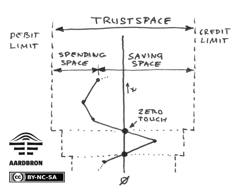

# Trustspace
### 2010-02-22

Imagine a monetary system where the amount of money you own does not matter anymore, since it is of no value to own money; you can't even own it, just like it does not make sense to own centimeters, inches or volts. Mutual credit systems are like this. A mutual credit system track of and shows you your current promises towards the community or vice versa.

::: as-is

:::

What does matter in a mutual credit system is the number of times you touched zero when trading (either or not changing sign), since at precisely that moment you have contributed to the community the exact value as the community contributed to you. You are in balance with your environment—that serves you so good and abundantly.

Every time you touch zero, your ‘trustspace’ increases, since you just proved to balance your consumption with your contribution.

To avoid kartels and free riding, the trustspace is parameterized by your turnover until now, a damping factor and a connectivity index derived from the relative number of others you traded with. Just like with [[flow money]], your trustspace diminishes, decays, over time. So you need to stay active and add value to your environment to keep up your trustspace.

The trustspace are the ‘credit’ and ‘debit’ limits for safe trade. Of course, if you like risk, you can go beyond someone's trustspace, but you know that you risk losing your extra investment.

It's just like scaling up microcredit to meso- and macrocredit. With our current technology level, it is a piece of cake to implement a global digital giral spreadsheet system—which is all we need; mind-boggling cheaper than all these expensive banks and their emplyoees who don't even understand their own products anymore.

This non-monetary but value-based balance is essential on all scales as well. Just as the individual needs to balance receiving and giving to the community, the import and export of countries should enjoy a dynamic (chaordic) balance.

Overshooting in either direction or not touching zero for longer time destroys your credibility als a good citizen or global player. Too much import increases your ‘debt’ or promise to other countries, your promise to do something back. Too much export hoards employabilty, depriving other countries from adding value and wealth to the world at large.

The balance and trustspace are similar to energy economics.

In short, let:

- _trustspace_ = _credit limit_ – _debit limit_;
- _trustspace_ = _spending space_ + _saving space_;
- _zero touch_ be the number of times you've changed the sign of your balance: if **sign**(_current balance_) ≠ **sign**(_previous balance_): + → 0, + → –, - → 0, - → +, + → – or - → +;
- _trade diversity_ be the number of unique legal entities you have traded with;
- _average turnover_ be the total value of net profit - gross profits divided by time—a synonym for average revenue (or in certain contexts, sales).

From 1) and 2) follows that:

- _credit limit_ – _debit limit_ = _spending space_ + _saving space_.

While _trustspace_ is calculated as:

- _trustspace_ = _damping factor_ × _zero touch_ × _average turnover_ × _trade diversity_.

## Mutual Credit

Money is created at the moment of transaction, and not by some central authority. When Mary buys something from John for 100, Mary's balance goes down 100, and John's goes up 100. In this system, it is okay to be ‘in debt’. In fact, everyone starts at zero, thus the very first transaction, of 100 say, implies that one will end up at –100 while the other ends up at +100.

**_Dynamic Trustspace_**—Just like with microcredits, you get the growing benefit of the doubt. It's okay to have an outstanding promise to the community or society (be ‘in debt’), yet within limits. These limits, plus and minus, are your trustspace. If you are a good citizin and compensate your debt by providing a service to someone else, your debt will be lessened, and you might even flip to the positive side of the balance, thereby showing your trustworthiness.

In fact, _**balance is key here**_. The most important thing. Your trustspace grows everytime when you touch or cross zero. Your turnover is a measure of your activity, hence your trustspace can grow as a fraction of your turnover. For example, if your turnover is 1,000 and your trustspace is 20, and as you touch zero, your new trustspace grows to 22, say.

Since trustspace includes the average turnover over time, it decreases if you sit idle for too long. In other words, your trustspace keeps fresh and fit as you continue to add value and trade.

You may even consider that when a shrinking trustspace becomes less than _credit limit_ – _debit limit_, the excess is trimmed off to a commons fund and your new limits are set to the current trustspace. So when you are inactive for too long, you've left the system, say, you're effectively ‘squeezed out’ of the system, releasing any credit to the commons. If your balance was in debit, though, the commons fund needs to repair your promises by ‘funding’ your debt. It is a loss borne by the community at large. You, of course, lose your trustworthiness and credibility.

Question: How do you elegantly avoid or choke when two malafid friends who agreed to pump up their trustspace by a large number of fast transactions between the two and at maximum trustspace.

Just like an engine that runs smoothly when stationary, but as soon as you push down tha gas throttle, it chokes, even turns off.

My quest is to find:

- the extremely elegant formulas that take any financial transaction log and calculate the trustspace within which a player can safely trade;
- how to connect two ecowebs that have so far been developing independently and suddenly touch;
- design an immune system that keeps the system as a whole healthy, even when (severely) attacked;
- the distributed, decentralized, peer-to-peer layers of software, infrastructure and humanstructure that make it feasable and completely self-everything (organizing, healing, supporting, etc.); and
- the way to have a holarchy emerge that use a cascade of flow money for ever larger commons activities, up to the global level, while embellishing local wealth and unfolding.